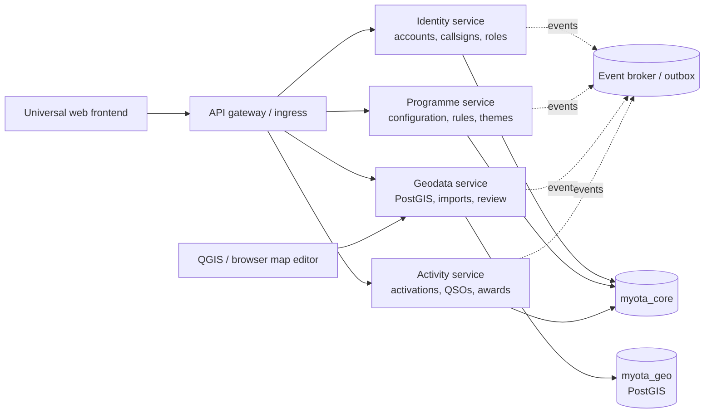
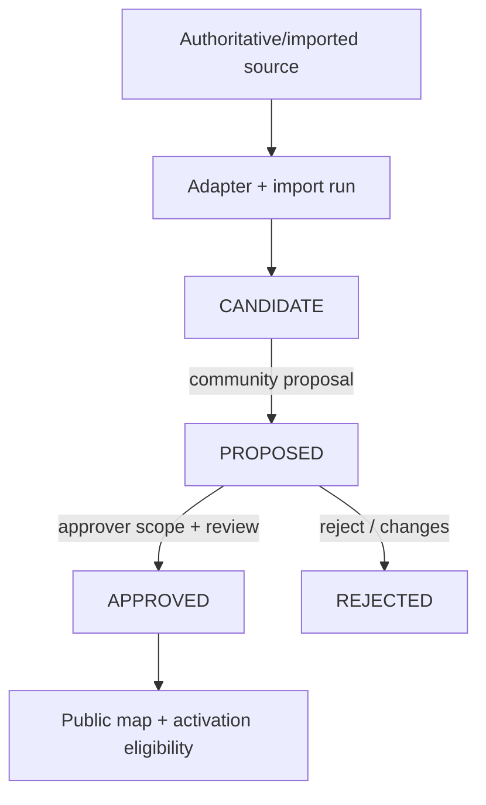
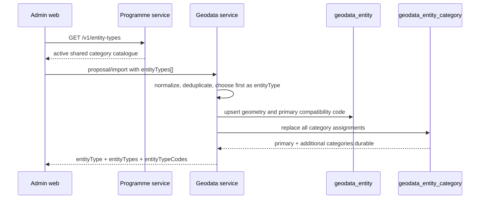

# MyOTA platform architecture

Editable Mermaid views are maintained in [`diagrams/service-boundaries.md`](diagrams/service-boundaries.md), [`diagrams/programme-configuration-lifecycle.md`](diagrams/programme-configuration-lifecycle.md), and [`diagrams/data-model.md`](diagrams/data-model.md). This document remains the narrative architecture reference; the diagrams intentionally show the major ownership and lifecycle relationships without replacing detailed API or migration documentation.

## Scope

MyOTA is an Outdoor Activation Platform. A programme is configuration and policy data consumed by platform capabilities. MPOTA is only sample seed data; future programmes use the same APIs without cloning a codebase. The platform does not copy, inherit or silently normalize another programme's charter, rules, minimum QSOs, award logic or eligibility policy. Those are programme-owned inputs, versioned and auditable as configuration or programme code.

## Service boundaries



Each service owns its database tables and publishes events. No service reads another service's tables. The gateway/ingress is a routing boundary, not a domain owner.

Activity execution and award management are one bounded service and one API
deployment. Locally, both route families are exposed on port `8004`; award
paths remain distinct (`/v1/awards`) but do not create a second service or
port. The activity service owns normalized activation, QSO, aggregate, award,
import, correction, job, statistic and notification tables. It does not use
the generic JSONB `service_state` projection in durable mode. Activity and
award writes use bounded psycopg pools and transaction-local idempotency.

Geodata uses the same compatibility snapshot during the migration period, but
the authoritative entity catalogue is also upserted into the PostGIS-owned
`geodata_entity`, `geodata_entity_category`, `source_reference`, and review
tables. Manual candidates and their lifecycle changes therefore remain durable
independently of the JSON snapshot and are visible to QGIS. Hydration merges
relational-only entities and overlays category assignments onto legacy
snapshot entities; only an explicit API deletion removes a relational entity.

The service exposes two ingestion paths: ordinary idempotent QSO writes and a
PostgreSQL `COPY` staging path for batches and ADIF worker output. Distinct
subject/callsign/entity membership tables support precomputed activator and
hunter facts, while `activity_award_progress` stores a versioned evaluation
for historical award definitions. Reads never scan the full QSO table to
render participant progress.

The API deployment is stateless and horizontally scalable. Helm defaults to
three activity replicas; `activity_worker` handles ADIF parsing, award-rule
recalculation, PDF rendering, statistics and notification delivery, while the
notification consumer translates geodata and identity events into participant
notices. Each workload has its own bounded database pool.

Award background images, manager signatures and generated certificate objects
are addressed through an S3-compatible object store. Local Compose provides
MinIO; production Helm values point the activity service at the selected
managed or self-hosted object store. Metadata and immutable issuance render
specifications remain in the activity service so object storage can be replaced
without changing the API.

## Geodata lifecycle



The UI distinguishes `APPROVED` from `CANDIDATE` and never exposes a candidate as a programme reference until approval. Import refreshes update source provenance and geometry while preserving review state; an explicit policy can retire records that disappear from an authoritative source. Supported GeoJSON geometry types are `Point`, `LineString`, `MultiLineString`, `Polygon`, and `MultiPolygon`; trails/routes commonly use `LineString` (called a `way` in the administration UI). The importer also accepts the non-standard `way` geometry alias and normalizes it to `LineString`. Entity categories such as `MUNICIPAL_PARK` and `TRAIL` are shared master-data definitions that can be assigned to multiple programmes and can allow more than one geometry type; review changes are made through the geodata API and recorded in entity history.

## Import adapters

The adapter interface is a normalized feature stream:

```text
discover(source_config) -> source snapshot metadata
read(snapshot) -> {source_record_id, name, geometry, properties, license}
normalize(feature) -> canonical geometry/properties
conflate(feature, existing) -> match candidates + score
apply(feature, policy) -> candidate/update/retire
```

Required adapters are represented in the contract and storage model: `PARKSERVE_US`, `OSM`, `GOVERNMENT_GIS`, and `MANUAL`. Intake accepts GeoJSON, KML, GPX, WFS/ArcGIS GeoJSON, Shapefile archives (`.shp` with `.shx`/`.dbf` sidecars), OSM PBF, and ParkServe US binary payloads. ParkServe and government feeds remain source-specific integrations; OSM imports preserve ODbL attribution and retrieval metadata. Manual proposals use the same entity/review path and do not bypass approval. Dataset imports select one or more shared Master data categories, are programme-independent, and always create or refresh `CANDIDATE` records; programme assignment is handled separately and imports never promote an existing entity to `APPROVED`.

### Shared category selection and persistence



The browser never owns the category catalogue. The first category in the
ordered request is retained as the singular compatibility value, while
`geodata_entity_category` is authoritative for the complete assignment. The
same relation supports entities with no programme assignment and categories
assigned to several programmes.

The administration web has a dedicated Geodata imports page. It loads every category from the database-backed shared `/v1/entity-types` catalogue rather than a programme-scoped or hardcoded list. It supports copy/paste for text documents and file upload for binary or text documents. Uploads pass a size/malware gate, are stored under the geodata-import bucket, and generate an outbox event for NATS processing. The synchronous local decoder covers GeoJSON, KML, GPX and Shapefile archives; OSM PBF and ParkServe binary records are retained as queued source objects for their adapter workers. Compose can use its local object-store fallback when MinIO is unavailable; production Helm deployments use MinIO/S3 credentials.

The administration web also provides a read-only **Entity map** page. It loads
the complete paged entity catalogue, renders all geometries in Leaflet with
lifecycle-specific colours, clusters entity location markers with
Leaflet.markercluster, and opens a popup containing the entity name, location
metadata, shared categories, and derived programme memberships. Line and
polygon geometries remain visible as selectable overlays. The page is
intentionally separate from Geodata Review: it never enables geometry editing
or changes review state. Programme membership is derived from explicit
entity assignment when present and from the shared category assignments held by
the programme service, so unassigned entities remain visible.

## Security and operations

- Short-lived access tokens are verified at the gateway; the identity service issues radio-native claims (`account_id`, participation type, verified callsigns, scopes).
- OAuth/OIDC is optional per programme configuration and is never the identity source of truth. External subject mappings point to an internal account.
- Approver authorization is scope-based: programme + jurisdiction + entity type. Review mutations require an approver scope and are audit events. Shared category changes and display-name corrections are allowed for platform-wide entities as well as programme-assigned entities and preserve the previous value in audit history. Global and GIS administrators may convert point/way/polygon geometry with an audit record. GIS administrators may permanently delete rejected entities; a global administrator may delete any status. The global deletion workflow first calculates impact in the activity service, deletes linked valid QSOs, rebuilds aggregates and queues award recalculation, then removes the entity, conflation links and its audit record.
- The admin review queue is catalogue-driven rather than viewport-driven. Programme (including unassigned entities), entity type, continent, country, region/subdivision, province, city/municipality, and multi-select lifecycle status filters are applied by geodata before deterministic pagination. The map renders the current page and remains independently pannable/zoomable; selecting a result centres it without changing the queue.
- Every mutation accepts `Idempotency-Key`; service outboxes make event publication retry-safe.
- Rate limits apply at gateway, with stricter limits for import and proposal endpoints.
- JSON logs carry request, correlation, actor and programme IDs. Health/readiness endpoints are available per service.

## Activity execution boundary

Activation start/close captures a programme-rule snapshot and evaluates
validity windows, location requirements, operator/callsign authorization,
minimum QSOs, band/mode rules and correction state. Programme policy remains
owned by the programme service; the snapshot is retained so a later policy
change cannot silently rewrite a historical activation decision.

ADIF uploads are stored as objects after size and malware gates, then processed
as durable jobs. Parsing and normalization are separate from programme policy:
the worker validates callsign, timestamp, band, mode and worked-station
identity before the activity repository applies deduplication and aggregate
updates. Corrections are proposed and reviewed rather than mutating history
without an audit trail.
