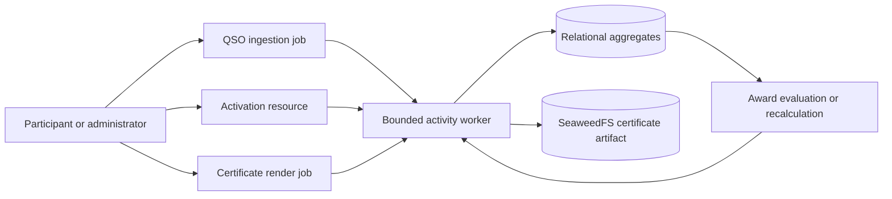

# Activity and award jobs

All job state is exposed through the activity service on port 8004. Workers
retry transient failures with bounded backoff, and every award evaluation uses
the programme-owned rule version attached to the job.
