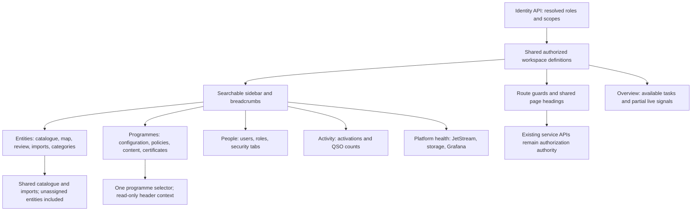

# Administration workspace navigation

Existing URLs stay valid. Category definitions are shared; programme assignments
stay in Programmes. Certificate design is separate from policy schemas. See the
[workspace guide](../../domain/administration/navigation-reorganization.md).
