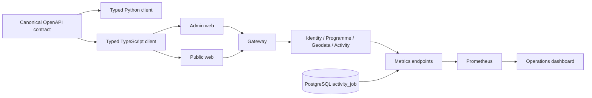

# Phase 4 client and operations flow

The compatibility aliases stay in the service route registries during Phase 4.
Their request counters allow the migration owner to identify remaining callers
before Phase 5 deprecation and removal.
