# Geodata import validation and promotion

This is the safety boundary for file and pasted-data imports. Pre-processing
normalizes and validates the source without making an unreviewed record part of
the public entity catalogue.

```mermaid
flowchart LR
  Source[File or pasted source] --> Intake[Stateless import API]
  Intake --> Session[(Relational upload session and checksummed parts)]
  Source -. 16 MiB resumable parts .-> Seaweed[(SeaweedFS S3 multipart object)]
  Session --> Seaweed
  Seaweed --> Outbox[(Import run + transactional outbox)]
  Outbox --> NATS[NATS JetStream durable subject]
  NATS --> Pre[Separately scaled geodata worker]
  Pre --> Lease[(PostgreSQL import_run lease + heartbeat)]
  Pre --> CancelCheck{Cancellation requested?}
  CancelCheck -->|No| Dedup[Duplicate verification]
  CancelCheck -->|Yes| Cancel[Stop at feature boundary]
  Cancel --> CancelCleanup[Delete staged rows + temporary source]
  CancelCleanup --> Cancelled[Retain summary as CANCELLED]
  Dedup --> Store[(Pre-processed candidate store)]
  Dedup -.-> Warning[Possible duplicate warning]
  Store --> Admin[Visible pre-processing queue]
  Warning -.-> Admin
  Admin --> Validate[Confirmed selection]
  Validate --> Confirm[(Atomic confirmation, job association and outbox)]
  Confirm --> PromoteOutbox[(Promotion outbox event)]
  PromoteOutbox --> PromoteNATS[NATS JetStream durable subject]
  PromoteNATS --> PromoteWorker[Promotion worker + atomic lease]
  PromoteWorker --> Candidate[CANDIDATE entity]
  PromoteWorker --> Approved[APPROVED entity]
  Candidate -->|when missing or geometry changed| LocationOutbox[Location-enrichment outbox request]
  Approved -->|when missing or geometry changed| LocationOutbox
  LocationAdmin[Entity Management retry] --> LocationOutbox
  LocationOutbox --> LocationNATS[NATS location-enrichment subject]
  LocationNATS --> LocationWorker[geodata-location-enrichment-v1 consumer]
  LocationWorker -->|persist only for matching request and geometry hash| LocationDB[(myota_geo PostGIS)]
  LocationWorker --> BDC[BigDataCloud reverse geocoder]
  Candidate --> Review[Geodata Review]
  Admin --> Preview[Candidate name map preview]
  Admin --> Finalize[Mark import as PROCESSED]
  Finalize --> Cleanup[Delete staged candidate and queue rows]
  Cleanup --> Summary[Keep import summary and audit metadata]
  Summary --> Retention{30 days since finalization or activity?}
  Retention -->|No| Summary
  Retention -->|Yes| Expunge[Delete source object and import logs]
  Expunge -.-> Entities[Keep promoted entities and provenance]
  Observer[Read-only operations service] -. metadata only .-> NATS
  Observer -. metadata only .-> PromoteNATS
  Observer --> History[(myota_core sampled history)]
```

The daily retention worker expunges the source object, import history, and
import-specific logs after 30 days. Finalized runs age from `processed_at`;
pending, failed, and stalled runs age from their latest start, completion, or
heartbeat. Active processing remains while its heartbeat advances. The worker
does not delete promoted entities or their provenance.

## Cancelling geodata preprocessing

Before review begins, administrators can idempotently cancel an upload or
preprocessing run with `PUT /v1/geodata/imports/{runId}/cancellation`. Queued
runs become `CANCELLED` immediately. Active runs become `CANCELLING`; the worker
stops at a feature boundary, removes staged candidate rows and temporary source
bytes, and preserves the run summary. A restart finalizes an outstanding
`CANCELLING` run. Reviewable `PREPROCESSED` runs cannot be cancelled.

The upload session stores the authenticated owner, file metadata, declared size,
expiry, object key, S3 multipart id, and each part's size, SHA-256, and ETag.
Retries can replace a part number; completion is accepted only when parts are
contiguous and the object size/checksum/malware gates pass. A daily expiry job
aborts abandoned multipart sessions. The geodata API has no persistent upload
spool volume.

The candidate store is represented by `geodata_import_candidate` in the
geodata PostGIS schema. Duplicate verification compares normalized geometry
with existing entities; identical geometry or a centroid distance under 50
metres adds `POSSIBLE_DUPLICATE` and comparison geometry to the candidate. It
does not automatically merge, reject, or modify an existing entity. The admin
modal shows both geometries on a Leaflet map.

`geodata_import_processing_queue` is the durable projection of the NATS
request. Local Compose and Helm run the same geodata-owned JetStream worker
separately from the API; durable pull consumers use explicit acknowledgements,
bounded redelivery, and PostgreSQL leases. The pre-processing queue remains
separate from Geodata Review until the worker materializes a confirmed record
as an entity. Preprocessing uses durable consumer `geodata-preprocessing-v1`;
promotion uses `geodata-import-processing-v2`. Confirmation, candidate/job
association and dispatch outbox commit together. Entity, candidate result and
audit/outbox changes commit atomically at promotion checkpoints. Queued
candidates cannot be rejected or submitted to another promotion job.
Location enrichment shares the geodata worker image/Deployment but has its own
durable consumer, `geodata-location-enrichment-v1`, on
`myota.geodata.entity.location-enrichment.v1`. It runs after candidate/approved
materialization when metadata is missing, after geometry changes, or after an
administrator releases manual fields. Preprocessing never calls the provider.
The worker looks up the persisted geometry centroid and discards a result if a
newer request or geometry revision exists; explicit manual values and their
codes are not overwritten.
Streaming parser batches and bounded candidate/spatial traversals remain
[scaling roadmap work](../../geodata/horizontal-scaling-roadmap.md); durable
repositories no longer hydrate or rewrite a service-wide snapshot.

Permanent entity deletion is a separate geodata-owned execution path on
`myota.geodata.entity.delete.v1`, consumer `geodata-entity-deletion-v1`, not
part of import validation. It performs the activity impact/cascade workflow
before removing geodata rows and audit history. The
[operations observer](../../operations/messaging/jetstream-admin-status.md) only samples metadata for
these four consumers; it does not receive/ACK business deliveries or change
consumer state. Persistent sampled history is not a per-message audit log.

The target status is chosen only after confirmation. The imports collection
returns candidate counts so the admin page can keep active pre-processing runs
visible while completed runs move to import history. A candidate can later be
reviewed through the normal lifecycle (`CANDIDATE` to `APPROVED` or `REJECTED`),
while an import may use `APPROVED` only when the administrator has the required
review authority.
