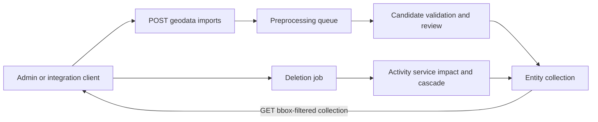

# Geodata resource lifecycle

The legacy action routes are aliases into the same resource handlers and are
marked with deprecation headers. Tile delivery remains separate from the
filtered entity collection.
