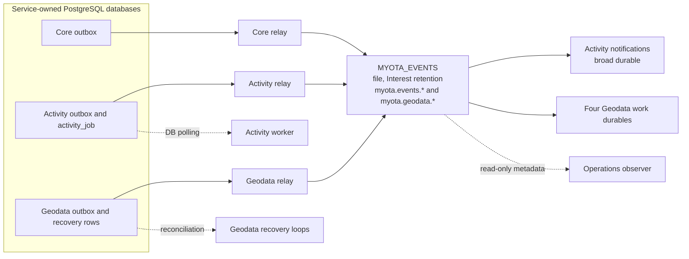
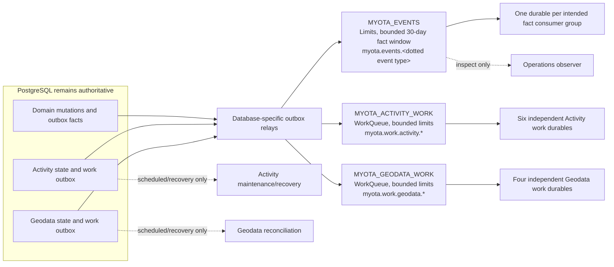

# NATS event and work topology

The diagrams distinguish observed live behavior from the selected target.
They describe ownership and delivery class; they are not evidence that the
target is deployed. See the [migration plan](../../operations/messaging/nats-event-migration-plan.md)
and [Phase 1 evidence](../../operations/messaging/evidence/phase1-contract-topology-2026-10-09.md).

## Current deployed topology — observed 9 October 2026

## Selected target — ADR-0008, not yet live

**Status:** Phase 0 is complete. Phase 1 contract and create-only provisioning
preparation is in progress. No target stream or runtime path has been changed.
