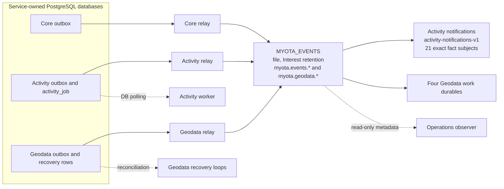
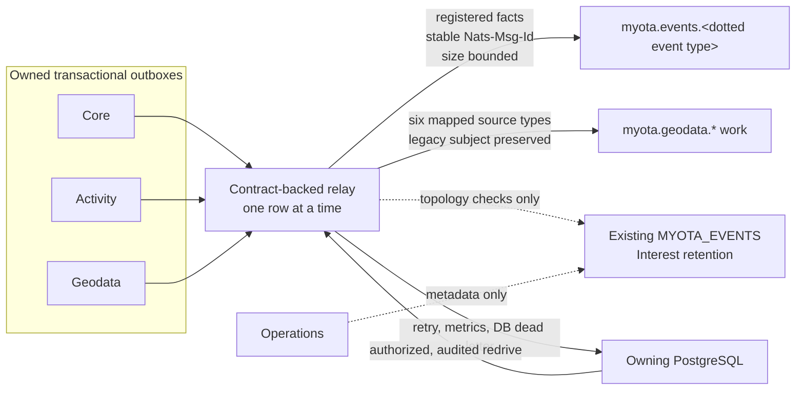
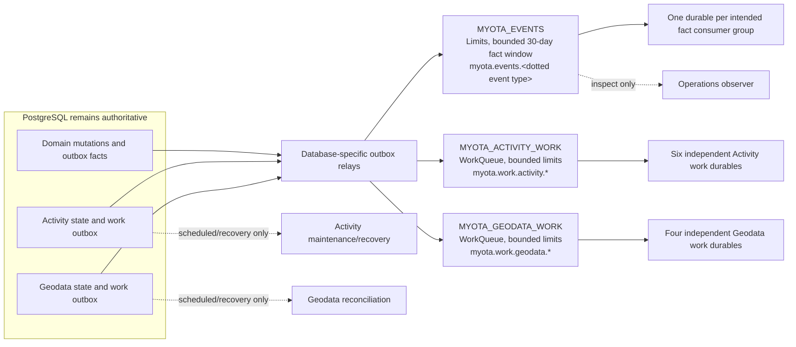

# NATS event and work topology

The diagrams distinguish observed live behavior from the selected target.
They describe ownership and delivery class; they are not evidence that the
target is deployed. See the [migration plan](../../operations/messaging/nats-event-migration-plan.md),
[joint review](../../operations/messaging/evidence/phase1-joint-review-2026-10-10.md),
[Phase 1 evidence](../../operations/messaging/evidence/phase1-contract-topology-2026-10-09.md), and the [recovery runbook](../../operations/messaging/jetstream-recovery.md).

## Current deployed topology — observed 10 October 2026

## Phase 2 relay behavior — deployed 10 October 2026

The relay mapping passed isolated checks and is now deployed to the local K3s
cluster. The stream and durable configuration remains the observed mixed legacy
topology above. This flow does not claim consumer or work-stream cutover.

## Phase 4 Activity work qualification — isolated, not yet live

The Activity command source, six durable filters, migration/backfill, retries,
lease fencing, dead-letter persistence, and redrive were exercised in a
separate disposable K3s namespace. The production Activity worker remains the
DB-polling path until the ordered drain and migration gate passes. The old
claim index and synthetic notification-job rows are retired only by migration
007 after that gate. See the [Phase 4 evidence](../../operations/messaging/evidence/phase4-activity-work-2026-10-10.md)
and [work queue runbook](../../operations/messaging/activity-work-queues.md).

## Selected target — ADR-0008, not yet live

**Status (10 October 2026):** Phases 0–3 are complete within their evidence
bounds. Phase 4 Activity code, schema retirement, and disposable PostgreSQL and
JetStream checks are complete. Production still uses the DB-polling Activity
worker; the target `MYOTA_ACTIVITY_WORK` stream is absent, the Activity claim
index is present, and the guarded production backfill/worker rollout remain
open. A read-only production query found no selected Activity work jobs, no
running jobs, and 154 already-succeeded synthetic notification jobs. Helm
revision 173 is deployed and the MyOTA Fleet bundle is Ready. The mixed
Interest-retained fact stream, its Activity notification durable, and four
Geodata work durables remain unchanged. Phase 5 Geodata work migration, payload
privacy/schema enforcement, and the final mixed-stream cutover remain separate
gates. The accepted cluster-internal trust boundary and deferred off-node
recovery remain as recorded in ADR-0008. See the [Phase 4 evidence](../../operations/messaging/evidence/phase4-activity-work-2026-10-10.md),
[Activity work queues runbook](../../operations/messaging/activity-work-queues.md),
and [Phase 3 evidence](../../operations/messaging/evidence/phase3-domain-consumers-2026-10-10.md).
