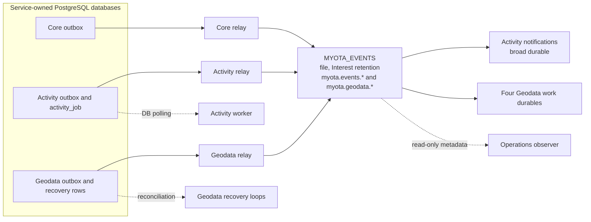
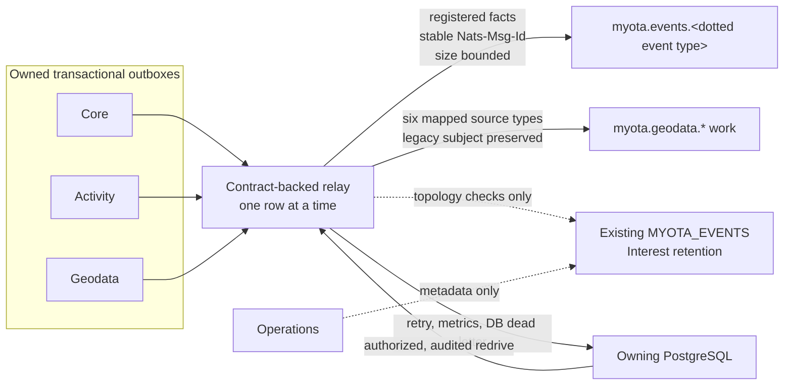
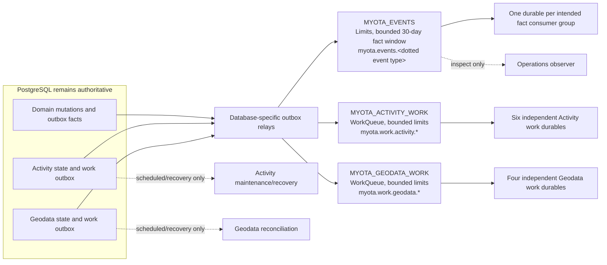

# NATS event and work topology

The diagrams distinguish observed live behavior from the selected target.
They describe ownership and delivery class; they are not evidence that the
target is deployed. See the [migration plan](../../operations/messaging/nats-event-migration-plan.md),
[joint review](../../operations/messaging/evidence/phase1-joint-review-2026-10-10.md),
[Phase 1 evidence](../../operations/messaging/evidence/phase1-contract-topology-2026-10-09.md), and the [recovery runbook](../../operations/messaging/jetstream-recovery.md).

## Current deployed topology — observed 10 October 2026

## Phase 2 relay source behavior — isolated verification

This records the relay implementation that passed isolated tests. The live
topology above was inspected separately; this flow does not claim a production
cutover.

## Selected target — ADR-0008, not yet live

**Status (10 October 2026):** Phases 0 and 1 contract/topology work and Phase 2
relay hardening/source coverage are complete within their evidence bounds.
The 68 fact schemas and ten selected work commands are registered; contract CI
checks their schema/disposition coverage and exact work-to-durable mapping. The
create-only provisioner and its drift checks passed focused and isolated tests.
The workspace owner accepted a cluster-internal NATS trust boundary without
authentication or TLS. The live NATS service is ClusterIP-only on port 4222;
the `myota` namespace has no NetworkPolicy, so any pod with network reachability
is trusted. Do not expose NATS outside the cluster. Provisional capacity,
restore/replay policy, and provisioner ownership are decisions, not production
qualification. The source relay now enforces registry routing, size bounds,
stable IDs, retries, dead-letter recovery, and metrics while validating legacy
topology read-only. The target streams and consumer/work paths have not been cut
over. Geodata payload minimization, schema/privacy enforcement, representative
full-window sizing, off-node/PVC-loss restore qualification, and production
compatibility transition remain open. See the recovery runbook and
[Phase 2 evidence](../../operations/messaging/evidence/phase2-relay-hardening-2026-10-10.md).
