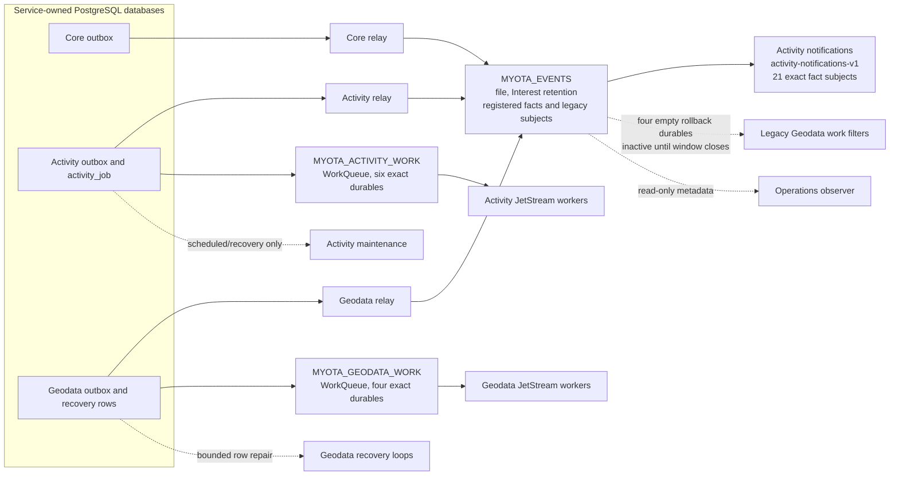
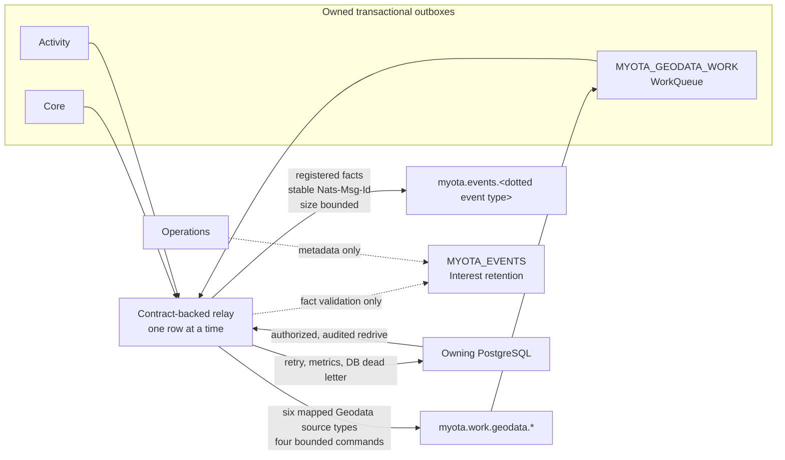
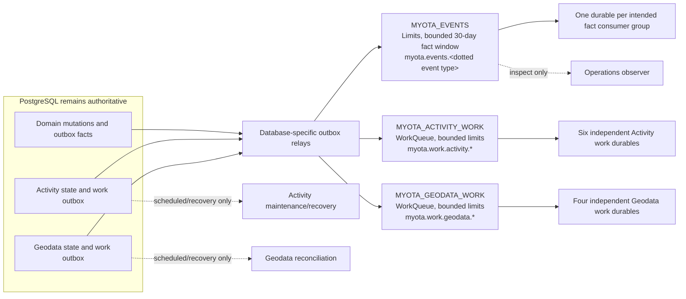

# NATS event and work topology

The diagrams distinguish observed live behavior from the selected target.
They describe ownership and delivery class; they are not evidence that the
target is deployed. See the [migration plan](../../operations/messaging/nats-event-migration-plan.md),
[joint review](../../operations/messaging/evidence/phase1-joint-review-2026-10-10.md),
[Phase 1 evidence](../../operations/messaging/evidence/phase1-contract-topology-2026-10-09.md), and the [recovery runbook](../../operations/messaging/jetstream-recovery.md).

## Current deployed topology — observed 10 October 2026 after Phase 5 cutover

## Phase 2 relay behavior — deployed 10 October 2026

The relay mapping is deployed to the local K3s cluster. Facts still publish to
the Interest-retained shared stream; mapped Activity and Geodata work commands
publish once to their disjoint WorkQueue streams. This Phase 2 view documents
the relay path; consumer cutover status is shown in the current-topology diagram.

## Phase 4 Activity work — live in production

The production `MYOTA_ACTIVITY_WORK` stream uses WorkQueue retention and the
six exact pull durables. Two Activity workers subscribe to them; the obsolete
`activity_job_claim_idx` and synthetic `NOTIFICATION_SEND` jobs were retired by
migration 007. `activity_job` remains the status, history, and recovery source
of truth. The production backlog was zero at cutover, so live handler execution
is not claimed; isolated PostgreSQL/JetStream qualification processed all six
registered command types. See the [Phase 4 evidence](../../operations/messaging/evidence/phase4-activity-work-2026-10-10.md)
and [work queue runbook](../../operations/messaging/activity-work-queues.md).

## Remaining target — ADR-0008; Geodata/Activity work streams are live

**Status (10 October 2026):** Phases 0–4 are complete within their evidence
bounds. Phase 5 has deployed the Geodata WorkQueue, four exact durables,
migration 021 and retry-safe partial-deletion handling. Helm revision 189 is
deployed and Fleet reports Ready=True with 60/60 resources. The four old
Geodata durables are inactive and empty during the rollback observation; remove
them only after the 24-hour window and database recovery check. A disposable
two-database retry test completed after NAK/redelivery with one Activity
cascade fact. The corrected Activity idempotency source is committed and
mirrored, but its new image is not yet deployed. Production Geodata queues had
no work to process. `MYOTA_EVENTS` remains file-backed with Interest retention
and its Activity notification durable remains active. The target bounded Limits fact stream and
Phase 6 lifecycle transition are not live. The accepted cluster-internal trust
boundary and deferred off-node recovery remain as recorded in ADR-0008. See the
[Phase 5 evidence](../../operations/messaging/evidence/phase5-geodata-work-2026-10-10.md),
[Phase 4 evidence](../../operations/messaging/evidence/phase4-activity-work-2026-10-10.md),
[Activity work queues runbook](../../operations/messaging/activity-work-queues.md),
and [Phase 3 evidence](../../operations/messaging/evidence/phase3-domain-consumers-2026-10-10.md).
