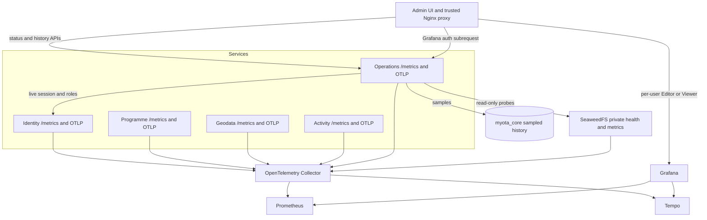

# Observability architecture

The collector is the single operational collection boundary. Business facts
remain service-owned; observability infrastructure does not become a new
source of truth.

The [JetStream admin page](../../operations/messaging/jetstream-admin-status.md) reads protected APIs
from the operations service. Broker snapshots are recorded in its control-plane
table; business-domain workers remain separate. The operations service is an
observer, never a consumer, ACK source, queue executor or message archive.
