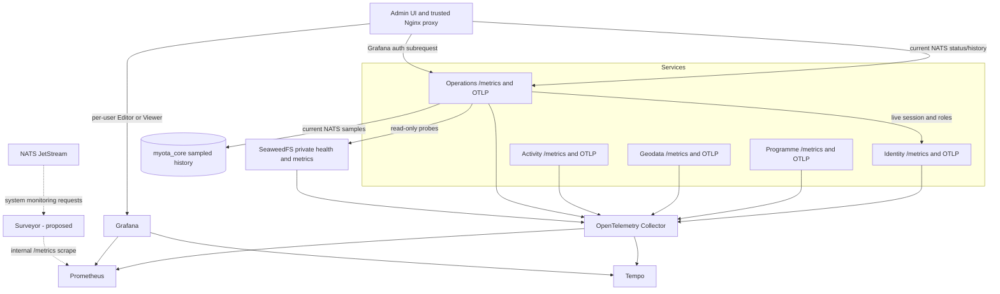

# Observability architecture

The collector is the operational collection boundary for service telemetry.
The solid NATS-to-Operations history path is the current implementation; the
dashed Surveyor-to-Prometheus path is proposed and not deployed. After its
acceptance gates pass, Surveyor will replace broker-metadata polling while
Operations remains for SeaweedFS and Grafana identity integration. See the
[NATS monitoring consolidation plan](../../observability/nats-surveyor-migration.md)
and the [current legacy NATS status page](../../operations/messaging/jetstream-admin-status.md).
