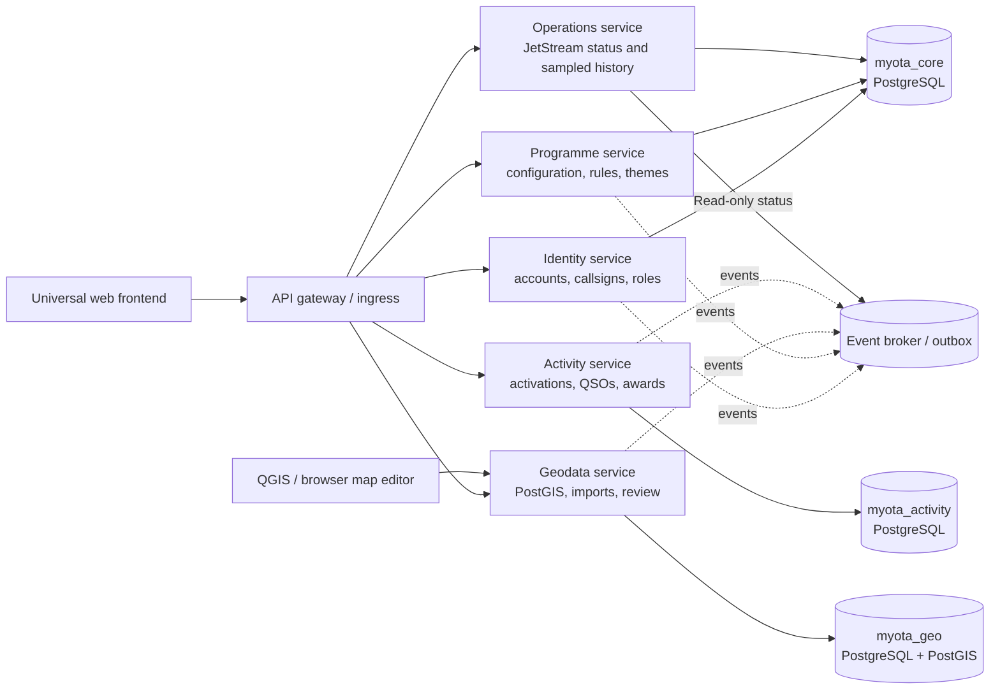
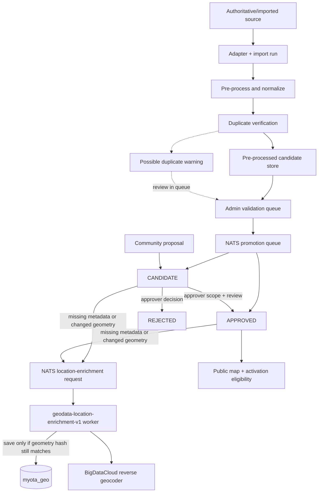
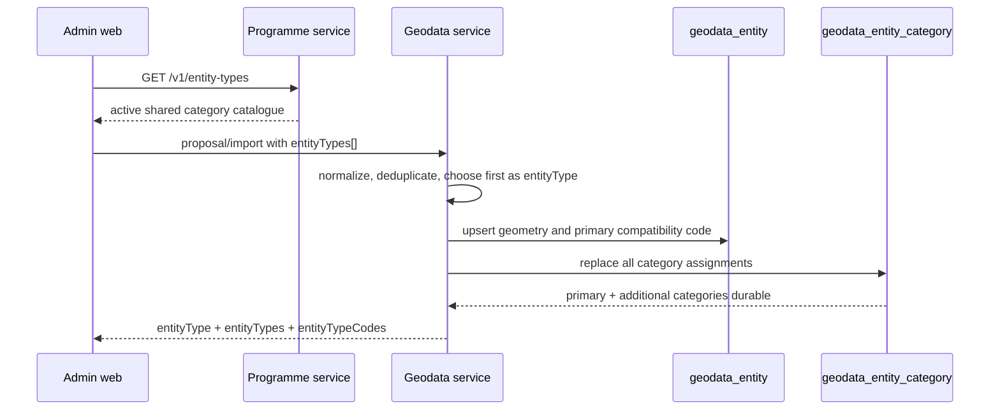

# MyOTA platform architecture

Editable Mermaid views are maintained in [`diagrams/service-boundaries.md`](diagrams/service-boundaries.md), [`diagrams/programme-configuration-lifecycle.md`](diagrams/programme-configuration-lifecycle.md), and [`diagrams/data-model.md`](diagrams/data-model.md). This document remains the narrative architecture reference; the diagrams intentionally show the major ownership and lifecycle relationships without replacing detailed API or migration documentation.

The current versus selected NATS event/work topology is kept separately in the
[NATS migration diagram](diagrams/nats-event-migration.md). Phase 0 is complete;
Phase 1 contract/provisioning preparation is in progress. The selected target is
not deployed.

## Scope

MyOTA is an Outdoor Activation Platform. A programme is configuration and policy data consumed by platform capabilities. MPOTA is only an optional programme-configuration example; entity seed data is no longer replayed. Future programmes use the same APIs without cloning a codebase. The platform does not copy, inherit or silently normalize another programme's charter, rules, minimum QSOs, award logic or eligibility policy. Those are programme-owned inputs, versioned and auditable as configuration or programme code.

The product motivation and working charter are documented in
[`project-charter.md`](../governance/project-charter.md). The current architecture is a
meaningful local vertical slice, not a claim that the participant experience,
community governance, public Explorer, or Internet-facing operational gates
are complete; see [`charter-gap-analysis.md`](../governance/charter-gap-analysis.md).

## Service boundaries

Cross-cutting time semantics follow the [UTC policy](../platform/utc-time-policy.md): all
operational date-times, QSO/activation timestamps, publication effective dates,
audit/events and observability use UTC. Browser/server local timezone must not
change an instant; programme configuration does not override operational time.
Existing database timestamps are not rewritten when applying this convention.



The deployment has three database containers/targets. `myota_core` is the
control plane for identity, programmes and shared configuration;
`myota_activity` owns activations, normalized QSOs, aggregates, awards and
execution workers; and `myota_geo` owns spatial entities and import/review
processing. Core and activity use plain PostgreSQL. PostGIS is installed only
where spatial indexes, geometry validation, conflation and QGIS integration
require it: `myota_geo`.

Each service owns its database tables and writes outbox events in its database.
Three database-specific relays publish from core, activity, and geodata. No
service reads another service's tables. The gateway/ingress is a routing
boundary, not a domain owner. The current NATS stream still mixes facts and
Geodata work with Interest retention; the selected bounded fact/work split is
recorded in [ADR-0008](decisions/0008-nats-jetstream-event-and-work-topology.md)
and remains unimplemented.

The operations service owns timestamped broker samples in the control-plane
database; domain workers still consume their own queues. Its
[authenticated JetStream page/API](../operations/messaging/jetstream-admin-status.md) is read-only.
Geodata now uses [database-authoritative, request-scoped row repositories](../geodata/phase1-relational-authority.md),
with transactionally coupled entity/candidate/audit writes and a write-fenced
rollout. This closes Phase 1 correctness, not the remaining scalability gates.

### Authenticated observability

Prometheus, Alertmanager, Tempo and the OpenTelemetry Collector are exposed as
cluster-internal Services only. Grafana is reverse-proxied at
`/observability/` by the Admin UI web server, not by a separate public
IngressRoute. The Vue UI mirrors its short-lived MyOTA access token into a
path-limited, SameSite=Strict cookie; the proxy sends that token to the identity
API through an Nginx `auth_request` check for every Grafana request. Grafana
anonymous access and its own login form are disabled, and successful proxy
authentication maps to a read-only Viewer. Prometheus, Alertmanager and Tempo
are only reached through Grafana's server-side data sources. See the
[operations guide](../operations/runbooks.md#rancher-fleet-on-k3s) for deployment and
storage details.

Activity execution and award management are one bounded service and one API
deployment. Locally, both route families are exposed on port `8004`; award
paths remain distinct (`/v1/awards`) but do not create a second service or
port. The activity service owns normalized activation, QSO, aggregate, award,
import, correction, job, statistic and notification tables. It does not use
the generic JSONB `service_state` projection in durable mode. Activity and
award writes use bounded psycopg pools and transaction-local idempotency.

Geodata uses the same compatibility snapshot during the migration period, but
the authoritative entity catalogue is also upserted into the PostGIS-owned
`geodata_entity`, `geodata_entity_category`, `source_reference`, and review
tables. Manual candidates and their lifecycle changes therefore remain durable
independently of the JSON snapshot and are visible to QGIS. Hydration merges
relational-only entities and overlays category assignments onto legacy
snapshot entities; only an explicit API deletion removes a relational entity.

The service exposes two ingestion paths: ordinary idempotent QSO writes and a
PostgreSQL `COPY` staging path for batches and ADIF worker output. Distinct
subject/callsign/entity membership tables support precomputed activator and
hunter facts, while `activity_award_progress` stores a versioned evaluation
for historical award definitions. Reads never scan the full QSO table to
render participant progress.

The API deployment is stateless and horizontally scalable. Helm defaults to
three activity replicas; `activity_worker` handles ADIF parsing, award-rule
recalculation, PDF rendering, statistics and notification delivery, while the
notification consumer translates geodata and identity events into participant
notices. It uses the shared durable pull consumer
`activity-notifications-pull-v1` with explicit acknowledgements and bounded
pending deliveries; replica overlap during deployment is supported. Its
database deduplication identity stays `activity-notifications` across the
transition from the old push consumer. Each workload has its own bounded
database pool.

Object storage is split into purpose-specific buckets on the same S3-compatible
SeaweedFS (or configured provider) endpoint: `myota-geodata-imports` for source
imports, `myota-adif` for submitted logs, `myota-award-assets` for editable
award backgrounds, `myota-award-signatures` for manager signatures, and
`myota-certificates` for generated issued certificates. These are separate
retention/access-policy boundaries, not separate storage clusters. The activity
API selects the background/signature bucket from asset kind; issued PDFs are
written only to the certificate bucket. Local Compose and Helm expose each
bucket as independent configuration. Award metadata and immutable issuance
render specifications remain in the activity service so object storage can be
replaced without changing the API. Geodata import retention applies only to
the geodata-import bucket. A separate activity-owned 15-day policy removes
source objects for completed and failed ADIF imports while retaining their
import results in PostgreSQL; queued and processing uploads are excluded.
Neither policy applies to award assets, signatures, or issued certificates.

## Geodata lifecycle



The UI distinguishes the **pre-processing queue** from **Geodata Review**. An
import run first reaches `QUEUED`, `PROCESSING`, and then `PREPROCESSED` (or
`PREPROCESSED_WITH_ERRORS`); its normalized records are stored as
`geodata_import_candidate` rows and are not entities or programme references
yet. Pre-processing isolates failures per feature: successfully normalized
records remain staged for validation, while failed feature indexes and messages
are retained in the run summary and only those records are omitted from the
candidate queue. During pre-processing each record is
checked against existing entity geometry. Identical geometry or a centroid
distance below 50 metres produces `dedupeWarning=POSSIBLE_DUPLICATE` and
comparison geometry/details. This warning is deliberately non-blocking: an
administrator reviews it in the import queue's map modal and decides whether
to confirm, reject, or leave the record pending. The admin imports page keeps
these runs in a visible pre-processing queue, separate from completed import
history and Geodata Review.

Candidate provenance records whether the record came from an `ADAPTER_IMPORT`
(with adapter/import-run identifiers) or a `COMMUNITY_PROPOSAL` (with
proposal/proposer identifiers). After selection and confirmation, the admin
publishes a durable NATS processing request. Only that queue worker materializes
the selected record as `CANDIDATE` or authorized `APPROVED`; a resulting
`CANDIDATE` then enters normal Geodata Review. Import refreshes update source
provenance and geometry while preserving review state; an explicit policy can
retire records that disappear from an authoritative source. Supported GeoJSON
geometry types are `Point`, `LineString`, `MultiLineString`, `Polygon`, and
`MultiPolygon`; trails/routes commonly use `LineString` (called a `way` in the
administration UI). The importer also accepts the non-standard `way` geometry
alias and normalizes it to `LineString`. Entity categories such as
`MUNICIPAL_PARK` and `TRAIL` are shared master-data definitions that can be
assigned to multiple programmes and can allow more than one geometry type;
review changes are made through the geodata API and recorded in entity history.

## Import adapters

The adapter interface is a normalized feature stream:

```text
discover(source_config) -> source snapshot metadata
read(snapshot) -> {source_record_id, name, geometry, properties, license}
normalize(feature) -> canonical geometry/properties
conflate(feature, existing) -> match candidates + score
apply(feature, policy) -> candidate/update/retire
```

Required adapters are represented in the contract and storage model: `PARKSERVE_US`, `OSM`, `GOVERNMENT_GIS`, and `MANUAL`. Intake accepts GeoJSON, KML, GPX, WFS/ArcGIS GeoJSON, Shapefile archives (`.shp` with `.shx`/`.dbf` sidecars), OSM PBF, and ParkServe US binary payloads. ParkServe and government feeds remain source-specific integrations; OSM imports preserve ODbL attribution and retrieval metadata. Manual community proposals use the same entity/review path and do not bypass approval. They are a candidate source alongside adapter/import runs, not a separate lifecycle state. Dataset imports select one or more shared Master data categories and are programme-independent. File and pasted imports first create durable `geodata_import_candidate` records and stop at `PREPROCESSED` or `PREPROCESSED_WITH_ERRORS`; duplicate verification is part of this step, not a silent merge. A feature-level preprocessing failure does not discard the rest of the import: valid records remain pending and failed indexes/messages remain in the run summary. An administrator validates a paged selection in the separate pre-processing queue, then publishes a processing request to the `myota.geodata.import.process.v1` NATS subject with target `CANDIDATE` or `APPROVED`. Only that worker creates or updates `geodata_entity`; programme assignment is handled separately.

The import safety boundary is explicit in both the API and schema. `GET
/v1/geodata/imports` returns import-run status plus pending, confirmed,
processed, and rejected candidate counts for the visible pre-processing queue.
`GET /v1/geodata/imports/{runId}/candidates` returns compact pages of pending
records only. Confirmed, rejected, and processed staging records are omitted
from the detail queue; rejected records are deleted immediately and successful
promotion deletes the staged record. `POST .../candidates/validate` remains
available for explicit administrator confirmation or rejection. The import UI
uses `POST /v1/geodata/imports/{runId}/process` to create a durable
processing-queue record
and an outbox event. Local development uses the same bounded worker as a
fallback; production NATS consumers use the event payload and are idempotent.
Pending or confirmed records may be promoted directly, and the selected target
is restricted to `CANDIDATE` or `APPROVED`. The PostGIS geometry and full normalized
payload remain available for validation without exposing an unconfirmed record
as a live entity.

Preprocessing cancellation is an idempotent resource operation:
`PUT /v1/geodata/imports/{runId}/cancellation`. A queued or upload-pending run
transitions directly to `CANCELLED`; a claimed worker transitions through
`CANCELLING` and observes the durable status at safe feature checkpoints.
Cancellation deletes staged candidate rows and temporary source bytes but
retains the import summary for history/retention. The route returns 202 while
an active worker is stopping and 200 after immediate or previously completed
cancellation. Runs already in the reviewable `PREPROCESSED` states are outside
the cancellation window.

The row repository is the only writer of cancellation timestamps and lifecycle
fields. Finalization reloads the authoritative row and holds its lock through
staged-record deletion and persistence, preventing timestamp conflicts and
stale worker changes from overwriting the cancellation request.

After validation and any desired promotion, an administrator can finalize the
run with `POST /v1/geodata/imports/{runId}/processed`. This is an explicit,
idempotent cleanup action: it deletes that run's staged candidate rows and
promotion-queue rows, records the actor and timestamp, changes the run to
`PROCESSED`, and preserves the top-level import summary for audit and history.
It does not delete entities that were already materialized by the promotion
worker. The import UI hides the validation queue after finalization and keeps
only that summary.

Import execution is restart-safe and no longer runs in API pod executors in
durable deployments. The geodata API persists the import row and outbox event;
the outbox relay publishes a versioned preprocessing subject to JetStream.
The geodata-owned worker uses durable pull consumers with explicit ack, bounded
pending deliveries, bounded redelivery, a PostgreSQL execution lease, and a
heartbeat while parsing. Promotion uses a separate durable consumer and queue
lease. Duplicate delivery is safe: import runs are claimed atomically and
promotion candidates retain a stable planned entity ID and processed marker
until finalization. Location enrichment uses a fourth durable consumer and does
not block preprocessing or the entity-write request. It checks a request ID and
geometry hash both before and after the provider call; a stale response is
discarded, and manually managed fields/codes are preserved. See the
[location-enrichment lifecycle](../geodata/location-enrichment.md). The migration
also creates recovery events for pre-existing queued/processing runs and
promotion queues. The default lease is 15 minutes; operators can tune it with
`MYOTA_IMPORT_LEASE_SECONDS` and the heartbeat interval with
`MYOTA_IMPORT_HEARTBEAT_SECONDS`. The current decoder still
materializes a source document and catalogue compatibility state in worker
memory; truly streaming feature batches and multi-replica data-state
reconciliation remain explicit open work in the horizontal-scaling roadmap.

The shared `MYOTA_EVENTS` JetStream stream uses Interest retention rather than
acting as an event archive. The outbox relay provisions the Activity durable
and all four geodata work durables before publishing; messages remain until
every matching consumer acknowledges them, then are removed. Explicit geodata
subjects are allow-listed to those queues. A 30-day `max_age` remains a safety
bound for stalled, unconsumed work; service-owned PostgreSQL remains the
durable recovery source. See [JetStream retention and rollout
operations](../operations/runbooks.md#jetstream-event-retention).

### Shared category selection and persistence



The browser never owns the category catalogue. The first category in the
ordered request is retained as the singular compatibility value, while
`geodata_entity_category` is authoritative for the complete assignment. The
same relation supports entities with no programme assignment and categories
assigned to several programmes.

The administration web has a dedicated Geodata imports page. It loads every category from the database-backed shared `/v1/entity-types` catalogue rather than a programme-scoped or hardcoded list. It supports copy/paste for text documents and file upload for binary or text documents, including an explicit OpenStreetMap GeoJSON option that routes GeoJSON through the OSM tag adapter. Browser file uploads use owner-bound resumable sessions (`/v1/geodata/import-uploads`), backed by SeaweedFS S3 multipart objects and relational session/part records; the browser sends independently retryable 16 MiB parts rather than one 1 GiB request. Session creation is idempotent, each part is SHA-256 checked, the completed object is size/checksum/malware checked, and a daily worker aborts expired multipart sessions. The accepted source object and import row are durable before a JetStream outbox event is published. No shared upload-spool PVC or pod-local path is part of the accepted-file handoff. The legacy single-request file endpoint is deprecated and rejected when durable storage is enabled; pasted JSON remains a separate API request path. GeoJSON, KML, GPX and Shapefile decoding is performed by a separately deployable geodata-owned worker, while OSM PBF and ParkServe binary records remain visibly queued for their source adapters. During pre-processing, each normalized record is checked against existing entity geometry; identical geometry or a centroid distance below 50 metres produces a `POSSIBLE_DUPLICATE` warning with comparison geometry, while the administrator retains the final decision. The imports collection exposes pending/confirmed/processed candidate counts, allowing the admin web to display a dedicated pre-processing queue before records are explicitly promoted into Geodata Review. Compose and Helm use the same geodata image in separate API, retention, and JetStream worker processes; the worker scales independently from HTTP API replicas. Production Helm can use the optional single-node SeaweedFS chart or an externally operated S3-compatible endpoint.

Import normalization also derives a canonical display name before a record enters the preprocessing queue. An explicit `name` wins, followed by common source aliases such as `SITE_NAME`, `official_name`, `NOMBRE`, `DENOMINACION`, `title`, and `label`; source codes, identifiers, geometry fields, and administrative metadata are excluded from name inference. The original property map remains unchanged in provenance, so the derived `name` is a review-friendly projection rather than a loss of source data. Records without a usable alias retain the `Unnamed candidate` fallback.

The administration web also provides a read-only **Entity map** page. It loads
the complete paged entity catalogue, renders all geometries in Leaflet with
lifecycle-specific colours, clusters entity location markers with
Leaflet.markercluster, and opens a popup containing the entity name, location
metadata, shared categories, and derived programme memberships. Line and
polygon geometries remain visible as selectable overlays. The page is
intentionally separate from Geodata Review: it never enables geometry editing
or changes review state. Programme membership is derived from explicit
entity assignment when present and from the shared category assignments held by
the programme service, so unassigned entities remain visible.

## Security and operations

- Short-lived access tokens are verified at the gateway; the identity service issues radio-native claims (`account_id`, participation type, verified callsigns, scopes).
- OAuth/OIDC is optional per programme configuration and is never the identity source of truth. External subject mappings point to an internal account.
- Approver authorization is scope-based: programme + jurisdiction + entity type. Review mutations require an approver scope and are audit events. Shared category changes and display-name corrections are allowed for platform-wide entities as well as programme-assigned entities and preserve the previous value in audit history. Global and GIS administrators may convert point/way/polygon geometry with an audit record. GIS administrators may permanently delete rejected entities; a global administrator may delete any status. The global deletion workflow first calculates impact in the activity service, deletes linked valid QSOs, rebuilds aggregates and queues award recalculation, then removes the entity, conflation links and its audit record.
- The admin review queue is catalogue-driven rather than viewport-driven. Programme (including unassigned entities), entity type, continent, country, region/subdivision, province, city/municipality, and multi-select lifecycle status filters are applied by geodata before deterministic pagination. The map renders the current page and remains independently pannable/zoomable; selecting a result centres it without changing the queue.
- Every mutation accepts `Idempotency-Key`; service outboxes make event publication retry-safe.
- Confirmed entity deletion is owned by geodata and cascades through activity
  before entity/audit removal. JetStream delivery is backed by a periodic
  database reconciliation pass for queued or lease-expired deletion jobs, so
  broker acknowledgement/checkpoint state cannot silently strand a deletion.
- Rate limits apply at gateway, with stricter limits for import and proposal endpoints.
- JSON logs carry request, correlation, actor and programme IDs. Health/readiness endpoints are available per service.

## Activity execution boundary

Activation start/close captures a programme-rule snapshot and evaluates
validity windows, location requirements, operator/callsign authorization,
minimum QSOs, band/mode rules and correction state. Programme policy remains
owned by the programme service; the snapshot is retained so a later policy
change cannot silently rewrite a historical activation decision.

ADIF uploads are stored as objects after size and malware gates, then processed
as durable jobs. Parsing and normalization are separate from programme policy:
the worker validates callsign, timestamp, band, mode and worked-station
identity before the activity repository applies deduplication and aggregate
updates. Corrections are proposed and reviewed rather than mutating history
without an audit trail.
