# MyOTA logical data model

This is the logical model for the current vertical slice and planned
programme-configuration completion work. It shows the important aggregates,
not every audit, outbox, job, or index table. The service boundary is more
important than a single physical database: cross-service links such as
`entity_id`, `programme_slug`, and `subject_id` are API-level references.

```mermaid
erDiagram
  ACCOUNT ||--o{ CALLSIGN : owns
  ACCOUNT ||--o| ACCOUNT_PRIMARY_CALLSIGN : selects
  CALLSIGN ||--o| ACCOUNT_PRIMARY_CALLSIGN : is_primary
  ACCOUNT ||--o{ ACCOUNT_ROLE : receives
  ACCOUNT ||--o{ APPROVER_SCOPE : receives

  PROGRAMME ||--o{ PROGRAMME_RULE : versions
  PROGRAMME ||--o{ PROGRAMME_POLICY_VERSION : publishes
  PROGRAMME ||--o{ JURISDICTION : defines
  JURISDICTION ||--o{ JURISDICTION : contains
  PROGRAMME ||--o{ OIDC_PROVIDER_MAPPING : enables
  PROGRAMME ||--o{ ACCOUNT_ROLE : scopes
  PROGRAMME ||--o{ APPROVER_SCOPE : scopes

  ENTITY_CATEGORY ||--o{ GEODATA_ENTITY_CATEGORY : classifies
  GEODATA_ENTITY ||--o{ GEODATA_ENTITY_CATEGORY : has
  GEODATA_ENTITY ||--o{ SOURCE_REFERENCE : has
  GEODATA_ENTITY ||--o{ ENTITY_REVIEW : receives
  GEODATA_ENTITY ||--o{ CONFLATION_CANDIDATE : participates
  IMPORT_RUN ||--o{ SOURCE_REFERENCE : produces

  PROGRAMME ||--o{ ACTIVITY_ACTIVATION : governs
  GEODATA_ENTITY ||--o{ ACTIVITY_ACTIVATION : is_activated
  ACCOUNT ||--o{ ACTIVITY_ACTIVATION : operates
  ACTIVITY_ACTIVATION ||--o{ ACTIVITY_QSO : contains
  ACTIVITY_QSO ||--o{ QSO_CORRECTION : may_have
  ACCOUNT ||--o{ ACTIVITY_QSO : hunts
  ACTIVITY_ACTIVATION ||--o{ ACTIVITY_IMPORT : receives

  PROGRAMME ||--o{ AWARD_DEFINITION : owns
  AWARD_DEFINITION ||--o{ AWARD_RULE : versions
  AWARD_DEFINITION ||--o{ AWARD_PROGRESS : calculates
  AWARD_DEFINITION ||--o{ AWARD_REQUEST : requested
  AWARD_REQUEST ||--o| AWARD_ISSUANCE : produces
  ACCOUNT ||--o{ AWARD_PROGRESS : earns

  ACCOUNT {
    uuid id PK
    text display_name
    text participation_type
    text status
  }
  CALLSIGN {
    uuid id PK
    uuid account_id FK
    text value
    text lifecycle_status
  }
  PROGRAMME {
    uuid id PK
    text slug UK
    text name
    jsonb config
    jsonb theme
    text status
  }
  PROGRAMME_RULE {
    uuid id PK
    uuid programme_id FK
    int version
    text rule_code
    jsonb configuration
    timestamptz effective_from
  }
  JURISDICTION {
    uuid id PK
    uuid programme_id FK
    text code
    uuid parent_id FK
  }
  ENTITY_CATEGORY {
    uuid id PK
    text code UK
    text label
    text geometry_types
    boolean active
  }
  GEODATA_ENTITY {
    uuid id PK
    text name
    geometry geom
    text lifecycle_status
    jsonb location_metadata
  }
  GEODATA_ENTITY_CATEGORY {
    uuid entity_id FK
    uuid category_id FK
    boolean is_primary
  }
  SOURCE_REFERENCE {
    uuid id PK
    uuid entity_id FK
    text adapter_code
    text source_record_id
    text license
  }
  ENTITY_REVIEW {
    uuid id PK
    uuid entity_id FK
    text decision
    text review_note
    timestamptz reviewed_at
  }
  IMPORT_RUN {
    uuid id PK
    text adapter_code
    text source_key
    text status
  }
  ACTIVITY_ACTIVATION {
    uuid id PK
    text programme_slug
    text entity_id
    text operator_id
    timestamptz started_at
    text status
  }
  ACTIVITY_QSO {
    uuid id PK
    uuid activation_id FK
    text programme_slug
    text operator_id
    text hunter_id
    text worked_callsign
    timestamptz occurred_at
    text deduplication_key UK
  }
  QSO_CORRECTION {
    uuid id PK
    uuid qso_id FK
    text status
    jsonb proposed_values
  }
  ACTIVITY_IMPORT {
    uuid id PK
    uuid activation_id FK
    text object_key
    text malware_status
    text status
  }
  AWARD_DEFINITION {
    uuid id PK
    text programme_slug
    text code
    int version
    text status
  }
  AWARD_RULE {
    uuid id PK
    uuid award_id FK
    int version
    jsonb configuration
  }
  AWARD_PROGRESS {
    uuid award_id FK
    int award_version
    text subject_id
    text category
    jsonb evaluation
  }
  AWARD_REQUEST {
    uuid id PK
    uuid award_id FK
    text subject_id
    text level_id
    text status
  }
  AWARD_ISSUANCE {
    uuid id PK
    uuid request_id FK
    text subject_id
    jsonb issuance
  }
  ACCOUNT_ROLE {
    uuid id PK
    uuid account_id FK
    uuid programme_id FK
    text role_code
    jsonb scopes
  }
  APPROVER_SCOPE {
    uuid id PK
    uuid account_id FK
    uuid programme_id FK
    uuid jurisdiction_id FK
    text entity_type_code
  }
  OIDC_PROVIDER_MAPPING {
    uuid id PK
    uuid programme_id FK
    text issuer
    text client_id
    boolean enabled
  }
```

## Important modelling decisions

- Categories are shared master data. `GEODATA_ENTITY_CATEGORY` is the
  authoritative many-to-many assignment; the first/primary category is kept
  only as a compatibility projection for older APIs.
- A geodata entity may exist without programme assignment. Programme
  eligibility is evaluated separately from import and review, even where the
  bootstrap retains compatibility programme columns.
- `ACTIVITY_ACTIVATION` and `ACTIVITY_QSO` retain the programme rule context
  used at execution time. This prevents later programme edits from silently
  changing historical decisions.
- Award definitions and rules are owned by activity, while their programme
  reference is required. Progress is versioned by award definition version;
  issuance records are permanent even if an award is later retired.
- Aggregate tables such as subject progress, statistics, and award progress
  are derived from durable activity records by reproducible jobs. They are not
  substitutes for the QSO or audit history.
- Audit, idempotency, outbox, consumer checkpoint, job, notification, asset,
  and object-storage metadata tables are omitted from the diagram for
  readability but remain part of the implementation boundary.
