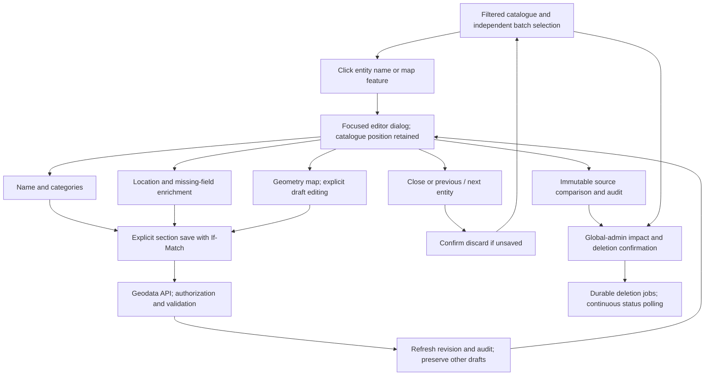

# Catalogue navigation and persistence

Review decisions remain on the separate review page. No database or broker
connection is introduced in the client. See the [editor guide](../entity-catalogue-editor.md).
