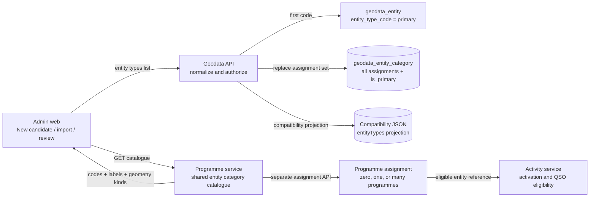

# Geodata category assignment

This diagram shows the ownership and persistence path for a candidate or
imported entity. Categories are shared Master data; programme assignment is a
separate eligibility relationship.

Rules:

- `entityTypes[]` must contain at least one stable uppercase category code.
- The first code is exposed as legacy `entityType` and stored as the one
  `is_primary` assignment.
- The relational assignment table is authoritative for multi-category reads;
  the JSON snapshot is retained for compatibility and export.
- Imports and manual proposals are programme-independent and always create
  `CANDIDATE` entities.
- A category can be assigned to multiple programmes, and an entity may have
  multiple categories.

The canonical schema is
`myota-geodata-service/migrations/008_entity_category_assignments.sql`.
Synchronized copies are applied by the platform bootstrap and deployment
migration runners.
