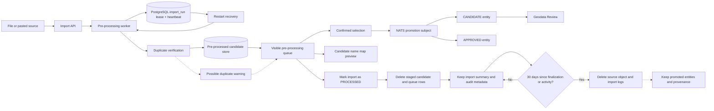

# Geodata import validation and promotion

This is the safety boundary for file and pasted-data imports. Pre-processing
normalizes and validates the source without making an unreviewed record part of
the public entity catalogue.

The daily retention worker expunges the source object, import history, and
import-specific logs after 30 days. Finalized runs age from `processed_at`;
pending, failed, and stalled runs age from their latest start, completion, or
heartbeat. Active processing remains while its heartbeat advances. The worker
does not delete promoted entities or their provenance.

The candidate store is represented by `geodata_import_candidate` in the
geodata PostGIS schema. Duplicate verification compares normalized geometry
with existing entities; identical geometry or a centroid distance under 50
metres adds `POSSIBLE_DUPLICATE` and comparison geometry to the candidate. It
does not automatically merge, reject, or modify an existing entity. The admin
modal shows both geometries on a Leaflet map.

`geodata_import_processing_queue` is the durable projection of the NATS
request. The local development worker consumes the same logical queue directly
while production deployments connect the outbox to NATS JetStream. The
pre-processing queue remains separate from Geodata Review until the worker
materializes a confirmed record as an entity.

The target status is chosen only after confirmation. The imports collection
returns candidate counts so the admin page can keep active pre-processing runs
visible while completed runs move to import history. A candidate can later be
reviewed through the normal lifecycle (`CANDIDATE` to `APPROVED` or `REJECTED`),
while an import may use `APPROVED` only when the administrator has the required
review authority.
