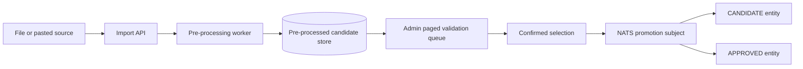

# Geodata import validation and promotion

This is the safety boundary for file and pasted-data imports. Pre-processing
normalizes and validates the source without making an unreviewed record part of
the public entity catalogue.

The candidate store is represented by `geodata_import_candidate` in the
geodata PostGIS schema. `geodata_import_processing_queue` is the durable
projection of the NATS request. The local development worker consumes the same
logical queue directly while production deployments connect the outbox to NATS
JetStream.

The target status is chosen only after confirmation. A candidate can later be
reviewed through the normal lifecycle (`CANDIDATE` to `APPROVED` or `REJECTED`),
while an import may use `APPROVED` only when the administrator has the required
review authority.
