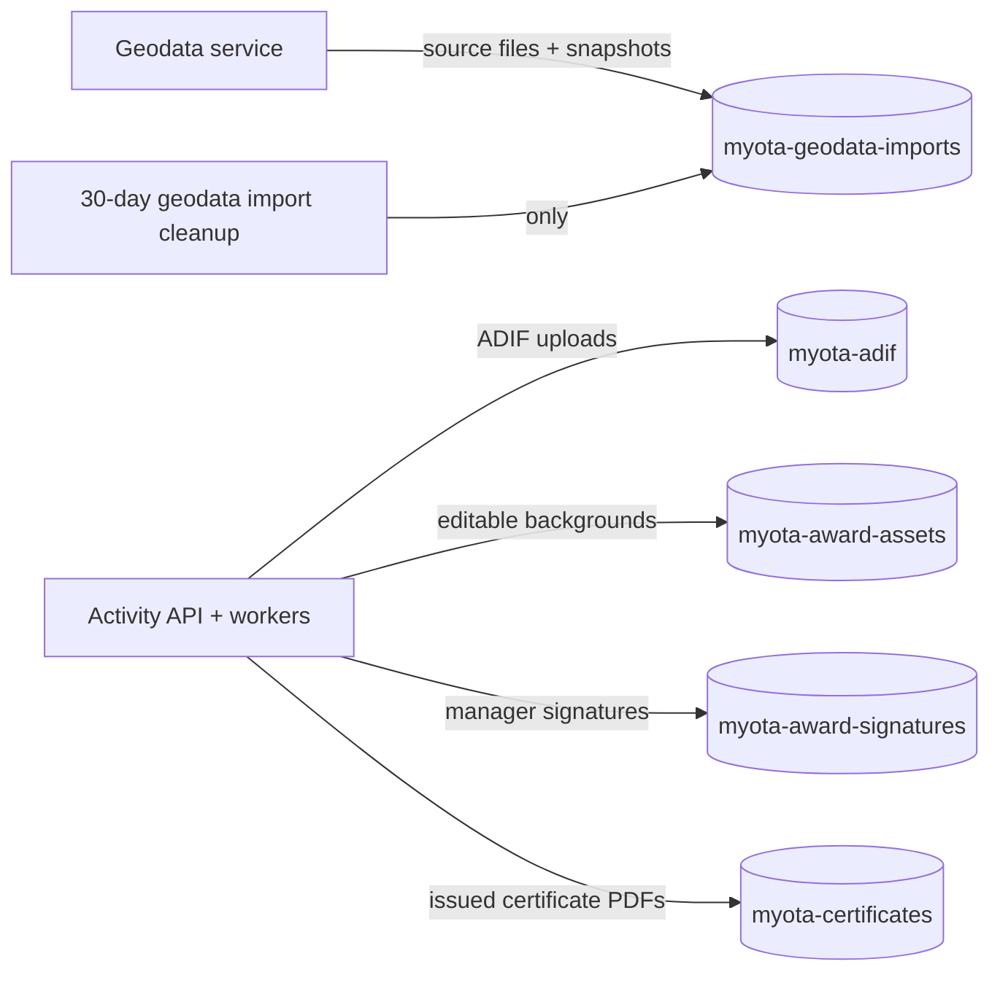

# Object-storage bucket boundaries

All buckets share one configured S3-compatible endpoint. Bucket names are
independently configurable in Compose and Helm. The separation is for purpose,
access, and lifecycle policy; it does not imply a separate SeaweedFS cluster per
bucket.

Background and signature bucket selection is server-side based on the asset
kind. Certificates remain durable issuance records and are never subject to
geodata import cleanup. ADIF retention follows the activity/privacy policy.
