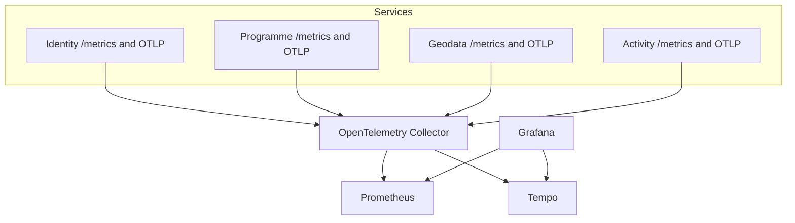

# Observability architecture

```mermaid
flowchart TB
  subgraph Services
    I[Identity /metrics and OTLP]
    P[Programme /metrics and OTLP]
    G[Geodata /metrics and OTLP]
    A[Activity /metrics and OTLP]
  end
  C[OpenTelemetry Collector]
  PR[Prometheus]
  GR[Grafana]
  T[Tempo]
  I --> C
  P --> C
  G --> C
  A --> C
  C --> PR
  C --> T
  GR --> PR
  GR --> T
```

The collector is the single operational collection boundary. Business facts
remain service-owned; observability infrastructure does not become a new
source of truth.
