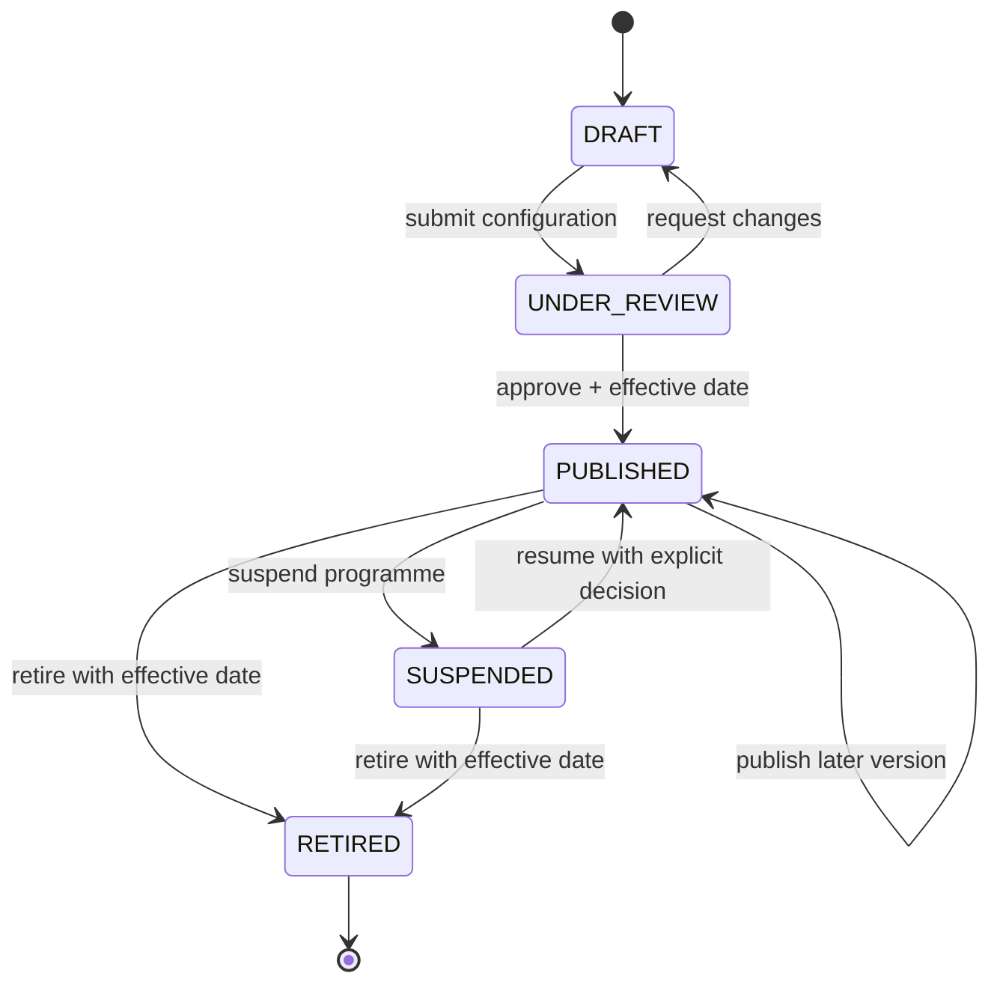
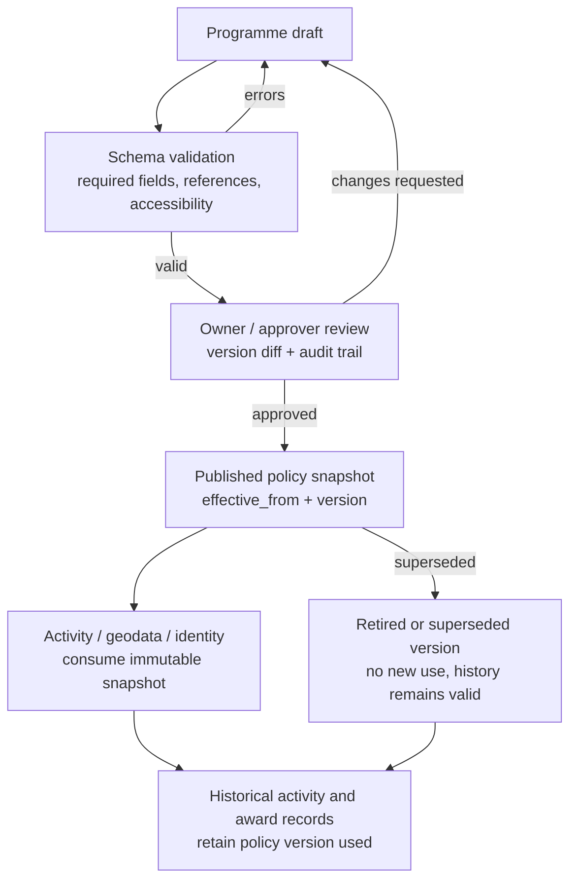

# Programme configuration lifecycle

Programme configuration is programme-owned and must be versioned before it
can affect new activity. Creating or editing a draft must not silently change
the rules used by historical activations, QSOs, or awards.

## Configuration layers

| Layer | Examples | Owner |
| --- | --- | --- |
| Programme identity | name, slug, owner, contacts, legal links, lifecycle | Programme service |
| Presentation/content | locales, fallback, theme, logos, public copy | Programme service + admin web |
| Eligibility policy | entity status/category, jurisdiction, location, duration, callsign, bands/modes, evidence | Programme service; evaluated by activity/geodata |
| Award linkage | published award references, participant categories, issuance defaults | Activity service owns definitions; programme stores policy linkage |
| Operational policy | notifications, public history, leaderboard/privacy, export defaults | Programme/activity services |

Imports remain programme-independent: a source adapter creates or refreshes a
candidate in geodata, and a programme later decides whether the category,
status, jurisdiction, provenance, and geometry satisfy its published policy.
