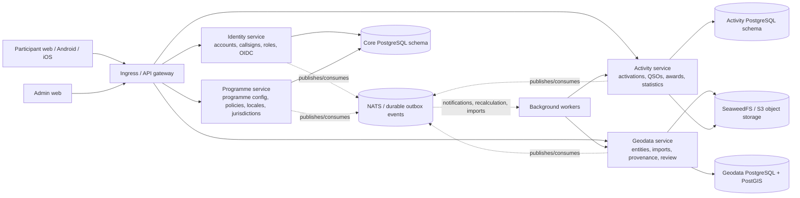
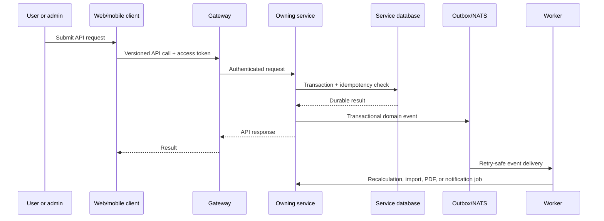

# MyOTA service and data ownership

This diagram is the practical ownership view for the current repository split.
The admin web is a control plane and does not own domain data. Cross-service
references are exchanged as IDs, slugs, and versioned API/event payloads; they
are not cross-database foreign keys.

## Ownership rules

- `myota-programme-service` owns programme metadata, published policy
  versions, locale and jurisdiction configuration, and the shared category
  catalogue/assignment APIs.
- `myota-identity-service` owns accounts, callsigns, authentication sessions,
  roles, scopes, and OIDC provider mappings.
- `myota-geodata-service` owns geometries, entity lifecycle, imports, source
  provenance, conflation, review, and geodata audit history.
- `myota-activity-service` owns activations, normalized QSOs, corrections,
  aggregates, award definitions/progress/issuance, statistics, and activity
  notifications. Activity and awards share one API deployment.
- `myota-admin-web` coordinates these APIs; it does not write database tables
  directly.
- `myota-deploy` owns runtime wiring, migration orchestration, workers,
  secrets, object storage, NATS, and Kubernetes/Compose configuration.

## Request and event flow

