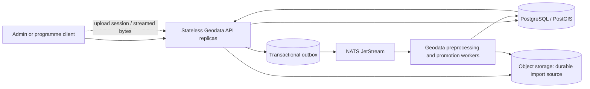

# Geodata API horizontal-scaling roadmap

## Status and scope

**Phase 0 read-only baseline delivered; Phase 2 upload handoff and Phase 3
worker isolation are implemented, with integration and failure-injection
gates still open. Phase 1 database authority is implemented and verified; remaining Phase 0 work and Phases 4 and 5 remain open.**
This checklist records the work needed before increasing the
Geodata API beyond one replica in production. The baseline does not make the
current service horizontally safe.

The goal is to scale the HTTP API independently from large dataset processing
while preserving entity, review, import, provenance, and audit correctness.
PostgreSQL/PostGIS remains the system of record; object storage remains the
durable source for uploaded datasets; NATS JetStream carries asynchronous work
and cross-service events.

Current implementation hazards to resolve:

- Phase 1 no longer hydrates a mutable catalogue snapshot. Request/job-scoped
  projections read authoritative rows and flush only changed rows, with locks,
  revisions and database idempotency. See the [Phase 1 evidence and rollout
  record](geodata-phase1-relational-authority.md).
- Durable imports now use resumable object-storage multipart sessions and a
  separately deployed JetStream worker. Large-source parsing and worker-side broad candidate/spatial traversals
  are not yet streaming/bounded end to end.

See [overall architecture](architecture.md),
[operations](operations.md),
[geodata import validation and promotion](diagrams/geodata-import-validation.md),
and the upload-session/worker deployment in `myota-deploy` for current
behavior.

## Target shape

The API validates/authenticates requests, performs bounded relational and
spatial queries, creates durable upload/import records, and returns. Workers
parse, normalize, deduplicate, enrich, and promote data. No process-local cache,
executor queue, or pod filesystem is authoritative for accepted work.

## Phased to-do list

### Phase 0 — establish a measurable baseline

- [x] Define a bounded production-safe workload for health, paged catalogue,
  bounding-box catalogue, and entity-detail reads. This is a closed-loop
  read-only profile (2 VUs/60s by default; hard cap 4 VUs/5m), not a write,
  import, or stress test. See the [geodata service k6 instructions](https://github.com/myota-platform/myota-geodata-service#read-only-load-baseline-grafana-k6).
- [x] Define isolated representative workload profiles for large uploads,
  simultaneous edits, preprocessing, promotion, and sustained queue backlog.
  They require explicit environment acknowledgement and exact host allowlisting;
  production additionally requires its own opt-in, retains hard safety caps,
  and requires separately enabled production cleanup. All profiles clean tagged
  fixtures on successful completion. See the [workload and query-evidence runbook](geodata-load-test-and-query-evidence.md)
  and the [k6 profile implementation](https://github.com/myota-platform/myota-geodata-service/blob/main/loadtests/geodata-workloads.js).
- [ ] Execute each write profile in a non-production deployment and retain its
  result summary. Do not run these profiles against production.
- [x] Export API request rate, response-duration histogram (p50/p95/p99 in
  Grafana), errors, active requests, and request body size through OpenTelemetry.
- [x] Export process CPU time and resident memory with a unique
  `service.instance.id` resource attribute for per-process views.
- [x] Export Postgres connection-pool size/availability/waiters, cumulative
  pool-wait time, active connections, max connections, and lock waits.
- [x] Add query-level slow-query counters and dedicated PostGIS timings for
  bounding-box reads and entity upserts. Provide a guarded, read-only
  `EXPLAIN (ANALYZE, BUFFERS)` evidence tool for development, test, or staging;
  the API latency histogram is kept separate from query execution time. See
  the [query-evidence runbook](geodata-load-test-and-query-evidence.md) and
  [evidence tool](https://github.com/myota-platform/myota-geodata-service/blob/main/scripts/geodata-query-plan-evidence.py).
- [x] Export durable geodata import queue depth/age, processing heartbeat age,
  retry attempts, feature totals, and unpublished outbox depth/age.
- [x] Export JetStream consumer pending/ack-pending counts, broker redelivery
  counts, and oldest outstanding message age directly from JetStream consumer
  state. Age is explicitly marked unavailable if retention removes the
  referenced message before its timestamp is read. See the
  [JetStream metrics implementation](https://github.com/myota-platform/myota-geodata-service/blob/main/jetstream_observability.py).
- [x] Provision the **MyOTA Geodata capacity baseline** dashboard and backlog,
  pool, and heartbeat alerts in local Compose and Helm Grafana/Prometheus files.
- [x] Provision a separate **MyOTA JetStream backlog and PostGIS query
  performance** dashboard in Compose and Helm, with broker-lag and dedicated
  PostGIS query percentiles/slow-query panels.
- [x] Add a repeatable macOS Grafana k6 script. It samples at most ten public
  production entities in memory and makes no application writes or uploads;
  there are no persisted fixture records or objects to clean up after success.
  The script also refuses production runs without an explicit acknowledgement.

**Exit criteria: partially met.** The production-safe read baseline and
explicitly gated write profiles are implemented, and the dashboards now separate
API latency, query time/plan evidence, durable import state, and JetStream
consumer lag. Phase 0 remains open until all write profiles have been run in a
non-production deployment and representative query-plan/load evidence has been
reviewed for PostGIS, object storage, and worker bottlenecks.

### Phase 1 — remove cross-replica mutable process state

- [x] Inventory every `GeoHandler.store.items`, `store.data`, `store.events`,
  and `store.idempotency` read/write path and classify its source of truth.
- [x] Replace entity catalogue reads with indexed, paginated PostGIS repository
  queries, including map bounds, category, status, and location filters.
- [x] Replace entity edits, status changes, category assignments, geometry
  updates, reviews, and audit writes with narrowly scoped database
  transactions and optimistic/version checks where concurrent edits matter.
- [x] Replace whole-state snapshot persistence for durable geodata operations
  with row-level repository writes. Keep any compatibility projection
  read-only or remove it after an explicit migration/reconciliation plan.
- [x] Make import runs, staged candidates, processing queues, audit history,
  and idempotency records database-authoritative; do not merge stale pod-local
  snapshots back into Postgres.
- [x] Ensure every mutating endpoint has database-enforced idempotency or a
  safe conditional update, including concurrent duplicate requests.
- [x] Add concurrency tests with two independent service instances editing and
  reading the same entity/import state.

Implementation, complete source-of-truth inventory, API concurrency behavior,
migration/rollout guidance and test links are in the
[Phase 1 delivery record](geodata-phase1-relational-authority.md).
Local Colima validation includes 83 unit/database tests plus one HTTP test against
two independent running API containers. CI runs the same database and two-process
HTTP tests before image publication. The database fence rejects obsolete writers,
including during mixed-image rollout.

**Exit criteria: met for Phase 1.** Restarting or adding an API pod cannot overwrite a newer
database value with an older in-memory copy; concurrent updates are either
serialized or return an explicit conflict.

### Phase 2 — make upload handoff durable without a shared pod volume

- [x] Design an upload-session record with explicit states, owner, filename,
  expected size, checksum, object key, expiry, and completion status.
- [x] Test SeaweedFS multipart create/upload/complete/read-checksum/delete and
  abort against the locally deployed pinned image
  `chrislusf/seaweedfs:latest@sha256:ce9e796f1fe6f06968f4c04bdaf8f678dad9c8acdfef3d244133d71bfa6bf882`.
- [ ] Test resumable API-session recovery across API termination and object
  storage restart against the production SeaweedFS image before closing the
  version-specific integration gate.
- [x] Implement bounded 16 MiB multipart-part transfer through the API to
  object storage; do not materialize the complete upload in API memory or a
  shared `ReadWriteOnce` PVC.
- [x] Persist the completed object reference and import metadata before
  publishing work. Do not report an import as accepted until this durable
  handoff succeeds.
- [x] Keep malware scanning and file/type/size validation in the durable
  lifecycle. Define how multipart parts and abandoned sessions are cleaned up.
- [x] Make upload retries idempotent and define whether an incomplete upload is
  resumed or restarted after a client/network failure.
- [x] Remove the shared upload-spool PVC dependency. Any remaining local
  scratch space is bounded per part and reconstructible from the client or
  object store; the restart/failure test is still outstanding.

**Exit criteria: not yet verified.** Multipart operations and checksums pass
against the pinned local SeaweedFS image. API-session resume after API/SeaweedFS
restart must still pass against the deployed image before this phase can close.

### Phase 3 — isolate preprocessing and promotion from API pods

- [x] Make the API write a durable import/job row and transactional outbox
  event, then return; remove API-local submission of durable preprocessing or
  promotion work in production mode.
- [x] Use one authoritative production dispatch path through JetStream. Keep a
  local development fallback only if it preserves the same durable claim,
  retry, and idempotency semantics and cannot run alongside the production
  consumer for the same job.
- [x] Move preprocessing into a geodata-owned worker Deployment that reads
  immutable source objects and claims work from a database lease/queue.
- [x] Make worker claims atomic and recoverable with lease expiry, heartbeat,
  attempt count, bounded retry/backoff, and a visible terminal error state.
- [x] Make each feature/candidate write idempotent; use stable import and
  source-record identity so a retry cannot create duplicate candidates.
- [ ] Persist progress in bounded batches. Avoid holding an entire large
  dataset or all entity geometries in worker memory when a streaming parser or
  indexed spatial query can be used. Part transfer is bounded; feature parsing
  and some worker candidate/conflation traversals remain whole-run/in-memory; no
  catalogue snapshot is authoritative or rewritten. Phase 1 now commits entity,
  candidate-result and audit/outbox rows atomically at checkpoints.
- [x] Make promotion consume only confirmed candidate IDs and record the
  resulting status/entity IDs and audit information with idempotent stable IDs.
  Entity/result/audit atomicity and duplicate promotion replay now have local
  database integration coverage in the [Phase 1 tests](geodata-phase1-relational-authority.md).
- [x] Add worker shutdown/drain behavior: stop fetching on SIGTERM/SIGINT,
  finish the active delivery, and drain the NATS connection.
- [ ] Test pod termination during parsing, enrichment, candidate persistence,
  and promotion, including forced termination after the grace period.

**Exit criteria: partially met.** API requests no longer execute durable
preprocessing or promotion locally; worker retries use database leases and
stable identities. The parser is not yet batch/stream bounded, and termination,
forced-termination and concurrent multi-worker delivery scenarios remain required.

### Phase 4 — remove unsafe infrastructure constraints

Phase 1 removes the shared snapshot correctness blocker, but does not authorize
production replica increases. Apply the [write-fenced migration/rollout
procedure](geodata-phase1-relational-authority.md#migration-and-rollout) first;
then complete the infrastructure and operational gates below.

- [ ] Remove the geodata API's dependency on a shared `ReadWriteOnce` upload
  spool, then review all remaining volumes mounted by API pods.
- [ ] Make NATS consumers explicitly scale-safe (queue-group or pull-consumer
  design, durable identity, acknowledgement, and idempotent side effects)
  before increasing consumer replicas.
- [ ] Keep PostGIS connection use bounded across all API and worker replicas;
  size per-pod pools from the database connection budget and consider
  PgBouncer if appropriate.
- [ ] Review `EXPLAIN (ANALYZE, BUFFERS)` for high-volume entity/map queries;
  add or adjust B-tree/GiST indexes based on observed query plans.
- [ ] Add Kubernetes CPU/memory requests and limits, startup/readiness probes,
  graceful termination, pod disruption budgets, and topology spreading for
  stateless API pods.
- [ ] Add an API HPA using tested resource/latency signals and a separate worker
  scaling policy using queue depth/oldest-message age. Set minimum and maximum
  replicas from load-test results, not guesses.
- [ ] Confirm rate limiting, request/body limits, timeouts, and backpressure
  remain effective when more API pods are available.

**Exit criteria:** replicas can be added and removed without violating storage,
queue, database-connection, or availability constraints.

### Phase 5 — staged rollout and operational proof

Current CI now covers relational migrations, concurrent independent repositories,
promotion replay, migration replay, and two actual API processes. Large-source
memory, forced termination, storage restart and load/canary proof remain open.

- [ ] Run contract, integration, migration, multi-instance concurrency, and
  worker recovery tests in CI.
- [ ] Load-test the API at one, two, and increasing replica counts; verify
  throughput and latency improve without shifting saturation to Postgres or
  object storage.
- [ ] Exercise large-file upload, interrupted client upload, receiver-pod
  termination, worker termination, duplicate event delivery, and SeaweedFS
  restart scenarios.
- [ ] Deploy a two-replica canary in a non-production environment and compare
  error rate, latency, lost/duplicate work, DB pool waits, and JetStream lag.
- [ ] Document rollback steps, in-flight import recovery, queue redrive, and
  upload-session cleanup before production rollout.
- [ ] Increase production API replicas gradually and retain a tested rollback
  to the prior deployment and schema-compatible code version.
- [ ] Update `myota-deploy` Helm values, Compose development topology,
  dashboards/alerts, and operator documentation as each phase is completed.

**Overall completion criteria:** multiple Geodata API replicas can be rolled,
rescheduled, and autoscaled while large imports continue to recover; catalogue
reads and edits remain consistent; no accepted upload depends on pod-local
storage; and measured tests show the intended throughput/latency improvement.

## Ownership and sequencing

- `myota-geodata-service`: repository/query changes, upload API, worker logic,
  idempotency, concurrency tests, and service-level telemetry.
- `myota-deploy`: worker/API separation, Helm and Compose topology, storage
  claims, autoscaling, resource limits, probes, alerts, and rollout procedures.
- `myota-contracts`: only if upload-session or job APIs/events change; freeze
  and document the public contract before implementation.
- `myota-docs`: maintain this checklist, architecture diagrams, operational
  guidance, and phase completion links.

Do not mark a phase complete solely because replicas can be configured. Check
the phase's exit criteria and attach test/deployment evidence.
