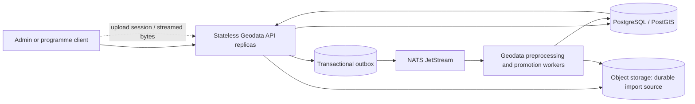

# Geodata API horizontal-scaling roadmap

## Status and scope

**Deferred work — not implemented.** This checklist records the work needed
before increasing the Geodata API beyond one replica in production. It is an
implementation roadmap, not a claim that the current service is horizontally
safe.

The goal is to scale the HTTP API independently from large dataset processing
while preserving entity, review, import, provenance, and audit correctness.
PostgreSQL/PostGIS remains the system of record; object storage remains the
durable source for uploaded datasets; NATS JetStream carries asynchronous work
and cross-service events.

Current implementation hazards to resolve:

- The geodata service hydrates catalogue/import state into process memory and
  persists compatibility snapshots. Multiple processes can therefore hold
  stale state while another replica changes the database.
- The upload path uses a persistent `ReadWriteOnce` spool and records its local
  path in import metadata. That volume is not a safe shared upload handoff for
  replicas that may run on different nodes.
- Import preprocessing uses in-process thread pools. Durable import leases and
  restart recovery exist, but API requests also dispatch local processing.
- Promotion has both an outbox/JetStream route and a local development fallback.
  A single authoritative execution path is required in production.

See [overall architecture](architecture.md),
[operations](operations.md),
[geodata import validation and promotion](diagrams/geodata-import-validation.md),
and the upload spool claim in `myota-deploy` for current behavior.

## Target shape

The API validates/authenticates requests, performs bounded relational and
spatial queries, creates durable upload/import records, and returns. Workers
parse, normalize, deduplicate, enrich, and promote data. No process-local cache,
executor queue, or pod filesystem is authoritative for accepted work.

## Phased to-do list

### Phase 0 — establish a measurable baseline

- [ ] Define expected request and import workloads, including large uploads,
  map/catalogue queries, simultaneous edits, and queue backlogs.
- [ ] Record API request rate, p50/p95/p99 latency, errors, in-flight requests,
  request sizes, and per-pod CPU/memory.
- [ ] Record Postgres pool wait time, active connections, slow query plans,
  PostGIS query latency, lock waits, and database saturation.
- [ ] Record JetStream pending/ack-pending counts, oldest-message age, worker
  throughput, retry counts, and import lease/heartbeat age.
- [ ] Add or confirm metrics for upload bytes and duration, preprocessing
  duration and feature counts, and queue depth by job type. Avoid labels with
  unbounded values such as entity IDs, import IDs, or filenames.
- [ ] Establish a repeatable load-test dataset and scripts without using
  production personal data.

**Exit criteria:** the team can identify whether API, PostGIS, object storage,
or import workers are the bottleneck under a representative test.

### Phase 1 — remove cross-replica mutable process state

- [ ] Inventory every `GeoHandler.store.items`, `store.data`, `store.events`,
  and `store.idempotency` read/write path and classify its source of truth.
- [ ] Replace entity catalogue reads with indexed, paginated PostGIS repository
  queries, including map bounds, category, status, and location filters.
- [ ] Replace entity edits, status changes, category assignments, geometry
  updates, reviews, and audit writes with narrowly scoped database
  transactions and optimistic/version checks where concurrent edits matter.
- [ ] Replace whole-state snapshot persistence for durable geodata operations
  with row-level repository writes. Keep any compatibility projection
  read-only or remove it after an explicit migration/reconciliation plan.
- [ ] Make import runs, staged candidates, processing queues, audit history,
  and idempotency records database-authoritative; do not merge stale pod-local
  snapshots back into Postgres.
- [ ] Ensure every mutating endpoint has database-enforced idempotency or a
  safe conditional update, including concurrent duplicate requests.
- [ ] Add concurrency tests with two independent service instances editing and
  reading the same entity/import state.

**Exit criteria:** restarting or adding an API pod cannot overwrite a newer
database value with an older in-memory copy; concurrent updates are either
serialized or return an explicit conflict.

### Phase 2 — make upload handoff durable without a shared pod volume

- [ ] Design an upload-session record with explicit states, owner, filename,
  expected size, checksum, object key, expiry, and completion status.
- [ ] Test SeaweedFS S3 multipart/resumable upload, checksum validation, abort,
  and restart behavior against the deployed SeaweedFS version before choosing
  the upload protocol.
- [ ] Implement a bounded streaming or multipart upload path that does not
  materialize the complete file in API memory or a shared `ReadWriteOnce` PVC.
- [ ] Persist the completed object reference and import metadata before
  publishing work. Do not report an import as accepted until this durable
  handoff succeeds.
- [ ] Keep malware scanning and file/type/size validation in the durable
  lifecycle. Define how multipart parts and abandoned sessions are cleaned up.
- [ ] Make upload retries idempotent and define whether an incomplete upload is
  resumed or restarted after a client/network failure.
- [ ] Remove the shared upload-spool PVC dependency after the replacement path
  passes restart and failure tests. Any remaining local scratch space must be
  bounded, ephemeral, and reconstructible from the client or object store.

**Exit criteria:** a completed upload remains processable after its receiving
pod is terminated, and a replacement pod on another node can continue without
access to the original pod filesystem.

### Phase 3 — isolate preprocessing and promotion from API pods

- [ ] Make the API write a durable import/job row and transactional outbox
  event, then return; remove API-local submission of durable preprocessing or
  promotion work in production mode.
- [ ] Use one authoritative production dispatch path through JetStream. Keep a
  local development fallback only if it preserves the same durable claim,
  retry, and idempotency semantics and cannot run alongside the production
  consumer for the same job.
- [ ] Move preprocessing into a geodata-owned worker Deployment that reads
  immutable source objects and claims work from a database lease/queue.
- [ ] Make worker claims atomic and recoverable with lease expiry, heartbeat,
  attempt count, bounded retry/backoff, and a visible terminal error state.
- [ ] Make each feature/candidate write idempotent; use stable import and
  source-record identity so a retry cannot create duplicate candidates.
- [ ] Persist progress in bounded batches. Avoid holding an entire large
  dataset or all entity geometries in worker memory when a streaming parser or
  indexed spatial query can be used.
- [ ] Make promotion consume only confirmed candidate IDs and record the
  resulting status/entity IDs and audit information atomically.
- [ ] Add worker shutdown/drain behavior and test pod termination during
  parsing, enrichment, candidate persistence, and promotion.

**Exit criteria:** API replicas can scale without increasing parser memory or
CPU, and worker restarts or duplicate JetStream delivery do not lose or
duplicate entities.

### Phase 4 — remove unsafe infrastructure constraints

- [ ] Remove the geodata API's dependency on a shared `ReadWriteOnce` upload
  spool, then review all remaining volumes mounted by API pods.
- [ ] Make NATS consumers explicitly scale-safe (queue-group or pull-consumer
  design, durable identity, acknowledgement, and idempotent side effects)
  before increasing consumer replicas.
- [ ] Keep PostGIS connection use bounded across all API and worker replicas;
  size per-pod pools from the database connection budget and consider
  PgBouncer if appropriate.
- [ ] Review `EXPLAIN (ANALYZE, BUFFERS)` for high-volume entity/map queries;
  add or adjust B-tree/GiST indexes based on observed query plans.
- [ ] Add Kubernetes CPU/memory requests and limits, startup/readiness probes,
  graceful termination, pod disruption budgets, and topology spreading for
  stateless API pods.
- [ ] Add an API HPA using tested resource/latency signals and a separate worker
  scaling policy using queue depth/oldest-message age. Set minimum and maximum
  replicas from load-test results, not guesses.
- [ ] Confirm rate limiting, request/body limits, timeouts, and backpressure
  remain effective when more API pods are available.

**Exit criteria:** replicas can be added and removed without violating storage,
queue, database-connection, or availability constraints.

### Phase 5 — staged rollout and operational proof

- [ ] Run contract, integration, migration, multi-instance concurrency, and
  worker recovery tests in CI.
- [ ] Load-test the API at one, two, and increasing replica counts; verify
  throughput and latency improve without shifting saturation to Postgres or
  object storage.
- [ ] Exercise large-file upload, interrupted client upload, receiver-pod
  termination, worker termination, duplicate event delivery, and SeaweedFS
  restart scenarios.
- [ ] Deploy a two-replica canary in a non-production environment and compare
  error rate, latency, lost/duplicate work, DB pool waits, and JetStream lag.
- [ ] Document rollback steps, in-flight import recovery, queue redrive, and
  upload-session cleanup before production rollout.
- [ ] Increase production API replicas gradually and retain a tested rollback
  to the prior deployment and schema-compatible code version.
- [ ] Update `myota-deploy` Helm values, Compose development topology,
  dashboards/alerts, and operator documentation as each phase is completed.

**Overall completion criteria:** multiple Geodata API replicas can be rolled,
rescheduled, and autoscaled while large imports continue to recover; catalogue
reads and edits remain consistent; no accepted upload depends on pod-local
storage; and measured tests show the intended throughput/latency improvement.

## Ownership and sequencing

- `myota-geodata-service`: repository/query changes, upload API, worker logic,
  idempotency, concurrency tests, and service-level telemetry.
- `myota-deploy`: worker/API separation, Helm and Compose topology, storage
  claims, autoscaling, resource limits, probes, alerts, and rollout procedures.
- `myota-contracts`: only if upload-session or job APIs/events change; freeze
  and document the public contract before implementation.
- `myota-docs`: maintain this checklist, architecture diagrams, operational
  guidance, and phase completion links.

Do not mark a phase complete solely because replicas can be configured. Check
the phase's exit criteria and attach test/deployment evidence.
