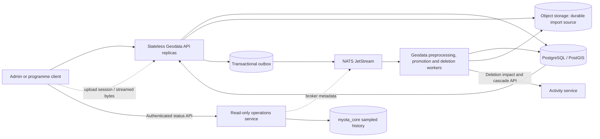

# Geodata API horizontal-scaling roadmap

## Status and scope

**Phase 0 read-only baseline delivered; Phase 2 upload handoff and Phase 3
worker isolation are implemented, with integration and failure-injection
gates still open. Phase 1 database authority is implemented and verified; remaining Phase 0 work and Phases 4 and 5 remain open.**
This checklist records the work needed before increasing the
Geodata API beyond one replica in production. The baseline does not make the
current service horizontally safe.

### Test-environment premise — 8 October 2026

The user-designated **provisional production** target is the current K3s
deployment on `spainip.es`, reached through `https://api.myota.top`. All
load/performance qualification for this roadmap—including read, upload,
preprocessing, promotion, queue, and API-capacity profiles—must target this
deployment. Earlier non-production load results remain historical records but
do not qualify this policy's capacity gates. Run profiles sequentially with a
dedicated test account, existing hard caps and exact-tag cleanup; retain the
production opt-ins and stop conditions. Production runs are manual, never CI.

This does not authorize destructive fault injection, service/pod termination,
database or object-store restart, queue redrive, cleanup of untagged data, or
production replica/configuration changes. Those correctness and recovery
exercises remain CI or isolated-test-environment work. Production load results
describe only the current provisional deployment and are not a guarantee for a
future production footprint.

The goal is to scale the HTTP API independently from large dataset processing
while preserving entity, review, import, provenance, and audit correctness.
PostgreSQL/PostGIS remains the system of record; object storage remains the
durable source for uploaded datasets; NATS JetStream carries asynchronous work
and cross-service events.

Current implementation and remaining hazards:

- Phase 1 no longer hydrates a mutable catalogue snapshot. Request/job-scoped
  projections read authoritative rows and flush only changed rows, with locks,
  revisions and database idempotency. See the [Phase 1 evidence and rollout
  record](geodata-phase1-relational-authority.md).
- Durable imports now use resumable object-storage multipart sessions and a
  separately deployed JetStream worker. Source-reference and proximity
  lookups are indexed, but large-source parsing and candidate staging are not
  yet streaming/bounded end to end.

See [overall architecture](architecture.md),
[operations](operations.md),
[geodata import validation and promotion](diagrams/geodata-import-validation.md),
and the upload-session/worker deployment in `myota-deploy` for current
behavior.

## Latest delivery and evidence — 8 October 2026

This reconciliation records published implementation, not a new production
rollout or a claim that every scaling phase is complete. Phase 1 is closed;
Phases 2 and 3 have delivered capabilities but still need the failure and
memory qualification below. Phases 4 and 5 remain rollout gates.

### Import cleanup stability — 8 October 2026

A production load-test run remained `PROCESSING`, so the guarded cleanup API
correctly refused to delete its fixtures. The underlying delay was not simply
the cleanup timeout: feature preprocessing repeatedly enumerated every staged
candidate and every entity, and the worker heartbeat could race with its final
run-status write. Candidate replay is now scoped to the import using the
existing `(import_run_id, ordinal)` index; source-reference reconciliation has
an indexed lookup; possible-duplicate checks use the PostGIS geography index.
The worker now joins its heartbeat and refreshes the database-authoritative
import row before marking a run complete or failed. Migration 018 installs the
source-reference index and is synchronized into the platform and deployment
migration runners. The five-minute cleanup wait remains a safety bound, not a
substitute for a worker completing reliably.

The service checks passed locally: 101 Python tests (15 skipped) and Ruff.
The parser still holds normalized features and stages candidate writes until
the run checkpoint, so bounded streaming/batch persistence remains an open
Phase 3 requirement; this fix does not mark that broader item complete.

| Delivered capability | Documentation and implementation evidence |
|---|---|
| Database-authoritative geodata rows, conditional edits, idempotency, atomic entity/candidate/audit/outbox checkpoints and obsolete-writer fence | [Phase 1 inventory, migration 016, rollout and 84-test record](geodata-phase1-relational-authority.md); [published geodata implementation](https://github.com/myota-platform/myota-geodata-service/commit/ab991891840590a2be9c4c458e1771a45e2c64d8); [successful database/two-API CI](https://github.com/myota-platform/myota-geodata-service/actions/runs/37642572170) |
| Owner-bound resumable uploads, pause/resume/discard, bounded checksummed parts, fresh completed-file submissions, revision-conflict reloads and active import refresh | [Admin workflow](admin-web-ux.md); [published Vue changes](https://github.com/myota-platform/myota-admin-web/commit/e17603fdcc6e3b85d7c062fbdc8ef7b9e2e1baae); [successful admin tests/build](https://github.com/myota-platform/myota-admin-web/actions/runs/37640776687) |
| Separate durable preprocessing, promotion and entity-deletion consumers with database leases and replay-safe effects | [Import lifecycle diagram](diagrams/geodata-import-validation.md), [recovery runbook](operations.md#import-recovery), [deletion authorization and lease boundary](geodata-phase1-relational-authority.md#mutation-and-api-behavior) |
| Read-only broker inspection and durable sampled history, separate from business workers | [JetStream status API/UI and operational semantics](jetstream-admin-status.md); [successful operations service CI](https://github.com/myota-platform/myota-operations-service/actions/runs/37642579946) |
| Canonical contracts, conditional-write clients and runtime route reconciliation | [Contract repository validation](https://github.com/myota-platform/myota-contracts#validate-contracts-and-clients); [successful contract freeze/client CI](https://github.com/myota-platform/myota-contracts/actions/runs/37642816616) |
| Compose/Helm worker separation, migration mirrors, operations service, scrape targets and availability/history alerts | [Deployment ownership](repository-map.md), [published deployment integration](https://github.com/myota-platform/myota-deploy/commit/6ceac513834554ddcf77768c8ccd0bbfa2f98813), [successful deployment tests/image build](https://github.com/myota-platform/myota-deploy/actions/runs/37642540219), [GitHub Helm validation](https://github.com/myota-platform/myota-deploy/actions/runs/37642215588) |

The Helm validation link records the chart-changing commit; later deployment
changes have their own test/image result above. Local Colima evidence is recorded
in the Phase 1 delivery record. These results do not substitute for termination,
SeaweedFS restart, multi-worker, sustained-load or production-canary tests.

The [organization documentation reconciliation](documentation-reconciliation-2026-10-07.md)
records coverage of all twelve repositories, current contract checks and the
42 service-owned migration mirrors, including the restored platform activity
retention copies. This is a synchronization repair, not a new live schema change.

## Target shape

The API validates/authenticates requests, performs bounded relational and
spatial queries, creates durable upload/import records, and returns. Workers
parse, normalize, deduplicate, enrich, and promote data. No process-local cache,
executor queue, or pod filesystem is authoritative for accepted work.

## Phased to-do list

### Phase 0 — establish a measurable baseline

ChatGPT implementation prompt: [review remaining query and bottleneck evidence](geodata-scaling-prompts/phase-0-baseline.md).

- [x] Define and run a bounded production-safe workload for health, paged
  catalogue, bounding-box catalogue, and entity-detail reads. It defaults to
  2 VUs/60s and is capped at 50 VUs/5m. The 2-VU/60s empty-catalogue run
  passed health/page reads; a separate 2-VU/30s run with five temporary tagged
  geometries passed map/detail reads. Both are documented in the
  [production evidence record](geodata-phase0-production-evidence-2026-10-08.md).
  Qualification uses the current provisional-production
  deployment; see the [geodata service k6 instructions](https://github.com/myota-platform/myota-geodata-service#read-only-load-baseline-grafana-k6).
- [x] Define bounded representative workload profiles for large uploads,
  simultaneous edits, preprocessing, promotion, and sustained queue backlog.
  They require explicit environment acknowledgement and exact host allowlisting;
  the current qualification target additionally requires its production opt-in,
  retains hard safety caps, and uses separately enabled production cleanup. All
  five profiles passed against provisional production and cleaned tagged
  fixtures. See the [production evidence record](geodata-phase0-production-evidence-2026-10-08.md),
  [workload and query-evidence runbook](geodata-load-test-and-query-evidence.md),
  and the [k6 profile implementation](https://github.com/myota-platform/myota-geodata-service/blob/main/loadtests/geodata-workloads.js).
- [x] Record the earlier non-production write-profile runs and retained
  summaries as historical results. They do not qualify the current
  provisional-production capacity gates.
- [x] Run the five bounded write profiles against the current provisional
  production target, one at a time, using the dedicated test account and
  successful exact-tag cleanup. Retain run IDs, settings and summaries in the
  [production evidence record](geodata-phase0-production-evidence-2026-10-08.md).
  Do not weaken caps or run profiles in CI.
- [x] Reconcile large-upload profiles with the resumable upload contract and
  remove tagged terminal session/part records during cleanup. Add automated
  upload/abort/checksum/cleanup regressions and a real-k6 localhost transport
  smoke; see the [verification record](geodata-load-test-upload-verification.md).
  These correctness checks do not close the representative workload gate above.
- [x] Export API request rate, response-duration histogram (p50/p95/p99 in
  Grafana), errors, active requests, and request body size through OpenTelemetry.
- [x] Export process CPU time and resident memory with a unique
  `service.instance.id` resource attribute for per-process views.
- [x] Export Postgres connection-pool size/availability/waiters, cumulative
  pool-wait time, active connections, max connections, and lock waits.
- [x] Add query-level slow-query counters and dedicated PostGIS timings for
  bounding-box reads and entity upserts. Provide a guarded, read-only
  `EXPLAIN (ANALYZE, BUFFERS)` evidence tool with a separate exact-host
  production acknowledgement and statement-time bound; the API latency
  histogram is kept separate from query execution time. See
  the [query-evidence runbook](geodata-load-test-and-query-evidence.md) and
  [evidence tool](https://github.com/myota-platform/myota-geodata-service/blob/main/scripts/geodata-query-plan-evidence.py).
- [x] Export durable geodata import queue depth/age, processing heartbeat age,
  retry attempts, feature totals, and unpublished outbox depth/age.
- [x] Export JetStream consumer pending/ack-pending counts, broker redelivery
  counts, and oldest outstanding message age directly from JetStream consumer
  state. Age is explicitly marked unavailable if retention removes the
  referenced message before its timestamp is read. See the
  [JetStream metrics implementation](https://github.com/myota-platform/myota-geodata-service/blob/main/jetstream_observability.py).
- [x] Provision the **MyOTA Geodata capacity baseline** dashboard and backlog,
  pool, and heartbeat alerts in local Compose and Helm Grafana/Prometheus files.
- [x] Provision a separate **MyOTA JetStream backlog and PostGIS query
  performance** dashboard in Compose and Helm, with broker-lag and dedicated
  PostGIS query percentiles/slow-query panels.
- [x] Add a repeatable Grafana k6 script. It samples at most ten public
  entities in memory and makes no application writes or uploads; if the
  catalogue is empty, it clearly skips map/detail requests and still measures
  health/catalogue reads. The script refuses production runs without explicit
  acknowledgement.
- [ ] Review query plans at representative catalogue cardinality and correlate
  storage and worker measurements. The bounded production plan capture used
  only 25 temporary rows. A guarded API-based provisioner now defines a
  permanent, unassigned 10,000-point synthetic Sevilla fixture set and refuses
  automatic cleanup; it has not yet been run. The final evidence must include
  the live rollout, representative-cardinality plans, and storage/worker
  correlation. See the [evidence limitations and next steps](geodata-phase0-production-evidence-2026-10-08.md#conclusion-and-remaining-gate)
  and the [scale-fixture provisioner](https://github.com/myota-platform/myota-geodata-service/blob/main/loadtests/provision_scale_fixtures.py).

**Exit criteria: open.** The read-only baseline and all five write profiles
have passed against provisional production with cleanup. The exact-query tool,
stable gateway route/environment labels, and SeaweedFS metrics/dashboard are
implemented and published; Fleet rollout and live metric coverage still need
verification against the permanent
representative-cardinality fixture set. The prior 25-row plan is not scale
evidence. See the [production evidence record](geodata-phase0-production-evidence-2026-10-08.md)
and [evidence review](geodata-load-test-and-query-evidence.md#phase-0-evidence-review-status).

### Phase 1 — remove cross-replica mutable process state

- [x] Inventory every `GeoHandler.store.items`, `store.data`, `store.events`,
  and `store.idempotency` read/write path and classify its source of truth.
- [x] Replace entity catalogue reads with indexed, paginated PostGIS repository
  queries, including map bounds, category, status, and location filters.
- [x] Replace entity edits, status changes, category assignments, geometry
  updates, reviews, and audit writes with narrowly scoped database
  transactions and optimistic/version checks where concurrent edits matter.
- [x] Replace whole-state snapshot persistence for durable geodata operations
  with row-level repository writes. Keep any compatibility projection
  read-only or remove it after an explicit migration/reconciliation plan.
- [x] Make import runs, staged candidates, processing queues, audit history,
  and idempotency records database-authoritative; do not merge stale pod-local
  snapshots back into Postgres.
- [x] Ensure every mutating endpoint has database-enforced idempotency or a
  safe conditional update, including concurrent duplicate requests.
- [x] Add concurrency tests with two independent service instances editing and
  reading the same entity/import state.
- [x] Migrate admin entity mutations to revision-aware requests and explicit
  reload guidance on HTTP 409; see the [admin workflow](admin-web-ux.md) and
  [concurrency/API behavior](geodata-phase1-relational-authority.md#mutation-and-api-behavior).

Implementation, complete source-of-truth inventory, API concurrency behavior,
migration/rollout guidance and test links are in the
[Phase 1 delivery record](geodata-phase1-relational-authority.md).
Local Colima validation includes 83 unit/database tests plus one HTTP test against
two independent running API containers. CI runs the same database and two-process
HTTP tests before image publication. The database fence rejects obsolete writers,
including during mixed-image rollout.

**Exit criteria: met for Phase 1.** Restarting or adding an API pod cannot overwrite a newer
database value with an older in-memory copy; concurrent updates are either
serialized or return an explicit conflict.

### Phase 2 — make upload handoff durable without a shared pod volume

ChatGPT implementation prompt: [test upload recovery across restarts](geodata-scaling-prompts/phase-2-upload-recovery.md).

- [x] Design an upload-session record with explicit states, owner, filename,
  expected size, checksum, object key, expiry, and completion status.
- [x] Test SeaweedFS multipart create/upload/complete/read-checksum/delete and
  abort against the locally deployed pinned image
  `chrislusf/seaweedfs:latest@sha256:ce9e796f1fe6f06968f4c04bdaf8f678dad9c8acdfef3d244133d71bfa6bf882`.
- [ ] Test resumable API-session recovery across API termination and object
  storage restart against the production SeaweedFS image before closing the
  version-specific integration gate.
- [x] Implement bounded 16 MiB multipart-part transfer through the API to
  object storage; do not materialize the complete upload in API memory or a
  shared `ReadWriteOnce` PVC.
- [x] Persist the completed object reference and import metadata before
  publishing work. Do not report an import as accepted until this durable
  handoff succeeds.
- [x] Keep malware scanning and file/type/size validation in the durable
  lifecycle. Define how multipart parts and abandoned sessions are cleaned up.
- [x] Make upload retries idempotent and define whether an incomplete upload is
  resumed or restarted after a client/network failure.
- [x] Integrate browser pause/resume/discard, saved-part verification, recovery
  after response loss and fresh submission identities after completion. See
  [admin upload behavior](admin-web-ux.md) and the [admin test/build evidence](#latest-delivery-and-evidence--7-october-2026).
- [x] Remove the shared upload-spool PVC dependency. Any remaining local
  scratch space is bounded per part and reconstructible from the client or
  object store; the restart/failure test is still outstanding.

**Exit criteria: not yet verified.** Multipart operations and checksums pass
against the pinned local SeaweedFS image. API-session resume after API/SeaweedFS
restart must still pass against the deployed image before this phase can close.

### Phase 3 — isolate preprocessing and promotion from API pods

ChatGPT implementation prompt: [implement bounded workers and failure recovery](geodata-scaling-prompts/phase-3-worker-isolation.md).

- [x] Make the API write a durable import/job row and transactional outbox
  event, then return; remove API-local submission of durable preprocessing or
  promotion work in production mode.
- [x] Use one authoritative production dispatch path through JetStream. Keep a
  local development fallback only if it preserves the same durable claim,
  retry, and idempotency semantics and cannot run alongside the production
  consumer for the same job.
- [x] Move preprocessing into a geodata-owned worker Deployment that reads
  immutable source objects and claims work from a database lease/queue.
- [x] Make worker claims atomic and recoverable with lease expiry, heartbeat,
  attempt count, bounded retry/backoff, and a visible terminal error state.
- [x] Make each feature/candidate write idempotent; use stable import and
  source-record identity so a retry cannot create duplicate candidates.
- [ ] Persist progress in bounded batches. Avoid holding an entire large
  dataset or all entity geometries in worker memory when a streaming parser or
  indexed spatial query can be used. Part transfer is bounded; feature parsing
  and candidate writes remain whole-run/in-memory. Candidate replay is scoped
  to its import and source-reference/nearby-entity checks use database indexes;
  no catalogue snapshot is authoritative or rewritten. Phase 1 commits entity,
  candidate-result and audit/outbox rows atomically at checkpoints.
- [x] Make promotion consume only confirmed candidate IDs and record the
  resulting status/entity IDs and audit information with idempotent stable IDs.
  Entity/result/audit atomicity and duplicate promotion replay now have local
  database integration coverage in the [Phase 1 tests](geodata-phase1-relational-authority.md).
- [x] Move confirmed permanent entity deletion to the separate
  `geodata-entity-deletion-v1` durable consumer, with saved authorization,
  recoverable leases and idempotent activity-cascade calls. See
  [deletion execution semantics](geodata-phase1-relational-authority.md#mutation-and-api-behavior).
- [x] Expose real streams, consumers, pending/ack-pending deliveries, redelivery
  state and persistent sampled history through the authenticated
  [operations service and admin page](jetstream-admin-status.md). The observer
  does not consume, acknowledge, redrive or purge domain work.
- [x] Add worker shutdown/drain behavior: stop fetching on SIGTERM/SIGINT,
  finish the active delivery, and drain the NATS connection.
- [ ] Test pod termination during parsing, enrichment, candidate persistence,
  and promotion, including forced termination after the grace period.

**Exit criteria: partially met.** API requests no longer execute durable
preprocessing or promotion locally; worker retries use database leases and
stable identities. The parser is not yet batch/stream bounded, and termination,
forced-termination and concurrent multi-worker delivery scenarios remain required.

### Phase 4 — remove unsafe infrastructure constraints

Phase 1 removes the shared snapshot correctness blocker, but does not authorize
production replica increases. Apply the [write-fenced migration/rollout
procedure](geodata-phase1-relational-authority.md#migration-and-rollout) first;
then complete the infrastructure and operational gates below.

ChatGPT implementation prompt: [review infrastructure and scaling constraints](geodata-scaling-prompts/phase-4-infrastructure.md).

- [x] Remove the geodata API's shared `ReadWriteOnce` upload-spool dependency;
  see [Phase 2](#phase-2--make-upload-handoff-durable-without-a-shared-pod-volume).
- [ ] Review all other volumes mounted by API pods before increasing replicas.
- [x] Implement durable pull consumers, explicit acknowledgement, database
  leases and idempotent side effects for the three geodata queues; see the
  [worker lifecycle](diagrams/geodata-import-validation.md).
- [ ] Qualify concurrent multi-worker delivery and failure recovery before
  increasing consumer replicas; implementation alone does not prove this gate.
- [ ] Keep PostGIS connection use bounded across all API and worker replicas;
  size per-pod pools from the database connection budget and consider
  PgBouncer if appropriate.
- [ ] Review `EXPLAIN (ANALYZE, BUFFERS)` for high-volume entity/map queries;
  add or adjust B-tree/GiST indexes based on observed query plans.
- [ ] Add Kubernetes CPU/memory requests and limits, startup/readiness probes,
  graceful termination, pod disruption budgets, and topology spreading for
  stateless API pods.
- [ ] Add an API HPA using tested resource/latency signals and a separate worker
  scaling policy using queue depth/oldest-message age. Set minimum and maximum
  replicas from load-test results, not guesses.
- [ ] Confirm rate limiting, request/body limits, timeouts, and backpressure
  remain effective when more API pods are available.

**Exit criteria:** replicas can be added and removed without violating storage,
queue, database-connection, or availability constraints.

### Phase 5 — staged rollout and operational proof

Current CI now covers relational migrations, concurrent independent repositories,
promotion replay, migration replay, and two actual API processes. Large-source
memory, forced termination, storage restart and load/canary proof remain open.

ChatGPT implementation prompt: [complete staged rollout and operational proof](geodata-scaling-prompts/phase-5-rollout.md).

- [x] Run contract, integration, migration/replay and independent-instance
  concurrency checks in CI; see the [delivery evidence](#latest-delivery-and-evidence--7-october-2026)
  and [Phase 1 test inventory](geodata-phase1-relational-authority.md#recorded-validation).
- [ ] Add and pass forced worker-recovery and API/object-storage restart
  failure-injection tests in CI.
- [ ] Load-test the current provisional-production API at its deployed replica
  count; verify throughput and latency without shifting saturation to Postgres
  or object storage. Testing other replica counts requires a separately
  approved production rollout/change window; do not change replicas as part of
  a load run.
- [ ] Exercise large-file upload, interrupted client upload, receiver-pod
  termination, worker termination, duplicate event delivery, and SeaweedFS
  restart scenarios.
- [ ] Run a bounded provisional-production canary at the currently deployed
  replica count and compare error rate, latency, DB pool waits, object-store
  metrics and JetStream lag. Any production replica change is a separate
  operator-approved rollout, not an implicit load-test step.
- [x] Document the Phase 1 write fence, coordinated API/worker rollout and
  rollback restrictions in the [migration/rollout record](geodata-phase1-relational-authority.md#migration-and-rollout).
- [ ] Complete and drill the end-to-end operational rollback, in-flight import
  recovery, queue redrive and upload-session cleanup procedure before scaling production.
- [ ] Increase production API replicas gradually and retain a tested rollback
  to the prior deployment and schema-compatible code version.
- [x] Update current Compose/Helm topology, migration mirrors, operations
  scrape/alerts and operator docs for the delivered work; see the
  [deployment evidence](#latest-delivery-and-evidence--7-october-2026).
- [ ] Update and revalidate deployment limits, autoscaling, dashboards/alerts
  and operator documentation when the remaining qualification gates close.

**Overall completion criteria:** multiple Geodata API replicas can be rolled,
rescheduled, and autoscaled while large imports continue to recover; catalogue
reads and edits remain consistent; no accepted upload depends on pod-local
storage; and measured tests show the intended throughput/latency improvement.

## Ownership and sequencing

- `myota-geodata-service`: repository/query changes, upload API, worker logic,
  idempotency, concurrency tests, and service-level telemetry.
- `myota-admin-web`: resumable upload UX, active queue/detail refresh,
  revision-conflict handling and authenticated JetStream views; API access only.
- `myota-operations-service`: read-only broker inspection and service-owned
  sampled history in `myota_core`, not geodata job execution.
- `myota-identity-service`: assignable operations/observability permissions;
  do not grant broker visibility automatically to ordinary participants.
- `myota-deploy`: worker/API separation, Helm and Compose topology, storage
  claims, autoscaling, resource limits, probes, alerts, and rollout procedures.
- `myota-contracts`: canonical upload, conditional-update, job and operations
  contracts/clients; reconcile runtime routes and mirrors before publication.
- `myota-platform`: synchronized integration/migration/contract mirrors and
  cross-service compatibility tests; not a new domain owner.
- `myota-docs`: maintain this checklist, architecture diagrams, operational
  guidance, and phase completion links.
- `.github`: keep the public summary/checklist aligned with this detailed roadmap.

Do not mark a phase complete solely because replicas can be configured. Check
the phase's exit criteria and attach test/deployment evidence.
