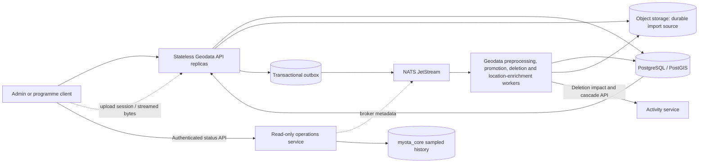

# Geodata API horizontal-scaling roadmap

## Status and scope

**Phase 0 evidence gate complete at 2,875 measured entities. Phases 1, 2, and
3 are implemented and verified against their recorded evidence gates. Phases 4
and 5 remain open; Phase 3 qualification does not authorize increasing the
production replica count.**
This checklist records the work needed before increasing the
Geodata API beyond one replica in production. The baseline does not make the
current service horizontally safe.

### Test-environment premise — 8 October 2026

The user-designated **provisional production** target is the current K3s
deployment on `spainip.es`, reached through `https://api.myota.top`. All
load/performance qualification for this roadmap—including read, upload,
preprocessing, promotion, queue, and API-capacity profiles—must target this
deployment. Earlier non-production load results remain historical records but
do not qualify this policy's capacity gates. Run profiles sequentially with a
dedicated test account, existing hard caps and exact-tag cleanup; retain the
production opt-ins and stop conditions. Production runs are manual, never CI.

This does not authorize destructive fault injection, service/pod termination,
database or object-store restart, queue redrive, cleanup of untagged data, or
production replica/configuration changes. Those correctness and recovery
exercises remain CI or isolated-test-environment work. Production load results
describe only the current provisional deployment and are not a guarantee for a
future production footprint.

The goal is to scale the HTTP API independently from large dataset processing
while preserving entity, review, import, provenance, and audit correctness.
PostgreSQL/PostGIS remains the system of record; object storage remains the
durable source for uploaded datasets; NATS JetStream carries asynchronous work
and cross-service events.

Current implementation and remaining hazards:

- Phase 1 no longer hydrates a mutable catalogue snapshot. Request/job-scoped
  projections read authoritative rows and flush only changed rows, with locks,
  revisions and database idempotency. See the [Phase 1 evidence and rollout
  record](phase1-relational-authority.md).
- Durable imports now use resumable object-storage multipart sessions and a
  separately deployed JetStream worker. Source-reference and proximity
  lookups are indexed. Uploaded GeoJSON, KML, GPX, Shapefile/ParkServe, and OSM
  PBF have streaming decoders and commit stable-ordinal candidate checkpoints
  in batches bounded by 100 features or 32 MiB serialized source data. XML
  subtree and OSM area guards run before materialization/conversion. RSS is
  measured across the supported formats, a maximum-vertex feature, and a
  complete-snapshot worker run; process-death/replay is tested at parsing,
  checkpoint, enrichment, and promotion stages. See the
  [Phase 3 evidence](evidence/phase3-bounded-preprocessing-2026-10-09.md).
- Phase 2's API and SeaweedFS restart-recovery gate passed in an isolated CI
  environment using the exact SeaweedFS image digest observed in the live K3s
  pod. No production API or object-store process was restarted; see the
  [Phase 2 evidence](evidence/phase2-upload-recovery-2026-10-09.md).

See [overall architecture](../architecture/overview.md),
[operations](../operations/runbooks.md),
[geodata import validation and promotion](../architecture/diagrams/geodata-import-validation.md),
and the upload-session/worker deployment in `myota-deploy` for current
behavior.

## Earlier delivery context — 8 October 2026

This dated section preserves the state before the 9 October Phase 2/3
qualification documented above and below. It is historical context, not the
current completion status. Phase 4 and 5 remain rollout gates.

### Entity location metadata lifecycle — 8 October 2026

Reverse geocoding now runs after entity materialization, after geometry/type
changes, or when an administrator releases manual values. Import preprocessing
does not wait on the provider. Requests are written through the transactional
outbox and handled by the durable `geodata-location-enrichment-v1` consumer;
the worker rechecks the request ID and geometry hash after lookup so a result
cannot overwrite metadata for newer coordinates. Explicit manual values and
their codes keep precedence. Entity Management exposes a retry button while
required location values are missing. The API, event and lifecycle details are
in the [location-enrichment guide](location-enrichment.md),
[REST consolidation plan](../domain/api/rest-consolidation-plan.md), and
[event contract](https://github.com/myota-platform/myota-contracts/blob/main/contracts/events.md).

### Import cleanup stability — 8 October 2026

A production load-test run remained `PROCESSING`, so the guarded cleanup API
correctly refused to delete its fixtures. The underlying delay was not simply
the cleanup timeout: feature preprocessing repeatedly enumerated every staged
candidate and every entity, and the worker heartbeat could race with its final
run-status write. Candidate replay is now scoped to the import using the
existing `(import_run_id, ordinal)` index; source-reference reconciliation has
an indexed lookup; possible-duplicate checks use the PostGIS geography index.
The worker now joins its heartbeat and refreshes the database-authoritative
import row before marking a run complete or failed. Migration 018 installs the
source-reference index and is synchronized into the platform and deployment
migration runners. The five-minute cleanup wait remains a safety bound, not a
substitute for a worker completing reliably.

The service checks passed locally at that point: 101 Python tests (15 skipped)
and Ruff. The parser and worker gaps noted in this 8 October snapshot were
closed by the bounded streaming, RSS, and recovery qualification recorded in
the 9 October Phase 3 evidence report.

| Delivered capability | Documentation and implementation evidence |
|---|---|
| Database-authoritative geodata rows, conditional edits, idempotency, atomic entity/candidate/audit/outbox checkpoints and obsolete-writer fence | [Phase 1 inventory, migration 016, rollout and 84-test record](phase1-relational-authority.md); [published geodata implementation](https://github.com/myota-platform/myota-geodata-service/commit/ab991891840590a2be9c4c458e1771a45e2c64d8); [successful database/two-API CI](https://github.com/myota-platform/myota-geodata-service/actions/runs/37642572170) |
| Owner-bound resumable uploads, pause/resume/discard, bounded checksummed parts, fresh completed-file submissions, revision-conflict reloads and active import refresh | [Admin workflow](../domain/administration/overview.md); [published Vue changes](https://github.com/myota-platform/myota-admin-web/commit/e17603fdcc6e3b85d7c062fbdc8ef7b9e2e1baae); [successful admin tests/build](https://github.com/myota-platform/myota-admin-web/actions/runs/37640776687) |
| Separate durable preprocessing, promotion, entity-deletion and location-enrichment consumers with replay-safe effects | [Import lifecycle diagram](../architecture/diagrams/geodata-import-validation.md), [recovery runbook](../operations/runbooks.md#import-recovery), [deletion authorization and lease boundary](phase1-relational-authority.md#mutation-and-api-behavior), [location-enrichment lifecycle](location-enrichment.md) |
| Read-only broker inspection and durable sampled history, separate from business workers | [JetStream status API/UI and operational semantics](../operations/messaging/jetstream-admin-status.md); [successful operations service CI](https://github.com/myota-platform/myota-operations-service/actions/runs/37642579946) |
| Canonical contracts, conditional-write clients and runtime route reconciliation | [Contract repository validation](https://github.com/myota-platform/myota-contracts#validate-contracts-and-clients); [successful contract freeze/client CI](https://github.com/myota-platform/myota-contracts/actions/runs/37642816616) |
| Compose/Helm worker separation, migration mirrors, operations service, scrape targets and availability/history alerts | [Deployment ownership](../architecture/repository-map.md), [published deployment integration](https://github.com/myota-platform/myota-deploy/commit/6ceac513834554ddcf77768c8ccd0bbfa2f98813), [successful deployment tests/image build](https://github.com/myota-platform/myota-deploy/actions/runs/37642540219), [GitHub Helm validation](https://github.com/myota-platform/myota-deploy/actions/runs/37642215588) |

The Helm validation link records the chart-changing commit; later deployment
changes have their own test/image result above. Local Colima evidence is recorded
in the Phase 1 delivery record. These results do not substitute for forced
receiver-pod/worker termination, multi-worker, node/disk failure, sustained-load
or production-canary tests. The controlled API and SeaweedFS container restarts
are covered separately by the Phase 2 evidence below.

## Phase 2 completion and evidence — 9 October 2026

The remaining resumable upload recovery gate is complete. The recovery workflow
used SeaweedFS image
`docker.io/chrislusf/seaweedfs@sha256:4e61d15fd35994cb1e43e1e553dff106794841fd9a99ade2fc8c8bfce4d7872d`,
matching the image ID read from the live `myota-seaweedfs` K3s pod on 9 October.
GitHub Actions ran the service API and PostGIS against a disposable test
database and this digest-pinned SeaweedFS image with a disposable named data
volume. It restarted the API between multipart parts and restarted the
isolated SeaweedFS container before completing the transfer. The assembled
6,291,593-byte object matched the submitted whole-object SHA-256; its part
checksums, completed upload row, import metadata and single outbox event
survived the restarts. Completion retry did not duplicate the run/event,
another subject could not inspect/resume/abort the session, and an incomplete
second transfer was aborted with no lingering multipart entry. Disposable
object-store data was removed at job end.

The workflow and isolated test are in
[geodata-service commit 853fcbc](https://github.com/myota-platform/myota-geodata-service/commit/853fcbc5b30085c8a450ff0accbe32e414348c22).
The [CI run](https://github.com/myota-platform/myota-geodata-service/actions/runs/37908154059)
passed the restart-recovery job and all service regression/quality jobs; image
publication also succeeded. See the detailed [Phase 2 evidence record](evidence/phase2-upload-recovery-2026-10-09.md).
This verifies graceful API process replacement and a SeaweedFS container
restart with its persistent volume, not physical disk loss, abrupt node loss,
or object-store multi-node failover. Re-run the gate whenever the deployed
SeaweedFS image digest changes. The provisional-production cluster itself was
not mutated by this failure-injection test.

The [organization documentation reconciliation](../history/documentation-reconciliation-2026-10-07.md)
records coverage of all twelve repositories, current contract checks and the
42 service-owned migration mirrors, including the restored platform activity
retention copies. This is a synchronization repair, not a new live schema change.

## Target shape

The API validates/authenticates requests, performs bounded relational and
spatial queries, creates durable upload/import records, and returns. Workers
parse, normalize, deduplicate, enrich, and promote data. No process-local cache,
executor queue, or pod filesystem is authoritative for accepted work.

## Phased to-do list

### Phase 0 — establish a measurable baseline

ChatGPT implementation prompt: [review remaining query and bottleneck evidence](prompts/scaling/phase-0-baseline.md).

- [x] Define and run a bounded production-safe workload for health, paged
  catalogue, bounding-box catalogue, and entity-detail reads. It defaults to
  2 VUs/60s and is capped at 50 VUs/5m. The 2-VU/60s empty-catalogue run
  passed health/page reads; a separate 2-VU/30s run with five temporary tagged
  geometries passed map/detail reads. Both are documented in the
  [production evidence record](evidence/phase0-production-evidence-2026-10-08.md).
  Qualification uses the current provisional-production
  deployment; see the [geodata service k6 instructions](https://github.com/myota-platform/myota-geodata-service#read-only-load-baseline-grafana-k6).
- [x] Define bounded representative workload profiles for large uploads,
  simultaneous edits, preprocessing, promotion, and sustained queue backlog.
  They require explicit environment acknowledgement and exact host allowlisting;
  the current qualification target additionally requires its production opt-in,
  retains hard safety caps, and uses separately enabled production cleanup. All
  five profiles passed against provisional production and cleaned tagged
  fixtures. See the [production evidence record](evidence/phase0-production-evidence-2026-10-08.md),
  [workload and query-evidence runbook](evidence/load-test-and-query-evidence.md),
  and the [k6 profile implementation](https://github.com/myota-platform/myota-geodata-service/blob/main/loadtests/geodata-workloads.js).
- [x] Record the earlier non-production write-profile runs and retained
  summaries as historical results. They do not qualify the current
  provisional-production capacity gates.
- [x] Run the five bounded write profiles against the current provisional
  production target, one at a time, using the dedicated test account and
  successful exact-tag cleanup. Retain run IDs, settings and summaries in the
  [production evidence record](evidence/phase0-production-evidence-2026-10-08.md).
  Do not weaken caps or run profiles in CI.
- [x] Reconcile large-upload profiles with the resumable upload contract and
  remove tagged terminal session/part records during cleanup. Add automated
  upload/abort/checksum/cleanup regressions and a real-k6 localhost transport
  smoke; see the [verification record](evidence/load-test-upload-verification.md).
  These correctness checks do not close the representative workload gate above.
- [x] Export API request rate, response-duration histogram (p50/p95/p99 in
  Grafana), errors, active requests, and request body size through OpenTelemetry.
- [x] Export process CPU time and resident memory with a unique
  `service.instance.id` resource attribute for per-process views.
- [x] Export Postgres connection-pool size/availability/waiters, cumulative
  pool-wait time, active connections, max connections, and lock waits.
- [x] Add query-level slow-query counters and dedicated PostGIS timings for
  bounding-box reads and entity upserts. Provide a guarded, read-only
  `EXPLAIN (ANALYZE, BUFFERS)` evidence tool with a separate exact-host
  production acknowledgement and statement-time bound; the API latency
  histogram is kept separate from query execution time. See
  the [query-evidence runbook](evidence/load-test-and-query-evidence.md) and
  [evidence tool](https://github.com/myota-platform/myota-geodata-service/blob/main/scripts/geodata-query-plan-evidence.py).
- [x] Export durable geodata import queue depth/age, processing heartbeat age,
  retry attempts, feature totals, and unpublished outbox depth/age.
- [x] Export JetStream consumer pending/ack-pending counts, broker redelivery
  counts, and oldest outstanding message age directly from JetStream consumer
  state. Age is explicitly marked unavailable if retention removes the
  referenced message before its timestamp is read. See the
  [JetStream metrics implementation](https://github.com/myota-platform/myota-geodata-service/blob/main/jetstream_observability.py).
- [x] Provision the **MyOTA Geodata capacity baseline** dashboard and backlog,
  pool, and heartbeat alerts in local Compose and Helm Grafana/Prometheus files.
- [x] Provision a separate **MyOTA JetStream backlog and PostGIS query
  performance** dashboard in Compose and Helm, with broker-lag and dedicated
  PostGIS query percentiles/slow-query panels.
- [x] Add a repeatable Grafana k6 script. It samples at most ten public
  entities in memory and makes no application writes or uploads; if the
  catalogue is empty, it clearly skips map/detail requests and still measures
  health/catalogue reads. The script refuses production runs without explicit
  acknowledgement.
- [x] Review retained results for all five bounded write profiles; the runs
  and summaries are recorded in the [production evidence record](evidence/phase0-production-evidence-2026-10-08.md).
- [x] Verify the real SeaweedFS S3 metrics endpoint, Fleet scrape, and
  Prometheus series on private port 9324; correct the unsupported port 9327
  target and add automatic Collector rollout on scrape-config changes.
- [x] Correlate one bounded large upload with SeaweedFS request counters and
  latency, production gateway route labels, and post-cleanup worker/JetStream
  backlog. This confirms instrumentation and a low-load lifecycle, not capacity.
- [x] Provision the confirmed permanent synthetic Sevilla fixture set: 10,000
  input features in four 2,500-feature imports. The current requested sample
  promotes 5% per import (2.5% `CANDIDATE`, 2.5% `APPROVED`) and rejects the
  remainder from staging. The first import was already queued for full approval
  before this change; its 2,500 approved entities cannot be downgraded, so the
  remaining three batches use the sample and this legacy exception must be
  included in the evidence. The guarded script has no automatic cleanup.
  Retain the resulting import and entity counts in the [representative query review](evidence/phase0-representative-query-review-2026-10-08.md).
- [x] Capture and review map-bounds, catalogue-count, and catalogue-page
  `EXPLAIN (ANALYZE, BUFFERS)` plans at the resulting promoted cardinality, then
  run the bounded read profile and correlate API/PostGIS timings with object
  storage and worker metrics. See the [representative query review](evidence/phase0-representative-query-review-2026-10-08.md),
  [storage-correlation artifact](evidence/phase0-storage-correlation-2026-10-08.md),
  [pre-fixture low-cardinality plan snapshot](evidence/phase0-current-catalogue-plan-2026-10-08.md),
  [evidence limitations](evidence/phase0-production-evidence-2026-10-08.md#conclusion-and-representative-scale-gate),
  and the [scale-fixture provisioner](https://github.com/myota-platform/myota-geodata-service/blob/main/loadtests/provision_scale_fixtures.py).

**Exit criteria: complete for the measured 2,875-entity catalogue.** The
read-only baseline and all five write profiles passed against provisional
production with cleanup; the permanent fixture imports were finalized; and the
representative plans, 2-VU read results, PostGIS timings, SeaweedFS activity,
and worker/JetStream state are reviewed in the linked evidence. This does not
qualify capacity at 10,000 promoted entities, tens of thousands of users,
millions of QSOs, or cold-cache/high-concurrency conditions. See the
[production evidence record](evidence/phase0-production-evidence-2026-10-08.md)
and [representative query review](evidence/phase0-representative-query-review-2026-10-08.md).

### Phase 1 — remove cross-replica mutable process state

- [x] Inventory every `GeoHandler.store.items`, `store.data`, `store.events`,
  and `store.idempotency` read/write path and classify its source of truth.
- [x] Replace entity catalogue reads with indexed, paginated PostGIS repository
  queries, including map bounds, category, status, and location filters.
- [x] Replace entity edits, status changes, category assignments, geometry
  updates, reviews, and audit writes with narrowly scoped database
  transactions and optimistic/version checks where concurrent edits matter.
- [x] Replace whole-state snapshot persistence for durable geodata operations
  with row-level repository writes. Keep any compatibility projection
  read-only or remove it after an explicit migration/reconciliation plan.
- [x] Make import runs, staged candidates, processing queues, audit history,
  and idempotency records database-authoritative; do not merge stale pod-local
  snapshots back into Postgres.
- [x] Ensure every mutating endpoint has database-enforced idempotency or a
  safe conditional update, including concurrent duplicate requests.
- [x] Add concurrency tests with two independent service instances editing and
  reading the same entity/import state.
- [x] Migrate admin entity mutations to revision-aware requests and explicit
  reload guidance on HTTP 409; see the [admin workflow](../domain/administration/overview.md) and
  [concurrency/API behavior](phase1-relational-authority.md#mutation-and-api-behavior).

Implementation, complete source-of-truth inventory, API concurrency behavior,
migration/rollout guidance and test links are in the
[Phase 1 delivery record](phase1-relational-authority.md).
Local Colima validation includes 83 unit/database tests plus one HTTP test against
two independent running API containers. CI runs the same database and two-process
HTTP tests before image publication. The database fence rejects obsolete writers,
including during mixed-image rollout.

**Exit criteria: met for Phase 1.** Restarting or adding an API pod cannot overwrite a newer
database value with an older in-memory copy; concurrent updates are either
serialized or return an explicit conflict.

### Phase 2 — make upload handoff durable without a shared pod volume

ChatGPT implementation prompt: [test upload recovery across restarts](prompts/scaling/phase-2-upload-recovery.md).

- [x] Design an upload-session record with explicit states, owner, filename,
  expected size, checksum, object key, expiry, and completion status.
- [x] Test SeaweedFS multipart create/upload/complete/read-checksum/delete and
  abort against the locally deployed pinned image
  `chrislusf/seaweedfs:latest@sha256:ce9e796f1fe6f06968f4c04bdaf8f678dad9c8acdfef3d244133d71bfa6bf882`.
- [x] Test resumable API-session recovery across API termination and object
  storage restart using the exact SeaweedFS image digest observed in the
  deployment. The isolated database/object-store fixture, restart points,
  checksums, owner controls, retry semantics and cleanup all passed; see the
  [Phase 2 evidence](evidence/phase2-upload-recovery-2026-10-09.md) and
  [successful CI run](https://github.com/myota-platform/myota-geodata-service/actions/runs/37908154059).
- [x] Implement bounded 16 MiB multipart-part transfer through the API to
  object storage; do not materialize the complete upload in API memory or a
  shared `ReadWriteOnce` PVC.
- [x] Persist the completed object reference and import metadata before
  publishing work. Do not report an import as accepted until this durable
  handoff succeeds.
- [x] Keep malware scanning and file/type/size validation in the durable
  lifecycle. Define how multipart parts and abandoned sessions are cleaned up.
- [x] Make upload retries idempotent and define whether an incomplete upload is
  resumed or restarted after a client/network failure.
- [x] Integrate browser pause/resume/discard, saved-part verification, recovery
  after response loss and fresh submission identities after completion. See
  [admin upload behavior](../domain/administration/overview.md) and the [admin test/build evidence](#latest-delivery-and-evidence--8-october-2026).
- [x] Remove the shared upload-spool PVC dependency. Any remaining local
  scratch space is bounded per part and reconstructible from the client or
  object store; see the [restart/recovery evidence](evidence/phase2-upload-recovery-2026-10-09.md).

**Exit criteria: complete for the tested SeaweedFS image digest.** Multipart
operations and part/whole-object checksums passed against the pinned image
reported by the live K3s deployment. Session resume after API process restart
and SeaweedFS container restart, durable metadata/outbox handoff, replay,
ownership checks and abort cleanup passed in an isolated CI environment.
Production itself was not restarted or used for test writes. Re-run this gate
if the deployed SeaweedFS image ID changes. This phase does not qualify
large-source parser memory or worker restart behavior; those remain Phase 3
gates.

### Phase 3 — isolate preprocessing and promotion from API pods

ChatGPT implementation prompt: [implement bounded workers and failure recovery](prompts/scaling/phase-3-worker-isolation.md).

- [x] Make the API write a durable import/job row and transactional outbox
  event, then return; remove API-local submission of durable preprocessing or
  promotion work in production mode.
- [x] Use one authoritative production dispatch path through JetStream. Keep a
  local development fallback only if it preserves the same durable claim,
  retry, and idempotency semantics and cannot run alongside the production
  consumer for the same job.
- [x] Move preprocessing into a geodata-owned worker Deployment that reads
  immutable source objects and claims work from a database lease/queue.
- [x] Make worker claims atomic and recoverable with lease expiry, heartbeat,
  attempt count, bounded retry/backoff, and a visible terminal error state.
- [x] Make each feature/candidate write idempotent; use stable import and
  source-record identity so a retry cannot create duplicate candidates.
- [x] Close the bounded-memory qualification for every supported source format
  and snapshot mode. GeoJSON FeatureCollections/arrays use `ijson`; KML streams
  placemarks; GPX streams waypoints and track segments; zipped Shapefile and
  ParkServe stream records after archive/record preflight; OSM PBF uses a
  disk-backed node-location index. Defaults cap a decoded feature at 16 MiB and
  250,000 vertices, cap Shapefile expansion at 1 GiB/100 members, and cap each
  import at 5,000 features. `completeSnapshot` preflights and reopens its
  immutable source instead of retaining a decoded feature list, then processes
  within the import cap. XML subtree preflight and OSM area vertex checks run
  before ElementTree feature construction and GeoJSON conversion. Retained RSS
  evidence covers 300k GeoJSON/WFS/ArcGIS response features; 50k KML, GPX,
  Shapefile/ParkServe, and OSM PBF records; a 250k-vertex feature; and
  complete-snapshot preprocessing. Candidate replay remains ordinal/range-scoped
  and spatial deduplication uses indexed queries. See the
  [implementation and measured limits](evidence/phase3-bounded-preprocessing-2026-10-09.md).
- [x] Make promotion consume only confirmed candidate IDs and record the
  resulting status/entity IDs and audit information with idempotent stable IDs.
  Entity/result/audit atomicity and duplicate promotion replay now have local
  database integration coverage in the [Phase 1 tests](phase1-relational-authority.md).
- [x] Move confirmed permanent entity deletion to the separate
  `geodata-entity-deletion-v1` durable consumer, with saved authorization,
  recoverable leases and idempotent activity-cascade calls. See
  [deletion execution semantics](phase1-relational-authority.md#mutation-and-api-behavior).
- [x] Expose real streams, consumers, pending/ack-pending deliveries, redelivery
  state and persistent sampled history through the authenticated
  [operations service and admin page](../operations/messaging/jetstream-admin-status.md). The observer
  does not consume, acknowledge, redrive or purge domain work.
- [x] Verify durable delivery against isolated JetStream: ACK-pending is
  released after handler success; a lost ACK after the processed-event commit
  redelivers without repeating the handler side effect; and competing pull
  consumers process a bounded event set once. The forced-process-death tests
  below separately verify lease reclaim and replay at each business stage. See
  the [Phase 3 evidence](evidence/phase3-bounded-preprocessing-2026-10-09.md).
- [x] Add worker shutdown/drain behavior: stop fetching on SIGTERM/SIGINT,
  finish the active delivery, and drain the NATS connection.
- [x] Test worker termination during parsing, enrichment, candidate
  persistence, and promotion, including forced process death, then verify lease
  reclaim and replay in an isolated environment. The K3s-host disposable
  PostGIS tests force-killed workers before the first parse checkpoint, after a
  committed candidate checkpoint, during enrichment before commit, and after
  promotion materialization before durable commit. Replay completed without
  duplicate ordinals/entities. A JetStream test also requested graceful stop
  during an active delivery, verified it completed and acknowledged, and
  observed zero pending messages. See the [Phase 3 evidence](evidence/phase3-bounded-preprocessing-2026-10-09.md).

**Exit criteria: met for the documented Phase 3 bounds.** API requests no longer execute durable
preprocessing or promotion locally; worker retries use database leases and
stable identities. Uploaded formats use streaming decoders with explicit
feature/import caps and preprocessing windows bounded by both 100 records and
32 MiB serialized input; representative all-format, remote-response, maximum
vertex, and complete-snapshot RSS stays below the enforced 96 MiB test ceiling.
Isolated PostGIS tests prove forced-death lease recovery/replay at each worker
stage, unique ordinals/entities, and one winner among competing claims.
Isolated JetStream tests verify ACK-pending release, commit-before-ACK
redelivery, idempotent effects, competing consumers, and graceful drain.
Performance scaling and larger real-world source envelopes remain governed by
Phases 4 and 5, not by this bounded correctness qualification.
See the [Phase 3 evidence](evidence/phase3-bounded-preprocessing-2026-10-09.md).

### Phase 4 — remove unsafe infrastructure constraints

Phase 1 removes the shared snapshot correctness blocker, but does not authorize
production replica increases. Apply the [write-fenced migration/rollout
procedure](phase1-relational-authority.md#migration-and-rollout) first;
then complete the infrastructure and operational gates below.

ChatGPT implementation prompt: [review infrastructure and scaling constraints](prompts/scaling/phase-4-infrastructure.md).

- [x] Remove the geodata API's shared `ReadWriteOnce` upload-spool dependency;
  see [Phase 2](#phase-2--make-upload-handoff-durable-without-a-shared-pod-volume).
- [ ] Review all other volumes mounted by API pods before increasing replicas.
- [x] Implement durable pull consumers, explicit acknowledgement, database
  leases and idempotent side effects for the three geodata queues; see the
  [worker lifecycle](../architecture/diagrams/geodata-import-validation.md).
- [ ] Qualify concurrent multi-worker delivery and failure recovery before
  increasing consumer replicas; implementation alone does not prove this gate.
- [ ] Keep PostGIS connection use bounded across all API and worker replicas;
  size per-pod pools from the database connection budget and consider
  PgBouncer if appropriate.
- [ ] Review `EXPLAIN (ANALYZE, BUFFERS)` for high-volume entity/map queries;
  add or adjust B-tree/GiST indexes based on observed query plans.
- [ ] Add Kubernetes CPU/memory requests and limits, startup/readiness probes,
  graceful termination, pod disruption budgets, and topology spreading for
  stateless API pods.
- [ ] Add an API HPA using tested resource/latency signals and a separate worker
  scaling policy using queue depth/oldest-message age. Set minimum and maximum
  replicas from load-test results, not guesses.
- [ ] Confirm rate limiting, request/body limits, timeouts, and backpressure
  remain effective when more API pods are available.

**Exit criteria:** replicas can be added and removed without violating storage,
queue, database-connection, or availability constraints.

### Phase 5 — staged rollout and operational proof

Current CI now covers relational migrations, concurrent independent repositories,
promotion replay, migration replay, and two actual API processes. GeoJSON
FeatureCollection streaming/checkpointing has focused unit coverage, but
universal large-source memory evidence, worker termination/reclaim, node/storage
failure and load/canary proof remain open. The API-session and SeaweedFS
container restart gate is complete.

ChatGPT implementation prompt: [complete staged rollout and operational proof](prompts/scaling/phase-5-rollout.md).

- [x] Run contract, integration, migration/replay and independent-instance
  concurrency checks in CI; see the [delivery evidence](#latest-delivery-and-evidence--8-october-2026)
  and [Phase 1 test inventory](phase1-relational-authority.md#recorded-validation).
- [x] Add and pass the resumable upload API/SeaweedFS restart-recovery test in
  CI against the deployed SeaweedFS image; see the [Phase 2 evidence](evidence/phase2-upload-recovery-2026-10-09.md).
- [ ] Add and pass forced worker-recovery failure-injection tests in CI.
- [ ] Load-test the current provisional-production API at its deployed replica
  count; verify throughput and latency without shifting saturation to Postgres
  or object storage. Testing other replica counts requires a separately
  approved production rollout/change window; do not change replicas as part of
  a load run.
- [ ] Exercise large-file upload, interrupted client upload, receiver-pod
  termination, worker termination, duplicate event delivery, and production
  storage/node-failure scenarios. The API-session and SeaweedFS container
  restart subset is complete in the [Phase 2 evidence](evidence/phase2-upload-recovery-2026-10-09.md).
- [ ] Run a bounded provisional-production canary at the currently deployed
  replica count and compare error rate, latency, DB pool waits, object-store
  metrics and JetStream lag. Any production replica change is a separate
  operator-approved rollout, not an implicit load-test step.
- [x] Document the Phase 1 write fence, coordinated API/worker rollout and
  rollback restrictions in the [migration/rollout record](phase1-relational-authority.md#migration-and-rollout).
- [ ] Complete and drill the end-to-end operational rollback, in-flight import
  recovery, queue redrive and upload-session cleanup procedure before scaling production.
- [ ] Increase production API replicas gradually and retain a tested rollback
  to the prior deployment and schema-compatible code version.
- [x] Update current Compose/Helm topology, migration mirrors, operations
  scrape/alerts and operator docs for the delivered work; see the
  [deployment evidence](#latest-delivery-and-evidence--8-october-2026).
- [ ] Update and revalidate deployment limits, autoscaling, dashboards/alerts
  and operator documentation when the remaining qualification gates close.

**Overall completion criteria:** multiple Geodata API replicas can be rolled,
rescheduled, and autoscaled while large imports continue to recover; catalogue
reads and edits remain consistent; no accepted upload depends on pod-local
storage; and measured tests show the intended throughput/latency improvement.

## Ownership and sequencing

- `myota-geodata-service`: repository/query changes, upload API, worker logic,
  idempotency, concurrency tests, and service-level telemetry.
- `myota-admin-web`: resumable upload UX, active queue/detail refresh,
  revision-conflict handling and authenticated JetStream views; API access only.
- `myota-operations-service`: read-only broker inspection and service-owned
  sampled history in `myota_core`, not geodata job execution.
- `myota-identity-service`: assignable operations/observability permissions;
  do not grant broker visibility automatically to ordinary participants.
- `myota-deploy`: worker/API separation, Helm and Compose topology, storage
  claims, autoscaling, resource limits, probes, alerts, and rollout procedures.
- `myota-contracts`: canonical upload, conditional-update, job and operations
  contracts/clients; reconcile runtime routes and mirrors before publication.
- `myota-platform`: synchronized integration/migration/contract mirrors and
  cross-service compatibility tests; not a new domain owner.
- `myota-docs`: maintain this checklist, architecture diagrams, operational
  guidance, and phase completion links.
- `.github`: keep the public summary/checklist aligned with this detailed roadmap.

Do not mark a phase complete solely because replicas can be configured. Check
the phase's exit criteria and attach test/deployment evidence.
