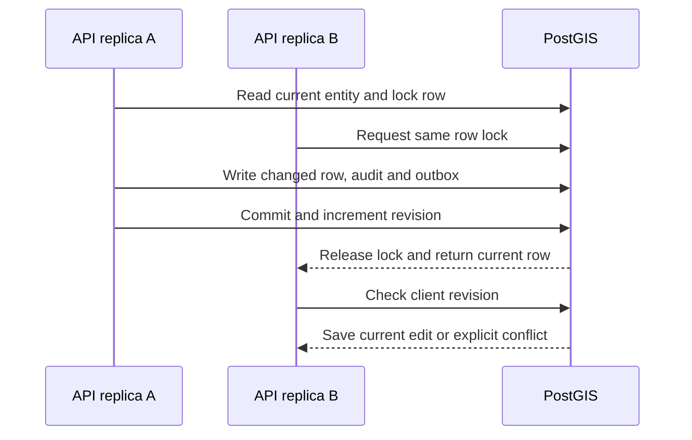

# Geodata Phase 1: database authority and concurrency evidence

Implemented 7 October 2026. This closes the process-state correctness work,
not the full horizontal-scaling rollout. Keep production replica counts unchanged
until the Phase 4 infrastructure and Phase 5 operational gates pass.

## State inventory

| Existing domain access | Authority now | Boundary / consistency |
|---|---|---|
| `store.items` entity detail, edits, reviews, status, categories, geometry, location, deletion | `geodata_entity`, category and source-reference rows | Request transaction, row locks, revision/`If-Match`, changed-row writes |
| Catalogue/filter/map reads | Indexed PostGIS queries | Database pagination and count; GiST bounds, category/status/location indexes; no catalogue hydration |
| `store.data.importRuns` | `import_run` | Fresh row projections per operation; row-level delta merge under locks; explicit conflict on competing lifecycle changes |
| `store.data.importCandidates` | `geodata_import_candidate` | Paged pending records, SQL counts, stable source ordinal, atomic entity/result/audit checkpoints |
| `store.data.importProcessingQueues` | `geodata_import_processing_queue` | Durable lease and JetStream delivery; selected records marked CONFIRMED and associated with their job before dispatch |
| `store.data.schedules`, `conflationCandidates`, `sourceManifests`, `entityDeletionJobs` | `geodata_control_record` | Individually keyed control resources, not one service-wide snapshot; existing resource payloads migrated once |
| `store.events` and entity audit | `geodata_audit_event` plus transactional `outbox_event` | Domain write, audit and event insert in one transaction; deletion purges the entity audit but retains the delivery event for downstream consumers |
| `store.idempotency` / `once` | `idempotency_record` | Database advisory lock, unique service/key; HTTP keys scoped to subject/resource; changed request body conflicts |
| Multipart upload/session/parts | Upload tables and SeaweedFS | Existing owner-bound conditional transitions; no browser/pod state is authoritative |
| Worker heartbeat, claim, consumer checkpoint and retention | Relational SQL | Bounded connections; independent heartbeats cannot be overwritten by stale whole-row copies |
| Non-durable unit-test dictionaries | Test-only fallback | No database configured; deployment still requires durable storage |

Implementation: [row repository](https://github.com/myota-platform/myota-geodata-service/blob/main/relational_state.py),
[HTTP/job boundaries](https://github.com/myota-platform/myota-geodata-service/blob/main/geodata_operations.py),
[paged queries](https://github.com/myota-platform/myota-geodata-service/blob/main/relational_queries.py).
The dictionary-shaped domain interface remains for compatibility, but its buffers
are scoped to a request/job and never become authoritative pod-wide caches.
Unchanged rows are never flushed. A stale buffer cannot recreate a deleted row.

## Mutation and API behavior

Entity reads return a database `version`; detail responses include its quoted
`ETag`. Preferred metadata, geometry, category and review writes accept
`If-Match`. A stale revision returns HTTP 409, as do conflicting concurrent
updates and reuse of an idempotency key for a different body. The admin client
supplies the selected revision and refreshes it after successful saves. Clients
without `If-Match` still receive a freshly locked row rather than editing an old
pod snapshot; independent worker checkpoints reject stale entity revisions.

Promotion atomically confirms selected records and associates them with a job.
Queued records cannot be rejected or submitted to a second promotion job.
Entity, candidate result and audit/outbox writes share each checkpoint transaction.
Worker failures discard uncommitted deltas before writing terminal error state.
At the time of this Phase 1 implementation, parsing and forced-termination
qualification remained open. Phase 3 has since added bounded streaming and
verified worker recovery for its documented limits; see the
[Phase 3 evidence report](evidence/phase3-bounded-preprocessing-2026-10-09.md).

Confirmed entity deletion is also dispatched through
`myota.geodata.entity.delete.v1`, durable pull consumer
`geodata-entity-deletion-v1`. The database job holds the verified submitting
authorization context, not the browser bearer token. The worker creates a short
execution token, claims a recoverable lease and uses a stable activity-cascade
idempotency key. Job APIs do not expose the execution context. Old local-executor
jobs lacking a durable authorization context are marked FAILED; recreate and
confirm them rather than granting implicit permission during recovery.

## Migration and rollout

1. Back up `myota_geo`, especially `service_state`, and preserve current source
   objects. Do not roll back by replaying an old process snapshot.
2. Publish the new API/worker image before reconciling the Helm release. Apply
   service migration `016_relational_authority.sql` using the deploy runner;
   its synchronized platform/deploy copies must match byte for byte.
3. The migration copies legacy metadata resources and audit history once, with
   `ON CONFLICT DO NOTHING`. Catalogue/import/candidate rows remain authoritative;
   stale snapshots are not merged back over them. The old snapshot is retained
   as an archive, never read or written by the new runtime.
4. A database write fence requires `myota.geodata_writer=row-v1` for geodata
   mutations. New repositories, workers, retention and migration commands set
   this transaction/session flag. An old image fails writes instead of overwriting
   newer rows during rollout. Expect a short write-maintenance interval while
   old pods are replaced; this is not a zero-downtime old-writer-compatible release.
5. Roll API and geodata worker pods together. Do not restore an old writer while
   retaining this schema/fence. Rollback requires an explicit maintenance window
   and reconciliation, not just decreasing an image tag.
   New API/consumer processes wait for the `row_authority_v1` feature marker
   before opening the HTTP listener or consuming JetStream deliveries. This
   prevents the automatic image rollout from serving a not-yet-migrated schema.
6. Verify upload completion, preprocessing, promotion, review and deletion jobs,
   then compare entity/audit counts and broker lag. Retry legacy FAILED deletion
   jobs by creating and confirming a new job.

## Recorded validation

- [x] 83 geodata unit/database tests pass in local Colima, including eleven
  isolated PostGIS boundary tests; the additional HTTP test passes against two
  independent running API containers (84 tests in total).
- [x] 27 integration regressions, 18 admin-client tests, four operations
  authorization/broker tests, UI type checking/build and Python quality checks pass.
- [x] 20 seed-free platform mirror tests pass without third-party runtime
  packages. Supporting import, location, metrics and storage modules are
  synchronized; activity/award object-storage compatibility is retained.
- [x] Two independent stores serialize simultaneous edits and preserve both fields.
- [x] Stale worker edits conflict rather than undoing another instance's approval.
- [x] A stale instance cannot resurrect an entity deleted by another instance.
- [x] Entity/audit/outbox writes roll back together after a failed operation.
- [x] Concurrent duplicate requests execute one mutation; changed-body key reuse conflicts.
- [x] Import metadata edits preserve independent worker heartbeat/attempt changes.
- [x] Indexed category, location, status and bounding-box pagination reads live rows.
- [x] Hydration ignores stale service snapshots and ordinary writes leave them untouched.
- [x] An obsolete writer is rejected by the database fence.
- [x] Replaying the migration cannot re-import deleted legacy control resources.
- [x] Promotion confirms records atomically; duplicate worker delivery keeps one entity and durable result.
- [x] Two actual API containers return one success and one stale-version conflict;
  both subsequently read the same revision and ETag.

Tests: [multi-instance evidence](https://github.com/myota-platform/myota-geodata-service/blob/main/tests/test_relational_concurrency.py).
The [two-process HTTP test](https://github.com/myota-platform/myota-geodata-service/blob/main/tests/test_two_api_instances.py)
checks both API responses and ETags.
The suite requires an isolated `*_tests` database through `GEO_TEST_DATABASE_URL`;
it refuses other database names. CI provisions PostGIS, applies the ordered
migrations and executes these same tests. Phase 5 still requires two-pod canary
load evidence and forced worker/storage termination tests.

