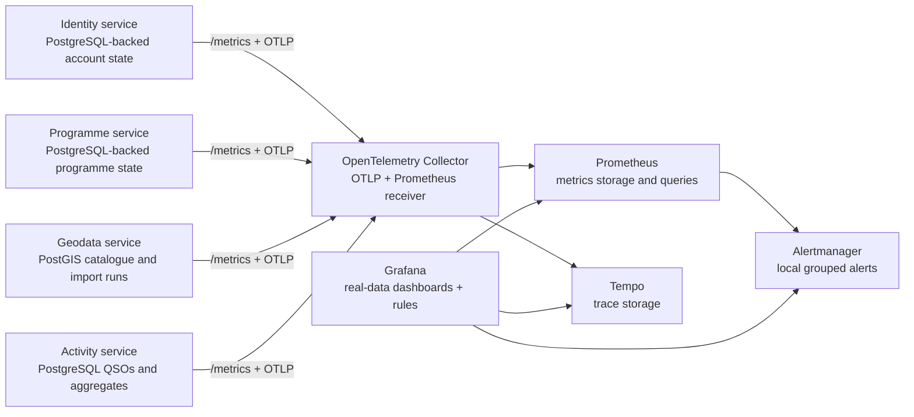

# MyOTA observability

Status: implemented for the local Compose stack and Helm packaging (updated 2026-10-05).

## What was confirmed

The original Grafana panels were not seeded with fabricated business values.
They were incomplete: request counters lived in each process and reset on a
restart, while most business panels had no durable user, entity, QSO, or award
measurements behind them. The only consistently visible value was gateway
health traffic. The old dashboard therefore did not provide a trustworthy
project-wide view.

The current dashboards use measurements derived from persisted service state,
live API/database execution, or direct JetStream consumer state. A zero is a
real zero; a missing value indicates that the source service or collector is
unavailable.


## Structured logging implementation roadmap

Durable application and worker logging is the next observability extension. The
implementation is specified in the
[structured logging implementation plan](observability/logging-implementation.md).

The plan adds Loki behind the existing OpenTelemetry Collector, standardizes
structured service and worker logging, propagates trace and business correlation
context through HTTP and NATS/JetStream, adds PostgreSQL/PostGIS database
metrics, traces and logs, and connects Grafana metrics, traces and logs. It is
split into independently executable phases, each with a linked
ChatGPT/Work/Codex implementation prompt.

## Collection architecture



The collector is infrastructure owned by `myota-deploy`; a separate business
metrics microservice would create a second owner for facts already owned by
identity, geodata, programme, and activity services. Prometheus scrapes the
collector's `:8889` endpoint. The collector also scrapes each service's
Prometheus-compatible `/metrics` endpoint, allowing durable gauges to remain
available during an OTLP exporter or collector restart.

## API endpoint telemetry

The OpenTelemetry HTTP instruments use the service name, normalized route
template, HTTP method, response status, and duration as dimensions. The
`MyOTA API performance` Grafana dashboard repeats four graphs for each observed
service and splits each graph into route/method series: request rate, p95
response time in milliseconds, 5xx server-error rate, and calculated
availability percentage. The route label is the registered API template (for
example `/v1/entities/{id}`), not an unbounded URL containing identifiers.
This keeps cardinality bounded and makes the dashboard usable for the new REST
resource API as well as the remaining compatibility aliases.

API latency is distinct from query-level timings. The geodata service observes
the PostGIS bounding-box query and entity upsert under
`myota_geodata_postgis_query_duration_seconds{query=...}` and counts operations
above the configured slow-query threshold. A guarded non-production tool
captures actual `EXPLAIN (ANALYZE, BUFFERS, FORMAT JSON)` plans; see the
[geodata load and query-evidence runbook](geodata-load-test-and-query-evidence.md).

## Alerting

Prometheus evaluates the source-of-truth rules in
`myota-deploy/observability/rules.yml` and sends alerts to Alertmanager. The
rules cover collector availability, service scrape availability, per-route 5xx
error rate above 5% for five minutes, p95 latency above one second for ten
minutes, and a critical p95 threshold above five seconds for five minutes.

Grafana provisions two equivalent Grafana-managed rules for API error rate and
latency. They use the provisioned Prometheus datasource and forward through the
local Alertmanager contact point, so operators can inspect both Grafana rule
state and Alertmanager grouping without an external notification account. The
local receiver intentionally has no outbound integration; production values
must replace it with an approved email, chat, webhook, or paging receiver and
should move Alertmanager storage to a persistent volume.

## Business metrics

Service endpoints expose these real aggregates without participant names,
emails, callsigns, or entity identifiers:

- Identity: users by status and participation type, callsigns, verified
  callsigns, roles, role definitions, security events, and locked accounts.
- Programme: programme totals and status, shared entity-category catalogue,
  and category-to-programme assignments.
- Geodata: entities by lifecycle status and GeoJSON geometry, categories,
  import runs by status, and pre-processing candidates by validation state.
- Activity: valid and void QSOs, activations by status, participants,
  activators, hunters, aggregate callsign/entity rows, award definitions and
  progress, ADIF imports, jobs, corrections, and queue lag.
- JetStream: per-stream/consumer pending and ack-pending messages, broker
  redeliveries, oldest outstanding message age, and metrics-poller health. The
  age lookup is marked unavailable if the broker no longer retains the target
  sequence. These are broker-side measurements, distinct from outbox/import
  database counts.

All service-specific values are read from the service's durable store at scrape
time. Request counters and distributed request histograms are emitted through
the OpenTelemetry Python SDK. API handlers remain available if the collector is
down because exporters are asynchronous and best-effort.

## Local access and verification

```bash
docker-compose --profile observability up -d --build
curl http://localhost:9090/-/ready
curl http://localhost:3000/api/health
curl http://localhost:8889/metrics
```

Grafana is at `http://localhost:3000`; Prometheus is at
`http://localhost:9090`; Alertmanager is at `http://localhost:9093`; Tempo's
local API is at `http://localhost:3200`. The provisioned `MyOTA operations`,
`MyOTA API performance`, `MyOTA Geodata capacity baseline`, and `MyOTA JetStream
backlog and PostGIS query performance` dashboards are tagged `real-data`.

Kubernetes enables the same collector, Prometheus, Alertmanager, Grafana and
Tempo resources with `observability.enabled=true`. Production should add
persistent volumes for Prometheus, Alertmanager and Tempo, resource limits,
retention settings, real notification receivers, and network policies
appropriate to the cluster.

## Operational interpretation

For authenticated stream/consumer inspection, choose **Platform health →
NATS / JetStream** (`/jetstream`) in the admin UI. The
[operations service](jetstream-admin-status.md) reads actual broker metadata
and persists sampled history in its own `myota_core` table every 30 seconds
by default, retaining seven days. The browser polls visible status every ten
seconds; it neither connects to NATS nor reads a database. Sampling failures
remain explicit `PARTIAL`/`UNAVAILABLE` records rather than zero backlog.
Availability and stalled-history alerts complement the Grafana broker panels.
The page is an observer, not a queue-redrive or consumer-management console.
See the [scaling delivery evidence and remaining gates](geodata-horizontal-scaling-roadmap.md#latest-delivery-and-evidence--7-october-2026).

- A missing series is not converted to a made-up value.
- Scrape and exporter health should be checked before interpreting an empty
  chart as zero activity.
- Request telemetry is technical telemetry, not a substitute for durable
  domain aggregates.
- Domain counters are intentionally aggregate-only and privacy-safe.
- Dashboards are a view, not an audit log. For investigation, use the service
  API, audit records, job records, and database-backed runbooks.
