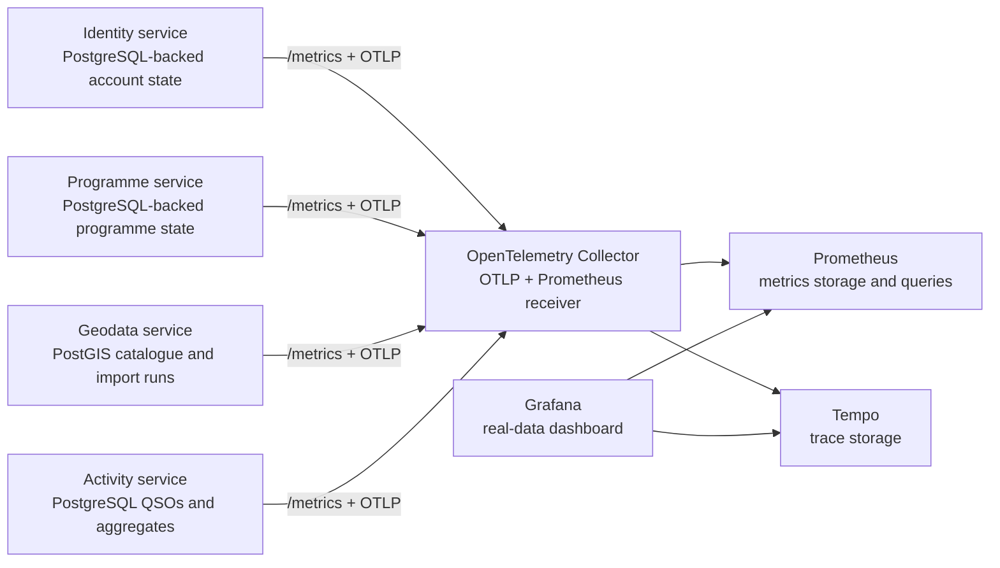

# MyOTA observability

Status: implemented for the local Compose stack and Helm packaging (2026-10-01).

## What was confirmed

The original Grafana panels were not seeded with fabricated business values.
They were incomplete: request counters lived in each process and reset on a
restart, while most business panels had no durable user, entity, QSO, or award
measurements behind them. The only consistently visible value was gateway
health traffic. The old dashboard therefore did not provide a trustworthy
project-wide view.

The current dashboard uses only measurements derived from persisted service
state. A zero is a real zero; a missing value indicates that the source service
or collector is unavailable.

## Collection architecture



The collector is infrastructure owned by `myota-deploy`; a separate business
metrics microservice would create a second owner for facts already owned by
identity, geodata, programme, and activity services. Prometheus scrapes the
collector's `:8889` endpoint. The collector also scrapes each service's
Prometheus-compatible `/metrics` endpoint, allowing durable gauges to remain
available during an OTLP exporter or collector restart.

## Business metrics

Service endpoints expose these real aggregates without participant names,
emails, callsigns, or entity identifiers:

- Identity: users by status and participation type, callsigns, verified
  callsigns, roles, role definitions, security events, and locked accounts.
- Programme: programme totals and status, shared entity-category catalogue,
  and category-to-programme assignments.
- Geodata: entities by lifecycle status and GeoJSON geometry, categories,
  import runs by status, and pre-processing candidates by validation state.
- Activity: valid and void QSOs, activations by status, participants,
  activators, hunters, aggregate callsign/entity rows, award definitions and
  progress, ADIF imports, jobs, corrections, and queue lag.

All service-specific values are read from the service's durable store at scrape
time. Request counters and distributed request histograms are emitted through
the OpenTelemetry Python SDK. API handlers remain available if the collector is
down because exporters are asynchronous and best-effort.

## Local access and verification

```bash
docker-compose --profile observability up -d --build
curl http://localhost:9090/-/ready
curl http://localhost:3000/api/health
curl http://localhost:8889/metrics
```

Grafana is at `http://localhost:3000`; Prometheus is at
`http://localhost:9090`; Tempo's local API is at `http://localhost:3200`.
The provisioned `MyOTA operations` dashboard is tagged `real-data`.

Kubernetes enables the same collector, Prometheus and Tempo resources with
`observability.enabled=true`. Production should add persistent volumes for
Prometheus and Tempo, resource limits, alert rules, retention settings, and
network policies appropriate to the cluster.

## Operational interpretation

- A missing series is not converted to a made-up value.
- Scrape and exporter health should be checked before interpreting an empty
  chart as zero activity.
- Request telemetry is technical telemetry, not a substitute for durable
  domain aggregates.
- Domain counters are intentionally aggregate-only and privacy-safe.
- Dashboards are a view, not an audit log. For investigation, use the service
  API, audit records, job records, and database-backed runbooks.
