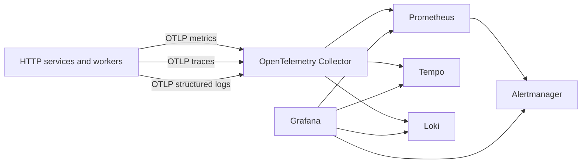
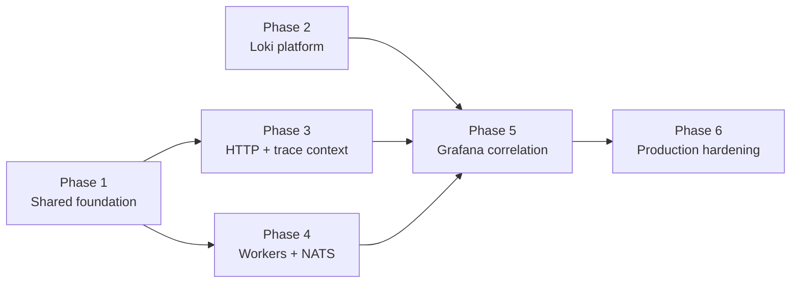

# Structured logging implementation plan

Status: planned extension to the implemented MyOTA observability stack.

Parent: [MyOTA observability](../observability.md)

## Objective

Add durable, structured, correlated application and worker logging to the existing
Prometheus + Tempo + Grafana + OpenTelemetry Collector stack without introducing
a second observability control plane.

The target architecture is:



MyOTA will use **Grafana Loki** as the log backend and the existing
**OpenTelemetry Collector** as the ingestion and processing layer. Promtail,
Filebeat, Fluent Bit, Elasticsearch, and OpenSearch are intentionally not part of
the first implementation.

## Design principles

1. Logs are structured telemetry, not unbounded `print()` output.
2. All services use the same resource identity and field semantics.
3. `trace_id`, `span_id`, `request_id`, and `correlation_id` have distinct purposes.
4. HTTP route labels use normalized route templates; identifiers never become metric
   or Loki labels.
5. Worker and NATS/JetStream operations are first-class observability subjects.
6. Payloads and secrets are not logged by default.
7. Metrics remain the primary source for rate, latency, availability, and queue alerts;
   logs are used for investigation and exceptional-event alerts.
8. Compose and Helm must remain functionally aligned.

## Correlation model

| Identifier | Scope | Purpose |
|---|---|---|
| `trace_id` | distributed execution path | OpenTelemetry trace correlation |
| `span_id` | one trace operation | link a log record to a specific span |
| `request_id` | one HTTP request | request/response troubleshooting |
| `correlation_id` | business/process workflow | correlate work across separate traces, queues and retries |
| `event_id` | one domain/message event | identify an emitted or consumed event |
| `job_id` | asynchronous job | follow job lifecycle and retries |

A single workflow may contain several traces while retaining one
`correlation_id`. For example an ADIF upload, JetStream processing, award
recalculation, and notification can remain queryable as one business operation
even if execution crosses asynchronous boundaries.

## Canonical structured log fields

Every application log record should support the following baseline fields:

```text
timestamp
severity
service.name
service.namespace = myota
service.instance.id
deployment.environment
component
event
trace_id
span_id
request_id
correlation_id
```

Context-specific fields may include:

```text
http.request.method
http.route
http.response.status_code
duration_ms

messaging.system
messaging.destination
messaging.message.id
messaging.operation
messaging.delivery_count

job.type
job.id
event.type
event.id

operator.id
programme.id
entity.id
import.id
activation.id
qso.id
award.id
```

Identifiers are fields/structured metadata, not Loki index labels.

## Loki label policy

Keep Loki labels deliberately low-cardinality. Initial labels should be limited to:

```text
service_name
service_namespace
deployment_environment
severity
component
```

A bounded `job_type` label may be added after validating cardinality.

Do **not** label on request IDs, trace IDs, correlation IDs, callsigns, operators,
entities, QSOs, imports, activations, programmes, awards, URLs, or arbitrary
exception messages.

## Data-handling policy

Do not log complete request/event payloads by default.

Explicitly exclude:

- Authorization headers and bearer tokens.
- JWTs, passwords, signing keys, S3 credentials, API keys and connection strings.
- Uploaded ADIF contents.
- GeoJSON/KML/GPX/WFS/ArcGIS bodies or complete geometries.
- Full user profiles or unrestricted personally identifying fields.
- Raw exception objects when they may embed credentials or payload fragments.

Prefer identifiers and bounded metadata such as import ID, feature count, source
type, object size, job type, delivery attempt, duration, result status, and
sanitized error classification.

## Retention baseline

Initial production target:

| Signal | Initial retention |
|---|---:|
| Prometheus | existing 15 days |
| Tempo | 7-14 days, capacity dependent |
| Loki | 14 days |
| DEBUG logs | disabled in production by default |

Start Loki with a 10-20 GiB persistent volume and measure actual ingestion before
raising retention. Longer WARN/ERROR retention may be considered later, but the
first implementation should keep one simple policy.

## Implementation phases

### Phase 1 - Shared structured logging foundation

Create a common MyOTA observability/logging helper and standardize resource
identity, severity, field names, redaction rules, and trace/span enrichment across
services.

Deliverables:

- shared logging configuration;
- JSON/structured log records;
- OpenTelemetry logging provider/handler;
- stable field names and resource attributes;
- trace/span context enrichment;
- tests for redaction and correlation fields;
- removal of duplicated logging setup where practical.

Implementation prompt:
[Phase 1 ChatGPT prompt](prompts/logging-phase-1-shared-foundation.md)

### Phase 2 - Loki, collector pipeline, Compose and Helm

Add Loki in single-binary mode, persist it, and connect the existing OTel logs
pipeline to Loki through OTLP. Keep Compose and Helm behavior aligned.

Deliverables:

- Loki configuration;
- Compose observability service and volume;
- Helm StatefulSet/service/PVC or equivalent chart resources;
- OTel Collector Loki exporter path;
- Grafana Loki datasource provisioning;
- configurable retention/storage;
- smoke tests proving logs survive collector/application restart as intended.

Implementation prompt:
[Phase 2 ChatGPT prompt](prompts/logging-phase-2-loki-platform.md)

### Phase 3 - HTTP request logging and distributed trace propagation

Instrument the common HTTP path with one completion log per request and proper W3C
trace-context extraction/injection.

Deliverables:

- `http.request.completed` events;
- normalized route, method, status and duration;
- request/correlation IDs in logs and responses;
- W3C `traceparent` / `tracestate` handling;
- consistent server spans rather than isolated manual spans;
- error classification without leaking request bodies;
- tests for 2xx, 4xx, 5xx and propagated trace context.

Implementation prompt:
[Phase 3 ChatGPT prompt](prompts/logging-phase-3-http-tracing.md)

### Phase 4 - Workers, NATS/JetStream and asynchronous correlation

Add structured lifecycle logs to asynchronous components and propagate
correlation/trace metadata through messages.

Target components include:

- `activity-worker`;
- `activity-notifications`;
- `activity-adif-retention`;
- `geodata-import-processing`;
- `geodata-import-retention`;
- `identity-maintenance`;
- `outbox-core`;
- `outbox-activity`;
- `outbox-geo`.

Standard worker events:

```text
job.received
job.started
job.completed
job.retry
job.failed
```

Standard messaging fields should include `messaging.system=nats`, destination,
message/event ID, operation, and delivery attempt where available.

Implementation prompt:
[Phase 4 ChatGPT prompt](prompts/logging-phase-4-workers-nats.md)

### Phase 5 - Grafana log exploration and metrics/traces/logs correlation

Turn Loki into a first-class Grafana datasource and connect all three observability
signals.

Deliverables:

- Loki datasource in Compose and Helm provisioning;
- Loki derived field linking `trace_id` to Tempo;
- Tempo trace-to-logs configuration;
- service/environment/severity/component filters;
- a MyOTA Logs / Failures dashboard;
- panels for errors by service, recent failures, worker failures/retries and HTTP
  server-error logs;
- links from existing operational dashboards where useful.

Implementation prompt:
[Phase 5 ChatGPT prompt](prompts/logging-phase-5-grafana-correlation.md)

### Phase 6 - Production hardening, retention, alerts and verification

Finalize privacy controls, bounded cardinality, retention, runbooks and a small set
of log-specific alerts.

Use Prometheus for conditions already represented as metrics. Loki alerts should be
reserved for discrete exceptional events such as:

- database migration failure;
- permanent object-retention failure;
- JetStream maximum-delivery exhaustion;
- award rendering failure;
- unexpected authentication/signing failure.

Deliverables:

- production retention settings;
- storage sizing notes and capacity signals;
- log cardinality checks;
- redaction/security tests;
- exceptional-event alert rules;
- verification/runbook updates;
- Compose/Helm parity check;
- end-to-end test: request -> trace -> log -> async worker correlation.

Implementation prompt:
[Phase 6 ChatGPT prompt](prompts/logging-phase-6-production-hardening.md)

## Phase dependencies



Phases 1 and 2 may proceed in parallel. Phase 3 and Phase 4 depend on the common
semantics from Phase 1. Phase 5 requires Loki plus instrumented data. Phase 6 is
the final production gate.

## Definition of done

Logging is considered implemented when:

1. Every production HTTP service and asynchronous worker emits structured logs.
2. Production logs reach Loki through the OTel Collector.
3. Compose and Helm expose equivalent logging capability.
4. Grafana can navigate from a log to its Tempo trace and from a trace to related logs.
5. A `correlation_id` can reconstruct a multi-service asynchronous workflow.
6. High-cardinality identifiers are queryable fields but not Loki labels.
7. Secrets and configured sensitive payload classes are demonstrably excluded.
8. Loki storage/retention is bounded and documented.
9. Existing Prometheus alert ownership is not duplicated by unnecessary log alerts.
10. Operational documentation includes troubleshooting queries and failure-mode guidance.
