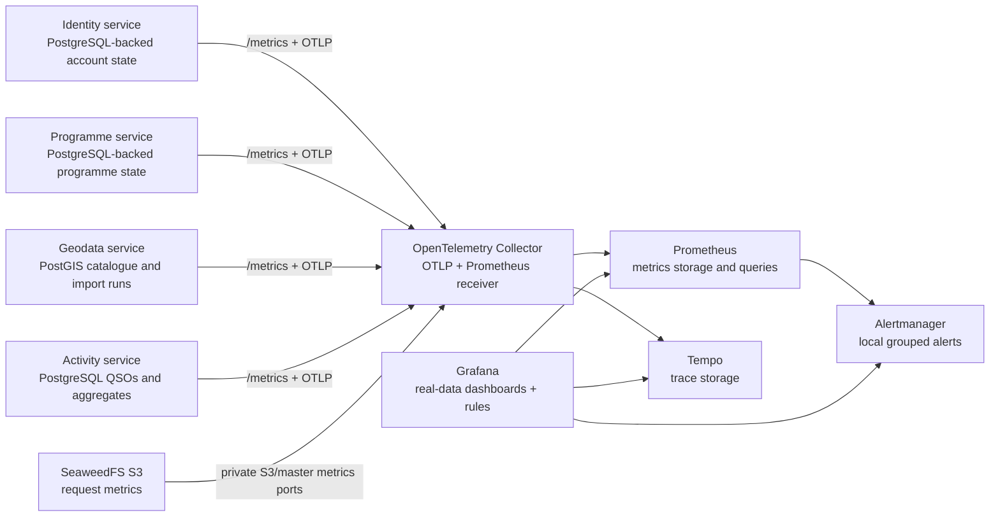

# MyOTA observability

Status: observability services and dashboards are implemented for local Compose
and Helm. Live K3s verification on 2026-10-08 found incomplete service-metric
coverage for identity and programmes; see [current verification and gaps](#live-k3s-verification-and-known-gap).

## What was confirmed

All five provisioned dashboards explicitly use UTC, and Grafana's Compose/Helm
default is UTC for new/ad-hoc dashboards. Operational NATS/SeaweedFS history
displays also identify UTC. The last-30-minutes and 30-second refresh defaults
are unchanged; see the [system-wide UTC policy](../platform/utc-time-policy.md).

The original Grafana panels were not seeded with fabricated business values.
They were incomplete: request counters lived in each process and reset on a
restart, while most business panels had no durable user, entity, QSO, or award
measurements behind them. The only consistently visible value was gateway
health traffic. The old dashboard therefore did not provide a trustworthy
project-wide view.

The current dashboards use measurements derived from persisted service state,
live API/database execution, or direct JetStream consumer state. A zero is a
real zero; a missing value indicates that the source service or collector is
unavailable.


## Structured logging implementation roadmap

Durable application and worker logging is the next observability extension. The
implementation is specified in the
[structured logging implementation plan](logging-implementation.md).

The plan adds Loki behind the existing OpenTelemetry Collector, standardizes
structured service and worker logging, propagates trace and business correlation
context through HTTP and NATS/JetStream, adds PostgreSQL/PostGIS database
metrics, traces and logs, and connects Grafana metrics, traces and logs. It is
split into independently executable phases, each with a linked
ChatGPT/Work/Codex implementation prompt.

## Collection architecture



The collector is infrastructure owned by `myota-deploy`; a separate business
metrics microservice would create a second owner for facts already owned by
identity, geodata, programme, and activity services. Prometheus scrapes the
collector's `:8889` endpoint. The collector also scrapes each service's
Prometheus-compatible `/metrics` endpoint, allowing durable gauges to remain
available during an OTLP exporter or collector restart.

### Live K3s verification and known gap

On 2026-10-08, the Identity and Programme pods were Ready, but a request from a
running service pod to `http://myota-identity:8001/metrics` and
`http://myota-programmes:8002/metrics` returned HTTP 404. Prometheus reported
`up=0` for those two scrape targets, and no Identity or Programme HTTP request
series appeared in the recent `myota_http_server_requests_total` query. This
is a **metrics coverage gap**, not proof that either application API is down;
the Identity login used for the authorized import completed successfully.

Do not treat missing Identity/Programme series as zero business activity or
claim complete per-service/per-API observability until resolved. The owning
services should expose their real aggregate and request metrics at the
configured endpoints, or the scrape config should be aligned with their actual
telemetry transport. Verify non-404 responses, live series, and dashboard
coverage after the fix. This issue does not invalidate the geodata-only Phase 0
query/load evidence below.

## API endpoint telemetry

The OpenTelemetry HTTP instruments use the service name, normalized route
template, HTTP method, response status, and duration as dimensions. The
`MyOTA API performance` Grafana dashboard repeats four graphs for each observed
service and splits each graph into route/method series: request rate, p95
response time in milliseconds, 5xx server-error rate, and calculated
availability percentage. The route label is the registered API template (for
example `/v1/entities/{id}`), not an unbounded URL containing identifiers.
This keeps cardinality bounded and makes the dashboard usable for the new REST
resource API as well as the remaining compatibility aliases.

API latency is distinct from query-level timings. The geodata service observes
the PostGIS bounding-box query and entity upsert under
`myota_geodata_postgis_query_duration_seconds{query=...}` and counts operations
above the configured slow-query threshold. A guarded non-production tool
captures actual `EXPLAIN (ANALYZE, BUFFERS, FORMAT JSON)` plans; see the
[geodata load and query-evidence runbook](../geodata/evidence/load-test-and-query-evidence.md).

SeaweedFS exposes master and S3 request metrics together on its private
Prometheus listener (Helm default: 9324). A live check confirmed S3 counters
and request-duration histograms on this endpoint; the previously configured
9327 listener is not exposed by the deployed build. The Collector scrapes S3
operation counts by operation/bucket/status, server-side request-duration
histograms, active uploads and bytes. The **MyOTA Object Storage** dashboard
displays throughput, p50/p95/p99 service time, non-2xx rates and in-flight
upload state; alerts cover missing scrape targets, sustained S3 errors and
high server-side p95 latency.
These server measurements separate SeaweedFS processing from end-to-end client
upload timing. The metric listeners are internal-only and must not be exposed
through an Ingress. Helm hashes the Collector scrape configuration into its
pod template so Fleet ConfigMap updates restart the Collector automatically.
The Grafana Deployment likewise hashes all provisioned Grafana files. This is
required because its dashboard and provisioning ConfigMap files are mounted
with `subPath`, which does not refresh an existing container when the
ConfigMap changes. A missing or stale provisioned dashboard should be
investigated by comparing the ConfigMap entry with the mounted file and
checking Grafana's dashboard-provisioning logs; the pod-template checksum
ensures future dashboard changes roll Grafana automatically.

## Alerting

Prometheus evaluates the source-of-truth rules in
`myota-deploy/observability/rules.yml` and sends alerts to Alertmanager. The
rules cover collector availability, service scrape availability, per-route 5xx
error rate above 5% for five minutes, p95 latency above one second for ten
minutes, and a critical p95 threshold above five seconds for five minutes.

Grafana provisions two equivalent Grafana-managed rules for API error rate and
latency. They use the provisioned Prometheus datasource and forward through the
local Alertmanager contact point, so operators can inspect both Grafana rule
state and Alertmanager grouping without an external notification account. The
local receiver intentionally has no outbound integration; production values
must replace it with an approved email, chat, webhook, or paging receiver and
should move Alertmanager storage to a persistent volume.

## Business metrics

Service endpoints expose these real aggregates without participant names,
emails, callsigns, or entity identifiers:

- Identity (intended aggregate set): users by status and participation type,
  callsigns, verified callsigns, roles, role definitions, security events, and
  locked accounts. **Not currently visible in K3s Prometheus** because the
  configured `/metrics` URL returns 404; see the live gap above.
- Programme (intended aggregate set): programme totals and status, shared
  entity-category catalogue, and category-to-programme assignments. **Not
  currently visible in K3s Prometheus** because the configured `/metrics` URL
  returns 404; see the live gap above.
- Geodata: entities by lifecycle status and GeoJSON geometry, categories,
  import runs by status, and pre-processing candidates by validation state.
- Activity: valid and void QSOs, activations by status, participants,
  activators, hunters, aggregate callsign/entity rows, award definitions and
  progress, ADIF imports, jobs, corrections, and queue lag.
- JetStream: per-stream/consumer pending and ack-pending messages, broker
  redeliveries, oldest outstanding message age, and metrics-poller health are
  currently provided by the custom Geodata poller. The age lookup is marked
  unavailable if the broker no longer retains the target sequence. These are
  broker-side measurements, distinct from outbox/import database counts. The
  [NATS Surveyor plan](nats-surveyor-migration.md) proposes centralizing these
  broker metrics and retiring the duplicate poller after validation.

All service-specific values are read from the service's durable store at scrape
time. Request counters and distributed request histograms are emitted through
the OpenTelemetry Python SDK. API handlers remain available if the collector is
down because exporters are asynchronous and best-effort.

## Local access and verification

```bash
docker-compose --profile observability up -d --build
curl http://localhost:8090/healthz
```

Sign in at `http://localhost:8090`, then open **Platform health → Observability**
at `/observability/`. Grafana uses individual MyOTA accounts; current
GLOBAL_OPERATOR/GLOBAL_ADMIN roles receive Editor and other authorized readers
receive Viewer. Prometheus, Alertmanager and Tempo ports are private. The
provisioned dashboards default to the last 30 minutes and refresh every
30 seconds; UI saves are enabled for Editors. Copy a source-managed dashboard
if its UI edits must survive later provisioning updates. The `MyOTA operations`,
`MyOTA API performance`, `MyOTA Geodata capacity baseline`, and current
`MyOTA JetStream backlog and PostGIS query performance` dashboards are tagged
`real-data`. The broker dashboard is planned for replacement by Surveyor; its
PostGIS panels must first move to the Geodata dashboard. See the
[NATS monitoring consolidation plan](nats-surveyor-migration.md).

Kubernetes enables the same collector, Prometheus, Alertmanager, Grafana and
Tempo resources with `observability.enabled=true`, including persistent volumes.
Production still needs verified restore procedures, appropriate resource limits,
retention settings, real notification receivers, and network policies
appropriate to the cluster.

## Operational interpretation

The [SeaweedFS storage page](../operations/storage/seaweedfs-admin-status.md) at `/object-storage`
follows the NATS page pattern: read-only operations APIs, real provider gauges,
explicit unavailable/partial/stale status, and persistent paged history. Native
bucket counts/sizes and filesystem capacity come from the private exporter;
no object scans or storage credentials are required by the Admin UI.

**Current NATS monitoring:** the authenticated Admin UI page at `/jetstream`
and Operations sampler read broker metadata and persist seven days of samples
in `myota_core`. Geodata also has a separate JetStream metrics poller. These
are current components, not the target design. The proposed
[NATS Surveyor consolidation](nats-surveyor-migration.md) will centralize
broker/server metrics in Prometheus and Grafana, then retire duplicate
broker-inspection code, history, and the Admin page after a verified overlap.
The app-level outbox and worker metrics remain because they describe delivery
and domain processing, which Surveyor cannot observe.

- A missing series is not converted to a made-up value.
- Scrape and exporter health should be checked before interpreting an empty
  chart as zero activity.
- Request telemetry is technical telemetry, not a substitute for durable
  domain aggregates.
- Domain counters are intentionally aggregate-only and privacy-safe.
- Dashboards are a view, not an audit log. For investigation, use the service
  API, audit records, job records, and database-backed runbooks.
