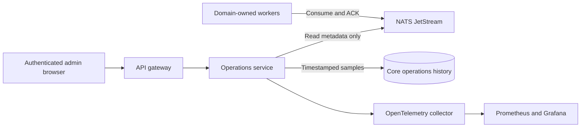

# NATS / JetStream administration status

The admin UI's **Platform health → NATS / JetStream** page (`/jetstream`) is a
read-only operational view, served by `myota-operations-service`. Business-domain
workers remain in their domain repositories; the new service does not consolidate
or execute identity, activity or geodata jobs.

The browser uses authenticated HTTP APIs only:

| Endpoint | Purpose |
|---|---|
| `GET /v1/operations/jetstream` | Latest broker sample, timestamp, health and stale indication |
| `GET /v1/operations/jetstream/snapshots?page=1&pageSize=20` | Persistent paged history, newest first; maximum 50 samples per page |

Both require GLOBAL_OPERATOR/GLOBAL_ADMIN, `observability.view`, `operations.read`
or wildcard permission. They never expose NATS credentials, broker addresses,
message payloads or administrator execution contexts. There are no consumer-create,
ACK, purge, retry or delete controls on this page.

## What is shown

This view reports the live broker, not the selected migration target. As of
9 October 2026, the deployed `MYOTA_EVENTS` stream still mixes facts and
Geodata work with Interest retention. Phase 1 has added isolated provisioning
preparation only; no live stream or consumer settings have changed. See the
[migration plan](nats-event-migration-plan.md), [evidence](evidence/phase1-contract-topology-2026-10-09.md),
and [current/target diagram](../../architecture/diagrams/nats-event-migration.md).

Streams: subjects, retained message count/bytes, storage and retention type,
sequence range, consumer count and explicit truncation warnings.
Consumers: durable name, filter subjects, pending and ack-pending deliveries,
redelivered count, waiting pulls, acknowledgement policy and timeout, delivery
limits, delivered/ack-floor sequences, and oldest-message age when verifiable.
Filter by stream and consumer; open any history row for its complete recorded
snapshot.

Counts are actual broker metadata. Pending totals across consumers count delivery
obligations, not unique messages or imported files. `num_redelivered` is the
broker's current redelivered-message count, not a lifetime cumulative counter.
Unknown age is unavailable, never fabricated as zero. Failed inspections persist
UNAVAILABLE/PARTIAL samples. If database recording stops, the last sample is marked
stale after three polling intervals.

`MYOTA_EVENTS` uses Interest retention, so its retained message count falls as
all consumers matching each subject acknowledge work. Unconsumed or
unacknowledged messages remain subject to delivery/retry and the configured
30-day maximum age. The stream is not a historical event archive; see the
[retention and recovery runbook](../runbooks.md#jetstream-event-retention).

## Persistence and deployment

The operations repository/image is public at
`ghcr.io/myota-platform/myota-operations-service:latest`. Organization package
policy permits public publication; source inheritance does not automatically
make a newly created GHCR package public. Verify anonymous pull access before
adding a new package to Fleet values.

Samples are recorded every 30 seconds by default, retained seven days and stored
in the operations-owned `operations_jetstream_snapshot` table in `myota_core`.
The browser refreshes every ten seconds while visible. History begins with the
deployment, not before it; samples are not an exhaustive message delivery audit.
One unique capture slot per interval prevents duplicate rows across sampler
replicas. All replicas must use the same polling interval.

Compose and Helm deploy the operations service on internal port 8005, route it
through the gateway and scrape its real metrics through the OpenTelemetry collector.
Existing core database and signing-key secrets are reused; no new public database
or NATS ports are needed. Its schema migration is synchronized to core deployment
migration `002_operations.sql`. The image is
`ghcr.io/myota-platform/myota-operations-service:latest`.

Under the accepted cluster-internal trust decision, Operations connects to
NATS without broker credentials and enforces inspection-only behavior in its
application code. The unauthenticated broker does not enforce a read-only role;
all pods that can reach the ClusterIP are trusted. Timestamp lookup currently
uses the stream-message inspection API: any returned content is discarded,
never retained or returned. The service's database pool is bounded to four
connections per process.

